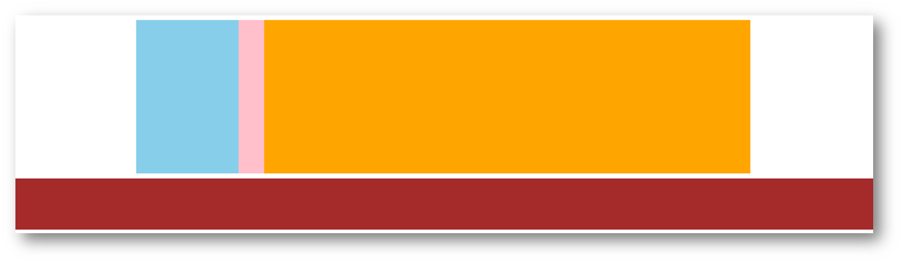

# day06-Flex布局


### 练习1-小米登录

 

#### 第一步搭建大盒子

~~~html
<!DOCTYPE html>
<html lang="en">

<head>
  <meta charset="UTF-8">
  <meta http-equiv="X-UA-Compatible" content="IE=edge">
  <meta name="viewport" content="width=device-width, initial-scale=1.0">
  <title>Document</title>
  <style>
    * {
      margin: 0;
      padding: 0;
      box-sizing: border-box;
    }

    .mi {
      width: 339px;
      height: 356px;
      background-color: pink;
      margin: 100px auto;
    }
  </style>
</head>

<body>
  <div class="mi"></div>
</body>

</html>
~~~

 

#### logo设置

>一般情况下，logo都是背景图片，而且是 h1 

html设置

~~~html
<body>
  <div class="mi">
    <h1></h1>
  </div>
</body>
~~~

css 设置

~~~css
 /* h1是logo 一般情况下都是背景 */
    .mi h1 {
      width: 49px;
      height: 49px;
      margin: 0 auto;
      background: #ff4c00 url(./images/mi-logo.png) no-repeat;
      /* background-color: red; */
    }
~~~

效果如下：

 


#### 标题和input设置

html

~~~html
<h2>小米账号登录</h2>
<input type="text" placeholder="邮箱/手机/小miID">
~~~

css

~~~css
.mi h2 {
  text-align: center;
  font-weight: 400;
  font-size: 28px;
  margin: 32px 0 44px;
}

.mi input {
  width: 339px;
  height: 50px;
  border: 1px solid #ccc;
  padding-left: 12px;
}
~~~

效果：

 

#### 密码框和登录按钮

html

~~~html
<input type="password" placeholder="密码">
<button>登录</button>
~~~

css

~~~css
.mi input {
  width: 339px;
  height: 50px;
  border: 1px solid #ccc;
  padding-left: 12px;
  margin-bottom: 12px;
}

.mi button {
  width: 339px;
  height: 50px;
  background-color: #ff4c00;
  border: 0;
  font-size: 14px;
  color: #fff;
}

.mi button:hover {
  background-color: red;
}
~~~

收工

 

完整写法：

~~~html
<!DOCTYPE html>
<html lang="en">

  <head>
    <meta charset="UTF-8">
    <meta http-equiv="X-UA-Compatible" content="IE=edge">
    <meta name="viewport" content="width=device-width, initial-scale=1.0">
    <title>Document</title>
    <style>
      * {
        margin: 0;
        padding: 0;
        box-sizing: border-box;
      }

      .mi {
        width: 339px;
        height: 356px;
        /* background-color: pink; */
        margin: 100px auto;
      }

      /* h1是logo 一般情况下都是背景 */
      .mi h1 {
        width: 49px;
        height: 49px;
        margin: 0 auto;
        background: #ff4c00 url(./images/mi-logo.png) no-repeat;
        /* background-color: red; */
      }

      .mi h2 {
        text-align: center;
        font-weight: 400;
        font-size: 28px;
        margin: 32px 0 44px;
      }

      .mi input {
        width: 339px;
        height: 50px;
        border: 1px solid #ccc;
        padding-left: 12px;
        margin-bottom: 12px;
      }

      .mi button {
        width: 339px;
        height: 50px;
        background-color: #ff4c00;
        border: 0;
        font-size: 14px;
        color: #fff;
      }

      .mi button:hover {
        background-color: red;
      }
    </style>
  </head>

  <body>
    <div class="mi">
      <h1></h1>
      <h2>小米账号登录</h2>
      <input type="text" placeholder="邮箱/手机/小miID">
      <input type="password" placeholder="密码">
      <button>登录</button>
    </div>
  </body>

</html>
~~~

### 爱宠案例

效果：

 

#### 大盒子 dog 搭建

~~~html
<!DOCTYPE html>
<html lang="en">

<head>
  <meta charset="UTF-8">
  <meta http-equiv="X-UA-Compatible" content="IE=edge">
  <meta name="viewport" content="width=device-width, initial-scale=1.0">
  <title>Document</title>
  <style>
    * {
      margin: 0;
      padding: 0;
      box-sizing: border-box;
    }

    li {
      list-style: none;
    }

    .dog {
      width: 262px;
      height: 342px;
      /* background-color: pink; */
      margin: 100px auto;
      border: 1px solid #090;
      background: url(./images/bg.gif);
    }
  </style>
</head>

<body>
  <div class="dog"></div>


  <!-- 爱宠知识
  养狗比养猫对健康更有利
  日本正宗柴犬亮相，你怎么看柴犬
  狗狗歌曲《新年旺旺》
  带宠兜风，开车带宠需要注意什么？
  【爆笑】这狗狗太不给力了
  狗狗与男童相同着装拍有爱造型照
  狗狗各个阶段健康大事件
  调皮宠物狗陷在沙发里的搞笑瞬间
  为什么每次大小便后，会用脚踢土？ -->
</body>

</html>
~~~

 

#### h2标题的做法

 

~~~html
<div class="dog">
  <h2>爱宠知识</h2>
</div>
~~~

css

~~~css
.dog {
  width: 262px;
  height: 342px;
  /* background-color: pink; */
  margin: 100px auto;
  border: 1px solid #090;
  background: url(./images/bg.gif);
  padding: 9px 9px 0;
}

.dog h2 {
  height: 25px;
  line-height: 25px;
  border-left: 5px solid #c9e143;
  font-size: 18px;
  color: #fff;
  padding-left: 10px;
}
~~~

#### ul 布局

~~~html
<ul>
  <li><a href="#">养狗比养猫对健康更有利</a></li>
  <li><a href="#">日本正宗柴犬亮相，你怎么看柴犬</a></li>
  <li><a href="#">狗狗歌曲《新年旺旺》</a></li>
  <li><a href="#">带宠兜风，开车带宠需要注意什么？</a></li>
  <li><a href="#">【爆笑】这狗狗太不给力了</a></li>
  <li><a href="#">狗狗与男童相同着装拍有爱造型照</a></li>
  <li><a href="#">狗狗各个阶段健康大事件</a></li>
  <li><a href="#">调皮宠物狗陷在沙发里的搞笑瞬间</a></li>
  <li><a href="#">为什么每次大小便后，会用脚踢土？</a></li>
</ul>
~~~

css 

~~~css
.dog ul {
  /* 背景给ul好一些 */
  background-color: #fff;
  /* 给ul padding 这样可以把li 挤到中间 */
  padding: 0 9px;
  margin-top: 5px;
}
~~~

效果

 

#### 修改li和a链接的样式

~~~css
.dog ul li {
  height: 30px;
  line-height: 30px;
  /* 大师的 */
  border-bottom: 1px dashed #000;
}

.dog ul li a {
  font-size: 12px;
  text-decoration: none;
}
~~~

 

#### 给li添加背景图片

给li添加，  让图片左侧对齐，垂直居中， 让li 做内边距 14px

~~~css
.dog ul li {
  height: 31px;
  line-height: 31px;
  /* 大师的 */
  border-bottom: 1px dashed #000;
  /*代码*/
  background: url(./images/tb.gif) no-repeat left center;
  padding-left: 14px;
}
~~~

完整的写法：

~~~html
<!DOCTYPE html>
<html lang="en">

<head>
  <meta charset="UTF-8">
  <meta http-equiv="X-UA-Compatible" content="IE=edge">
  <meta name="viewport" content="width=device-width, initial-scale=1.0">
  <title>Document</title>
  <style>
    * {
      margin: 0;
      padding: 0;
      box-sizing: border-box;
    }

    li {
      list-style: none;
    }

    .dog {
      width: 262px;
      height: 342px;
      /* background-color: pink; */
      margin: 100px auto;
      border: 1px solid #090;
      background: url(./images/bg.gif);
      padding: 9px 9px 0;
    }

    .dog h2 {
      height: 25px;
      line-height: 25px;
      border-left: 5px solid #c9e143;
      font-size: 18px;
      color: #fff;
      padding-left: 10px;
    }

    .dog ul {
      /* 背景给ul好一些 */
      background-color: #fff;
      /* 给ul padding 这样可以把li 挤到中间 */
      padding: 0 9px;
      margin-top: 5px;
    }

    .dog ul li {
      height: 31px;
      line-height: 31px;
      /* 大师的 */
      border-bottom: 1px dashed #000;
      background: url(./images/tb.gif) no-repeat left center;
      padding-left: 14px;
    }

    .dog ul li a {
      font-size: 12px;
      text-decoration: none;
    }
  </style>
</head>

<body>
  <div class="dog">
    <h2>爱宠知识</h2>
    <ul>
      <li><a href="#">养狗比养猫对健康更有利</a></li>
      <li><a href="#">日本正宗柴犬亮相，你怎么看柴犬</a></li>
      <li><a href="#">狗狗歌曲《新年旺旺》</a></li>
      <li><a href="#">带宠兜风，开车带宠需要注意什么？</a></li>
      <li><a href="#">【爆笑】这狗狗太不给力了</a></li>
      <li><a href="#">狗狗与男童相同着装拍有爱造型照</a></li>
      <li><a href="#">狗狗各个阶段健康大事件</a></li>
      <li><a href="#">调皮宠物狗陷在沙发里的搞笑瞬间</a></li>
      <li><a href="#">为什么每次大小便后，会用脚踢土？</a></li>
    </ul>
  </div>


</body>

</html>
~~~

 

> 目标：熟练使用 Flex 完成结构化布局

## 01-标准流

标准流也叫文档流，指的是标签在页面中**默认的排布规则**，例如：块元素独占一行，行内元素可以一行显示多个。 


## 02-浮动(了解即可，不用复习)

### 基本使用

作用：让块元素水平排列。

属性名：**float**

属性值

* **left**：左对齐
* **right**：右对齐

```html
<!DOCTYPE html>
<html lang="en">

<head>
  <meta charset="UTF-8">
  <meta http-equiv="X-UA-Compatible" content="IE=edge">
  <meta name="viewport" content="width=device-width, initial-scale=1.0">
  <title>浮动</title>
  <style>
    .left,
    .right {
      /* width: 200px; */
      height: 200px;
      background-color: pink;
    }

    .left {
      /* 左浮动 */
      float: left;
      margin-left: 20px;
    }

    .right {
      /* 右侧浮动 */
      float: left;
      height: 300px;
      background-color: purple;
    }

    .bottom {
      height: 50px;
      background-color: black;
    }
  </style>
</head>

<body>
  <div class="left">左侧123</div>
  <div class="right">右侧123</div>
  <div class="bottom"></div>
</body>

</html>
```

特点：

* 浮动后的盒子**顶对齐**
* 浮动后的盒子具备**行内块**特点
* 浮动后的盒子**脱标**，**不占用标准流的位置**


### 产品区域布局


#### 左右布局

html结构

```html
  <div class="mi">
    <div class="left">左侧</div>
    <div class="right">右侧</div>
  </div>
```

css样式

```html
 <style>
    * {
      margin: 0;
      padding: 0;
      box-sizing: border-box;
    }

    li {
      list-style: none;
    }

    .mi {
      width: 1226px;
      height: 614px;
      /* background-color: pink; */
      margin: 100px auto;
    }

    .left {
      float: left;
      width: 234px;
      height: 614px;
      background-color: skyblue;
    }

    .right {
      float: right;
      width: 978px;
      height: 614px;
      background-color: purple;
    }
</style>
```

效果：


#### 区域小li布局

完整写法

~~~html
<!DOCTYPE html>
<html lang="en">

<head>
  <meta charset="UTF-8">
  <meta http-equiv="X-UA-Compatible" content="IE=edge">
  <meta name="viewport" content="width=device-width, initial-scale=1.0">
  <title>Document</title>
  <style>
    * {
      margin: 0;
      padding: 0;
      box-sizing: border-box;
    }

    li {
      list-style: none;
    }

    .mi {
      width: 1226px;
      height: 614px;
      /* background-color: pink; */
      margin: 100px auto;
    }

    .left {
      float: left;
      width: 234px;
      height: 614px;
      background-color: skyblue;
    }

    .right {
      float: right;
      width: 978px;
      height: 614px;
      /* background-color: purple; */
    }

    .right li {
      float: left;
      width: 234px;
      height: 300px;
      background-color: pink;
      margin-bottom: 14px;
      margin-right: 14px;
    }

    /* 让第4,8 个li 去掉外边距 */
    .right li:nth-child(4n) {
      margin-right: 0;
    }
  </style>
</head>

<body>
  <div class="mi">
    <div class="left">左侧</div>
    <div class="right">
      <ul>
        <li>1</li>
        <li>1</li>
        <li>1</li>
        <li>1</li>
        <li>1</li>
        <li>1</li>
        <li>1</li>
        <li>1</li>
      </ul>
    </div>
  </div>
</body>

</html>
~~~

 

### 清除浮动

场景：浮动元素会脱标，如果**父级没有高度**，**子级无法撑开父级高度**（可能导致页面布局错乱）

解决方法：**清除浮动**（清除浮动带来的影响）

#### 场景搭建



```html
<style>
  .top {
    margin: 10px auto;
    width: 1200px;
    /* height: 300px; */
    background-color: pink;
  }

  .left {
    float: left;
    width: 200px;
    height: 300px;
    background-color: skyblue;
  }

  .right {
    float: right;
    width: 950px;
    height: 300px;
    background-color: orange;
  }

  .bottom {
    height: 100px;
    background-color: brown;
  }

</style>

<div class="top">
  <div class="left"></div>
  <div class="right"></div>
</div>
<div class="bottom"></div>
```

#### 额外标签法

在**父元素内容的最后**添加一个**块级**元素，设置 CSS 属性 **clear: both** 

```html
<style>
.clearfix {
  clear: both;
}
</style>

<div class="father">
  <div class="left"></div>
  <div class="right"></div>
  <div class="clearfix"></div>
</div>
```

#### 单伪元素法

1. 准备 after 伪元素

```css
.clearfix::after {
  content: "";
  display: block;
  clear: both;
}
```

2. 父级使用 clearfix 类

```html
<div class="father clearfix"></div>
```

#### 双伪元素法

1. 准备 after 和 before 伪元素

```css
/* before 解决外边距塌陷问题 */
/* 双伪元素法 */
.clearfix::before,
.clearfix::after {
  content: "";
  display: table;
}

/* after 清除浮动 */
.clearfix::after {
  clear: both;
}
```

2. 父级使用 clearfix 类

```html
<div class="father clearfix"></div>
```

#### overfow法

```css
.father {
  margin: 10px auto;
  width: 1200px;
  /* height: 300px; */
  background-color: pink;

  overflow: hidden;
}
```

## 03-Flex布局（重点）

Flex 布局也叫**弹性布局**，是浏览器**提倡的布局模型**，非常适合**结构化**布局，提供了强大的空间分布和对齐能力。

Flex 模型不会产生浮动布局中脱标现象，布局网页更简单、更灵活。


### Flex组成

设置方式：给**父**元素设置 **display: flex**，子元素可以自动挤压或拉伸

组成部分：

* 弹性容器
* 弹性盒子
* 主轴：默认在**水平**方向
* 侧轴 / 交叉轴：默认在**垂直**方向


### 主轴对齐方式

属性名：**justify-content**


重点记住标红的。如果非要问我那个常用，我只能说是  `space-between ` 

```css
justify-content: space-between;
```

显示效果：**两侧没缝隙**


```css
justify-content: space-around;
```

效果如下：  **记住2倍**


```css
justify-content: space-evenly;
```

效果如下： **记住空隙一样大**


```css
 justify-content: center;
```

效果如下： **经常用于让一个盒子水平居中**


记忆：

1. `两侧没缝隙是 between`
2. 缝隙一样大是 evenly
3. 2倍缝隙是 around

~~~html
<!DOCTYPE html>
<html lang="en">

<head>
  <meta charset="UTF-8">
  <meta http-equiv="X-UA-Compatible" content="IE=edge">
  <meta name="viewport" content="width=device-width, initial-scale=1.0">
  <title>Document</title>
  <style>
    .box {
      /* 给父亲添加 flex */
      display: flex;
      /* 主轴的排列方式 */
      /* justify-content: flex-start; */
      /* justify-content: flex-end; */
      /* 让子盒子居中对齐 */
      /* justify-content: center; */
      /* between  */
      /* justify-content: space-between; */
      /* justify-content: space-around; */
      justify-content: space-evenly;
      width: 900px;
      height: 200px;
      background-color: pink;
    }

    .box div {
      width: 249px;
      height: 200px;
      background-color: skyblue;
    }
  </style>
</head>

<body>
  <div class="box">
    <div>1</div>
    <div>2</div>
    <div>3</div>
  </div>
</body>

</html>
~~~

 

### 侧轴对齐方式

* align-items：当前弹性容器内**所有**弹性盒子的侧轴对齐方式（给**弹性容器**设置）
* align-self：单独控制**某个弹性盒子**的侧轴对齐方式（给**弹性盒子**设置）


~~~html
<!DOCTYPE html>
<html lang="en">

<head>
  <meta charset="UTF-8">
  <meta http-equiv="X-UA-Compatible" content="IE=edge">
  <meta name="viewport" content="width=device-width, initial-scale=1.0">
  <title>Document</title>
  <style>
    .box {
      /* 给父亲添加 flex */
      display: flex;
      /* 主轴的排列方式 */
      /* justify-content: flex-start; */
      /* justify-content: flex-end; */
      /* 让子盒子居中对齐 */
      /* justify-content: center; */
      /* between  */
      /* 两侧没缝隙 */
      /* justify-content: space-between; */
      /* 两倍缝隙 */
      /* justify-content: space-around; */
      justify-content: space-evenly;

      /* 侧轴的对齐方式 */
      /* 顶部对齐 */
      /* align-items: flex-start; */
      /* 底部对齐 */
      /* align-items: flex-end; */
      /* 居中对齐 */
      /* align-items: center; */
      /* 默认的 拉伸和父亲一样 */
      align-items: stretch;
      width: 900px;
      height: 500px;
      background-color: pink;
    }

    .box div {
      width: 249px;
      /* height: 200px; */
      background-color: skyblue;
    }
  </style>
</head>

<body>
  <div class="box">
    <div>1</div>
    <div>2</div>
    <div>3</div>
  </div>
</body>

</html>
~~~

 

#### 盒子水平和垂直居中的写法

 

~~~html
<!DOCTYPE html>
<html lang="en">

<head>
  <meta charset="UTF-8">
  <meta http-equiv="X-UA-Compatible" content="IE=edge">
  <meta name="viewport" content="width=device-width, initial-scale=1.0">
  <title>Document</title>
  <style>
    .father {
      /* 利用flex实现 */
      display: flex;
      /* 主轴水平居中 */
      justify-content: center;
      /* 侧轴水平居中 */
      align-items: center;
      width: 300px;
      height: 300px;
      background-color: pink;
    }

    .son {
      width: 200px;
      height: 200px;
      background-color: purple;
    }
  </style>
</head>

<body>
  <div class="father">
    <div class="son"></div>
  </div>
</body>

</html>
~~~

## 综合案例

 

### 大盒子搭建

html结构

~~~html
<div class="box">
    <div class="box-hd">头部</div>
    <div class="box-bd">主题</div>
  </div>
~~~

css 样式

~~~css
* {
  margin: 0;
  padding: 0;
  box-sizing: border-box;
}

li {
  list-style: none;
}

.box {
  width: 1240px;
  height: 540px;
  background-color: pink;
  margin: 100px auto;
}
~~~

显示：


### 头部标题制作

html写法

~~~html
<div class="box">
  <div class="box-hd">
    <h2>新鲜好物
      <span>新鲜出炉 品质靠谱</span>
    </h2>
    <a href="#">查看更多> </a>
  </div>
  <div class="box-bd">主题</div>
</div>
~~~

css 写法

~~~css
.box-hd {
  /* 给父亲添加 flex 里面的孩子  h2 和 a 可以一样显示 */
  display: flex;
  /* 两侧没缝隙 主轴对齐 */
  justify-content: space-between;
  /* 侧轴底对齐 */
  align-items: flex-end;
  padding: 40px 0;
}
~~~

效果：

 

### 修饰文字

css样式

~~~css

.box-hd h2 {
  font-size: 32px;
  font-weight: 400;
}

.box-hd h2 span {
  font-size: 16px;
  color: #999;
}

.box-hd a {
  font-size: 16px;
  color: #999;
}
~~~

展示：


### 底部小li 制作

html结构

~~~html
<ul>
  <li>
    
    <h4>全防水HABU旋钮</h4>
    <p>¥444.00</p>
  </li>
</ul>
~~~

css样式

~~~css
.box-bd li {
  width: 306px;
  height: 406px;
  background-color: skyblue;
  text-align: center;
}

.box-bd li img {
  width: 100%;
}

.box-bd li h4 {
  font-size: 22px;
  font-weight: 400;
  margin: 12px 0 20px;
}

.box-bd li p {
  font-size: 18px;
  color: orangered;
}
~~~

展示

 

### 让多个li显示到一行并且对齐

css样式

~~~css
.box-bd ul {
  /* 一定是li的亲爸爸 */
  display: flex;
  justify-content: space-between;
}

~~~

展示


### 最后完整效果

 

~~~html
<!DOCTYPE html>
<html lang="en">

  <head>
    <meta charset="UTF-8">
    <meta http-equiv="X-UA-Compatible" content="IE=edge">
    <meta name="viewport" content="width=device-width, initial-scale=1.0">
    <title>Document</title>
    <style>
      * {
        margin: 0;
        padding: 0;
        box-sizing: border-box;
      }

      li {
        list-style: none;
      }

      .box {
        width: 1240px;
        height: 540px;
        /* background-color: pink; */
        margin: 100px auto;
      }

      .box-hd {
        /* 给父亲添加 flex 里面的孩子  h2 和 a 可以一样显示 */
        display: flex;
        /* 两侧没缝隙 主轴对齐 */
        justify-content: space-between;
        /* 侧轴底对齐 */
        align-items: flex-end;
        padding: 40px 0;
      }

      .box-hd h2 {
        font-size: 32px;
        font-weight: 400;
      }

      .box-hd h2 span {
        font-size: 16px;
        color: #999;
      }

      .box-hd a {
        font-size: 16px;
        color: #999;
      }

      .box-bd ul {
        /* 一定是li的亲爸爸 */
        display: flex;
        justify-content: space-between;
      }

      .box-bd li {
        width: 306px;
        height: 406px;
        background-color: skyblue;
        text-align: center;
      }

      .box-bd li img {
        width: 100%;
      }

      .box-bd li h4 {
        font-size: 22px;
        font-weight: 400;
        margin: 12px 0 20px;
      }

      .box-bd li p {
        font-size: 18px;
        color: orangered;
      }
    </style>
  </head>

  <body>
    <div class="box">
      <!-- 头部部分 -->
      <div class="box-hd">
        <h2>新鲜好物
          <span>新鲜出炉 品质靠谱</span>
        </h2>
        <a href="#">查看更多> </a>
      </div>

      <!-- 主体部分 -->
      <div class="box-bd">
        <ul>
          <li>
            
            <h4>全防水HABU旋钮</h4>
            <p>¥444.00</p>
          </li>

          <li>
            
            <h4>全防水HABU旋钮</h4>
            <p>¥444.00</p>
          </li>

          <li>
            
            <h4>全防水HABU旋钮</h4>
            <p>¥444.00</p>
          </li>

          <li>
            
            <h4>全防水HABU旋钮</h4>
            <p>¥444.00</p>
          </li>
        </ul>
      </div>
    </div>

    <div class="box">
      <!-- 头部部分 -->
      <div class="box-hd">
        <h2>新鲜好物
          <span>新鲜出炉 品质靠谱</span>
        </h2>
        <a href="#">查看更多> </a>
      </div>

      <!-- 主体部分 -->
      <div class="box-bd">
        <ul>
          <li>
            
            <h4>全防水HABU旋钮</h4>
            <p>¥444.00</p>
          </li>

          <li>
            
            <h4>全防水HABU旋钮</h4>
            <p>¥444.00</p>
          </li>

          <li>
            
            <h4>全防水HABU旋钮</h4>
            <p>¥444.00</p>
          </li>

          <li>
            
            <h4>全防水HABU旋钮</h4>
            <p>¥444.00</p>
          </li>
        </ul>
      </div>
    </div>
  </body>

</html>
~~~


## 自动换行

弹性盒子可以自动挤压或拉伸，默认情况下，所有弹性盒子都在一行显示。

属性名：flex-wrap

属性值

•wrap：换行

•nowrap：不换行（默认）


## 作业

1. 利用flex 完成以下效果图


2. 利用flex完成以下效果


说明:

- 大盒子宽度1245， 高度为473

  ​

3. 利用flex完成京东效果

   

说明：

1. 大盒子 宽度 1150  高度 390

2. 左侧盒子宽度为  350像素， 中间盒子宽度 350，  右侧盒子宽度 350

3. 里面填充图片即可

   ​


