# day07-学成在线

## flex布局

### 弹性盒子换行

弹性盒子可以自动挤压或拉伸，默认情况下，`所有弹性盒子都在一行显示`。

属性名：**flex-wrap**

属性值

- wrap：换行
- nowrap：不换行（默认）

### 小米flex布局

 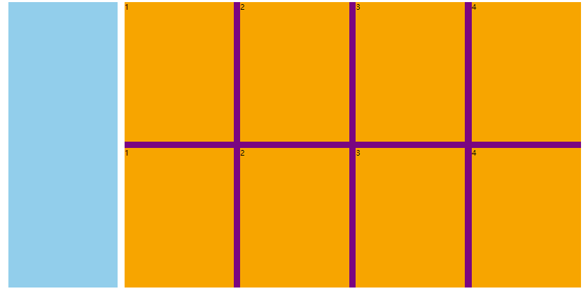

~~~html
<!DOCTYPE html>
<html lang="en">

<head>
  <meta charset="UTF-8">
  <meta http-equiv="X-UA-Compatible" content="IE=edge">
  <meta name="viewport" content="width=device-width, initial-scale=1.0">
  <title>Document</title>

  <style>
    * {
      margin: 0;
      padding: 0;
      box-sizing: border-box;
    }

    .mi {
      /* 父控子 */
      display: flex;
      justify-content: space-between;
      width: 1226px;
      height: 614px;
      /* background-color: pink; */
      margin: 100px auto;
    }

    .left {
      width: 234px;
      height: 614px;
      background-color: skyblue;
    }

    .right {
      width: 978px;
      height: 614px;
      background-color: purple;
    }

    .right ul {
      display: flex;
      /* 让li 自动换行 */
      flex-wrap: wrap;
      /* 主轴两侧对齐 */
      justify-content: space-between;

    }

    .right li {
      width: 234px;
      height: 300px;
      background-color: orange;
      list-style: none;
      margin-bottom: 14px;
    }
  </style>
</head>

<body>
  <div class="mi">
    <div class="left"></div>
    <div class="right">
      <ul>
        <li>1</li>
        <li>2</li>
        <li>3</li>
        <li>4</li>
        <li>1</li>
        <li>2</li>
        <li>3</li>
        <li>4</li>
      </ul>
    </div>
  </div>
</body>

</html>
~~~


### 多行对齐方式

> 如果有多行侧轴对齐，则去找align-content
>
> 如果是单行侧轴对齐，则去找 align-items

属性名：**align-content** 


> 注意：该属性对**单行**弹性盒子模型**无效**。 

~~~html
<!DOCTYPE html>
<html lang="en">

<head>
  <meta charset="UTF-8">
  <meta http-equiv="X-UA-Compatible" content="IE=edge">
  <meta name="viewport" content="width=device-width, initial-scale=1.0">
  <title>Document</title>
  <style>
    .box {
      display: flex;
      /* 换行 */
      flex-wrap: wrap;
      /* 主轴对齐 */
      justify-content: space-between;
      /* 侧轴单行控制 */
      /* align-items: center; */
      /* 侧轴多行对齐 */

      /* align-content: center; */
      align-content: space-between;
      width: 1000px;
      /* 亲父亲得有高度 */
      height: 500px;
      border: 3px solid #000;
      margin: 100px auto;
    }

    .box div {
      width: 300px;
      height: 200px;
      background-color: pink;
    }
  </style>
</head>

<body>
  <div class="box">
    <div>1</div>
    <div>2</div>
    <div>3</div>
    <div>4</div>
    <div>5</div>
    <div>6</div>
  </div>
</body>

</html>
~~~

 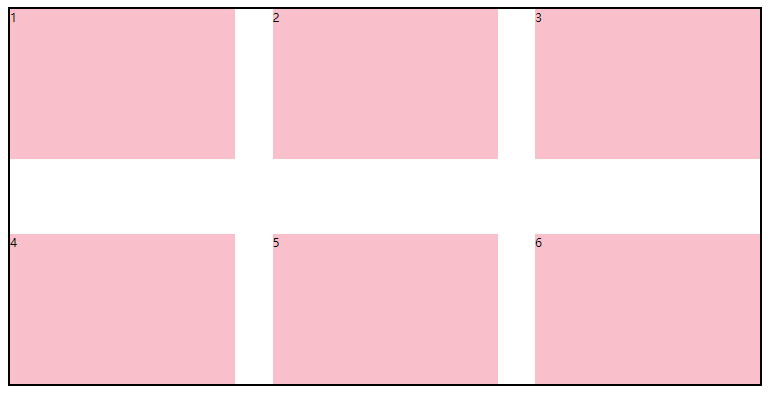

### 修改主轴方向

>为什么要修改主轴？  只要父亲添加了display: flex, 所有的子盒子都会一行显示（水平显示）  → 
>
>但是， 我们很多情况下，需要 盒子垂直竖着显示，此时就需要把主轴修改一下。修改为 竖着   ↓


主轴默认在水平方向，侧轴默认在垂直方向**

属性名：**flex-direction**

 

想要如下效果：

 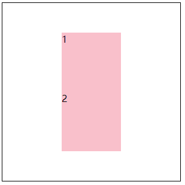

代码：

~~~html
<!DOCTYPE html>
<html lang="en">

<head>
  <meta charset="UTF-8">
  <meta http-equiv="X-UA-Compatible" content="IE=edge">
  <meta name="viewport" content="width=device-width, initial-scale=1.0">
  <title>Document</title>
  <style>
    .box {
      display: flex;
      /* 默认主轴是横向 row  */
      /* 更改主轴的方向 我想要1和2盒子竖着排列 */
      flex-direction: column;
      width: 300px;
      height: 300px;
      border: 1px solid #000;
      /* 主轴 */
      justify-content: center;
      /* 侧轴 */
      align-items: center;

    }

    .box div {
      width: 100px;
      height: 100px;
      background-color: pink;
    }
  </style>
</head>

<body>
  <div class="box">
    <div>1</div>
    <div>2</div>
  </div>
</body>
   
  
  
   
  
</html>
~~~


### 弹性伸缩比

作用：控制弹性盒子的主轴方向的尺寸。

属性名：**flex**

属性值：整数数字，表示占用**父级剩余尺寸的份数**。

~~~html
<!DOCTYPE html>
<html lang="en">

<head>
  <meta charset="UTF-8">
  <meta http-equiv="X-UA-Compatible" content="IE=edge">
  <meta name="viewport" content="width=device-width, initial-scale=1.0">
  <title>Document</title>
  <style>
    .box {
      display: flex;
      width: 80%;
      height: 200px;
      border: 1px solid #000;
    }

    .box span {
      /* 不会区分原来属于什么模式 */
      /* width: 100px;
      height: 100px;
      background-color: pink; */
      flex: 1;
      background-color: pink;
    }

    /* 圣杯布局两侧固定，中间自适应 */
    .left,
    .right {
      width: 100px;
      background-color: skyblue;
    }

    .center {
      flex: 1;
      background-color: purple;
    }

    .center1 {
      flex: 2;
      background-color: pink;
    }
  </style>
</head>

<body>
  <div class="box">
    <span>1</span>
    <span>2</span>
    <span>3</span>
    <span>4</span>
  </div>

  <div class="box">
    <div class="left">左</div>
    <div class="center">中</div>
    <div class="center1">中</div>
    <div class="right">右</div>
  </div>
</body>

</html>
~~~

 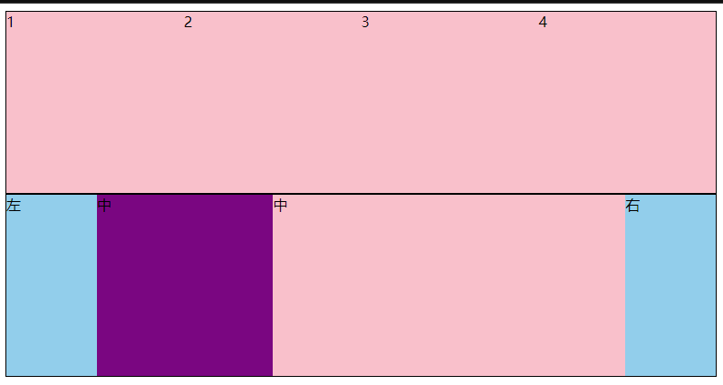

## 01-项目目录

网站根目录是指存放网站的**第一层**文件夹，内部包含当前网站的**所有素材**，包含 HTML、CSS、图片、JavaScript等等。 

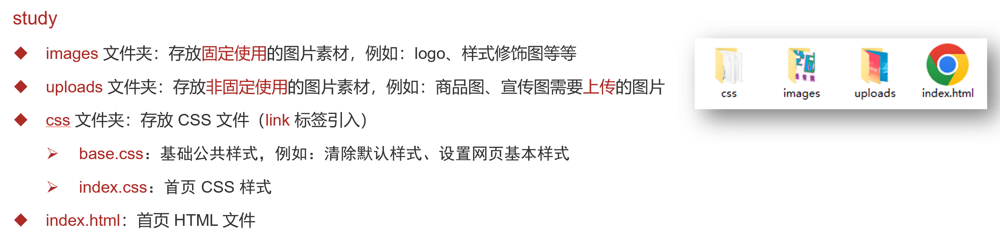

* 首页引入CSS文件

```html
<!-- 顺序要求：先清除再设置 -->
<link rel="stylesheet" href="./css/base.css">
<link rel="stylesheet" href="./css/index.css">
```

## 02-版心居中

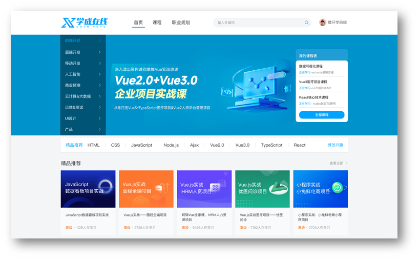

```css
.wrapper {
  margin: 0 auto;
  width: 1200px;
}

body {
  background-color: #f3f5f7;
}
```

## 03-布局思路

1. 布局思路：先整体再局部，从外到内，从上到下，从左到右
2. CSS 实现思路
   1. 画盒子，调整盒子范围 → 宽高背景色
   2. 调整盒子位置 → flex 布局、内外边距
   3. 控制图片、文字内容样式

## 04-header区域-整体布局

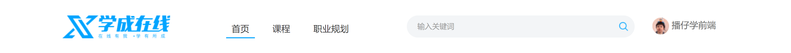

### HTML结构

```html
<!-- 头部区域 -->
<div class="header">
  <div class="wrapper">
    <!-- logo -->
    <div class="logo">logo</div>
    <!-- 导航 -->
    <div class="nav">导航</div>
    <!-- 搜索 -->
    <div class="search">search</div>
    <!-- 用户 -->
    <div class="user">用户</div>
  </div>
</div>
```

### CSS样式

```css
/* 头部区域 */
.header {
  height: 100px;
  background-color: #fff;
}

.header .wrapper {
  padding-top: 29px;
  display: flex;
}
```

## 05-header区域-logo


logo 功能：

* 单击跳转到首页
* 搜索引擎优化：提升网站百度搜索排名

实现方法：

* 标签结构：h1 > a > 网站名称（搜索关键字）

```html
<div class="logo">
  <h1><a href="#" title="学成在线">学成在线</a></h1>
</div>
```

* CSS 样式

```css
/* logo */
.logo a {
  display: block;
  width: 195px;
  height: 41px;
  background-image: url(../images/logo.png);
  font-size: 0;
}
```

## 06-header区域-导航

实现方法：

* 标签结构：ul > **li * 3** > a
* 优势：**避免堆砌 a 标签**，**网站搜索排名降级**

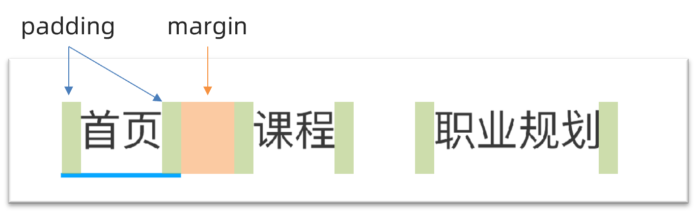

### HTML结构

```html
<!-- nav 导航 -->
<div class="nav">
  <ul>
    <li><a href="#">首页</a></li>
    <li><a href="#">课程</a></li>
    <li><a href="#">职业规划</a></li>
  </ul>
</div>
```

### CSS样式

```css
/* nav导航 */
.nav {
  margin-left: 100px;
}

.nav ul {
  display: flex;
}

.nav li {
  margin-right: 20px;
}

.nav li a {
  font-size: 19px;
  padding: 8px;
  line-height: 34px;

}

.nav li a:hover {
  border-bottom: 2px solid #00a4ff;
}
```

## 07-header区域-搜索布局

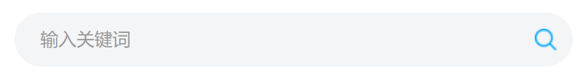

### HTML结构

```html
<div class="search"></div>
```

### CSS样式

```css
/* 搜索 */
.search {
  width: 412px;
  height: 40px;
  background-color: #f3f5f7;
  border-radius: 20px;
  margin-left: 80px;
}

```

## 08-header区域-搜索内容

### HTML结构

```html
<!-- search 搜索  -->
<div class="search">
  <input type="search" placeholder="输入关键词">
</div>

```

### CSS样式

```css
.search input {
  width: 412px;
  height: 40px;
  /* 背景色透明 */
  background-color: transparent;
  /* 自带边框为0不显示 */
  border: 0;
  padding-left: 20px;
  padding-right: 30px;
  /* 去掉点击之后显示的黑色边框 */
  outline: 0;
}
```

## 09-header区域-用户区域

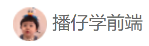

### HTML结构

```html
<div class="user">
  <a href="#">
    
    <span>播仔学前端</span>
  </a>
</div>
```

### CSS样式

```css
/* 用户模块 */
.user {
  margin-left: 32px;
}

.user img {
  /* 让文字和图片垂直居中对齐 */
  vertical-align: middle;
}

.user span {
  color: #666666;
}

```

## 10-banner区域-布局

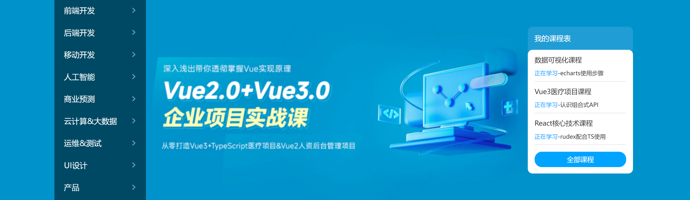

### HTML结构

```html
<div class="banner">
  <div class="wrapper">
    <div class="left">left</div>
    <div class="right">right</div>
  </div>
</div>
```

### CSS样式

```css
/* header盒子制作结束啦 */

/* banner开始 */
.banner {
  height: 420px;
  background-color: #0092cb;
}

.banner .wrapper {
  height: 420px;
  background: url(../uploads/banner.png);
}

.banner .wrapper {
  display: flex;
  /* 主轴两侧对齐 */
  justify-content: space-between;
  /* 侧轴居中 */
  align-items: center;
}

.banner .left {
  width: 191px;
  height: 420px;
  /*背景半透明*/
  background-color: rgba(0, 0, 0, 0.42);
}

.banner .right {
  width: 218px;
  height: 305px;
  background-color: pink;
}
```

## 11-banner区域-侧导航

### HTML结构

```html
<div class="left">
  <ul>
    <li><a href="#">前端开发</a></li>
    <li><a href="#">后端开发</a></li>
    <li><a href="#">移动开发</a></li>
    <li><a href="#">人工智能</a></li>
    <li><a href="#">商业预测</a></li>
    <li><a href="#">云计算&大数据</a></li>
    <li><a href="#">运维&测试</a></li>
    <li><a href="#">UI设计</a></li>
    <li><a href="#">产品</a></li>
  </ul>
</div>
```

### CSS样式

```css
/* 侧导航 */
.banner .left {
  padding: 3px 20px;
  width: 191px;
  height: 420px;
  background-color: rgba(0,0,0,0.42);
}

.banner .left a {
  /* 块级：宽度是父级的100% */
  display: block;
  height: 46px;
  background: url(../images/right.png) no-repeat right center;
  line-height: 46px;
  font-size: 16px;
  color: #fff;
}

.banner .left a:hover {
  background-image: url(../images/right-hover.png);
  color: #00a4ff;
}
```

## 12-banner区域-课程表布局

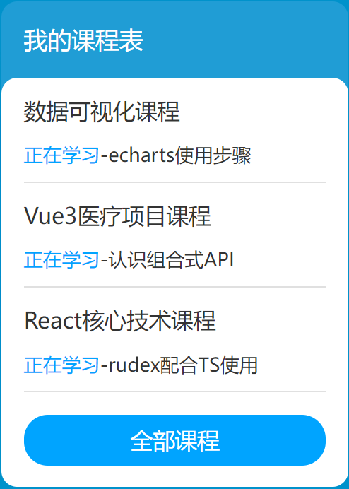

### HTML布局

```html
<div class="right">
  <h3>我的课程表</h3>
  <div class="content">1</div>
</div>
```

### CSS样式

```css
/* 课程表 */
.banner .right {
  margin-top: 60px;
  width: 218px;
  height: 305px;
  background-color: #209dd5;
  border-radius: 10px;
}

.banner .right h3 {
  margin-left: 14px;
  height: 48px;
  line-height: 48px;
  font-size: 15px;
  color: #fff;
  font-weight: 400;
}

.banner .right .content {
  padding: 14px;
  height: 257px;
  background-color: #fff;
  border-radius: 10px;
}
```

## 13-banner区域-课程表内容

### HTML结构

```html
<dl>
  <dt>数据可视化课程</dt>
  <dd><span>正在学习</span>-<strong>echarts使用步骤</strong></dd>
</dl>
<dl>
  <dt>Vue3医疗项目课程  </dt>
  <dd><span>正在学习</span>-<strong>认识组合式API</strong></dd>
</dl>
<dl>
  <dt>React核心技术课程</dt>
  <dd><span>正在学习</span>-<strong>rudex配合TS使用</strong></dd>
</dl>
```

### CSS样式

```css
.banner .right dl {
  margin-bottom: 12px;
  border-bottom: 1px solid #e0e0e0;
}

.banner .right dt {
  margin-bottom: 8px;
  font-size: 14px;
  line-height: 20px;
  font-weight: 700;
}

.banner .right dd {
  margin-bottom: 8px;
  font-size: 12px;
  line-height: 16px;
}

.banner .right dd span {
  color: #00a4ff;
}

.banner .right dd strong {
  color: #7d7d7d;
  font-weight: 400;
}
```

## 14-banner区域-全部课程

### HTML结构

```html
<a href="#">全部课程</a>
```

### CSS样式

```css
.banner .right a {
  display: block;
  height: 32px;
  background-color: #00a4ff;
  text-align: center;
  line-height: 32px;
  font-size: 14px;
  color: #fff;
  border-radius: 15px;
}
```

## 15-精品推荐-区域布局

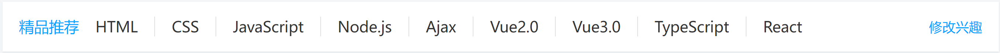

### HTML结构

```html
<!-- 精品推荐 -->
<div class="recommend wrapper">
  <h3>精品推荐</h3>
  <ul>
    <li><a href="#">HTML</a></li>
  </ul>
  <a href="#" class="modify">修改兴趣</a>
</div
```

### CSS样式

```css
/* 精品推荐 */
.recommend {
  display: flex;
  margin-top: 11px;
  padding: 0 20px;
  height: 60px;
  background-color: #fff;
  box-shadow: 0px 1px 2px 0px rgba(211, 211, 211, 0.5);
  line-height: 60px;
}
```

## 16-精品推荐-内容样式

### HTML结构

```html
<ul>
  <li><a href="#">HTML</a></li>
  <li><a href="#">CSS</a></li>
  <li><a href="#">JavaScript</a></li>
  <li><a href="#">Node.js</a></li>
  <li><a href="#">Ajax</a></li>
  <li><a href="#">Vue2.0</a></li>
  <li><a href="#">Vue3.0</a></li>
  <li><a href="#">TypeScript</a></li>
  <li><a href="#">React</a></li>
</ul>
```

### CSS样式

```css
.recommend h3 {
  font-size: 18px;
  color: #00a4ff;
  font-weight: 400;
}

.recommend ul {
  /* 除去标题和修改兴趣的尺寸，父级剩余尺寸都给ul，实现把修改兴趣挤到最右侧 */
  flex: 1;
  display: flex;
}

.recommend ul li a {
  padding: 0 24px;
  border-right: 1px solid #e0e0e0;
  font-size: 18px;
}

.recommend ul li:last-child a {
  border-right: 0;
}

.recommend .modify {
  font-size: 16px;
  color: #00a4ff;
}
```

## 17-推荐课程-标题区域

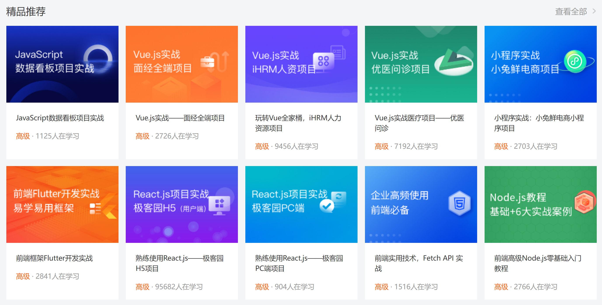

### HTML结构

```html
<!-- 精品推荐课程 -->
<div class="course wrapper">
  <!-- 标题 -->
  <div class="hd">
    <h3>精品推荐</h3>
    <a href="#" class="more">查看全部</a>
  </div>
  <!-- 内容 -->
  <div class="bd">1</div>
</div>
```

### CSS样式

```css
/* 推荐课程 */
.course {
  margin-top: 15px;
}

/* 标题 - 公共类，与其他区域共用 */
.hd {
  display: flex;
  justify-content: space-between;
  height: 60px;
  line-height: 60px;
}

.hd h3 {
  font-size: 21px;
  font-weight: 400;
}

.hd .more {
  padding-right: 20px;
  background: url(../images/more.png) no-repeat right center;
  font-size: 14px;
  color: #999;
}
```

## 18-推荐课程-内容布局

### HTML结构

```html
<ul>
  <li>1</li>
  <li>2</li>
  <li>3</li>
  <li>4</li>
  <li>5</li>
  <li>6</li>
  <li>7</li>
  <li>8</li>
</ul>
```

### CSS样式

```css
/* 课程内容 - 公共类 */
.bd ul {
  display: flex;
  flex-wrap: wrap;
  justify-content: space-between;
}

.bd li {
  margin-bottom: 14px;
  width: 228px;
  height: 271px;
  background-color: pink;
}
```

## 19-推荐课程-内容样式

### HTML结构

```html
<ul>
  <li>
    <a href="#">
      <div class="pic"></div>
      <div class="text">
        <h4>JavaScript数据看板项目实战</h4>
        <p><span>高级</span> · <i>1125</i>人在学习</p>
      </div>
    </a>
  </li>
  <li>
    <a href="#">
      <div class="pic"></div>
      <div class="text">
        <h4>Vue.js实战——面经全端项目</h4>
        <p><span>高级</span> · <i>2726</i>人在学习</p>
      </div>
    </a>
  </li>
  <li>
    <a href="#">
      <div class="pic"></div>
      <div class="text">
        <h4>玩转Vue全家桶，iHRM人力资源项目</h4>
        <p><span>高级</span> · <i>9456</i>人在学习</p>
      </div>
    </a>
  </li>
  <li>
    <a href="#">
      <div class="pic"></div>
      <div class="text">
        <h4>Vue.js实战医疗项目——优医问诊</h4>
        <p><span>高级</span> · <i>7192</i>人在学习</p>
      </div>
    </a>
  </li>
  <li>
    <a href="#">
      <div class="pic"></div>
      <div class="text">
        <h4>小程序实战：小兔鲜电商小程序项目</h4>
        <p><span>高级</span> · <i>2703</i>人在学习</p>
      </div>
    </a>
  </li>
  <li>
    <a href="#">
      <div class="pic"></div>
      <div class="text">
        <h4>前端框架Flutter开发实战</h4>
        <p><span>高级</span> · <i>2841</i>人在学习</p>
      </div>
    </a>
  </li>
  <li>
    <a href="#">
      <div class="pic"></div>
      <div class="text">
        <h4>熟练使用React.js——极客园H5项目</h4>
        <p><span>高级</span> · <i>95682</i>人在学习</p>
      </div>
    </a>
  </li>
  <li>
    <a href="#">
      <div class="pic"></div>
      <div class="text">
        <h4>熟练使用React.js——极客园PC端项目</h4>
        <p><span>高级</span> · <i>904</i>人在学习</p>
      </div>
    </a>
  </li>
  <li>
    <a href="#">
      <div class="pic"></div>
      <div class="text">
        <h4>前端实用技术，Fetch API 实战</h4>
        <p><span>高级</span> · <i>1516</i>人在学习</p>
      </div>
    </a>
  </li>
  <li>
    <a href="#">
      <div class="pic"></div>
      <div class="text">
        <h4>前端高级Node.js零基础入门教程</h4>
        <p><span>高级</span> · <i>2766</i>人在学习</p>
      </div>
    </a>
  </li>
</ul>
```

### CSS样式

```css
.bd li .pic {
  height: 156px;
}

.bd li .text {
  padding: 20px;
  height: 115px;
  background-color: #fff;
}

.bd li .text h4 {
  margin-bottom: 13px;
  height: 40px;
  font-size: 14px;
  line-height: 20px;
  font-weight: 400;
}

.bd li .text p {
  font-size: 14px;
  line-height: 20px;
  color: #999;
}

.bd li .text p span {
  color: #fa6400;
}

.bd li .text p i {
  font-style: normal;
}
```

## 20-前端开发工程师区域

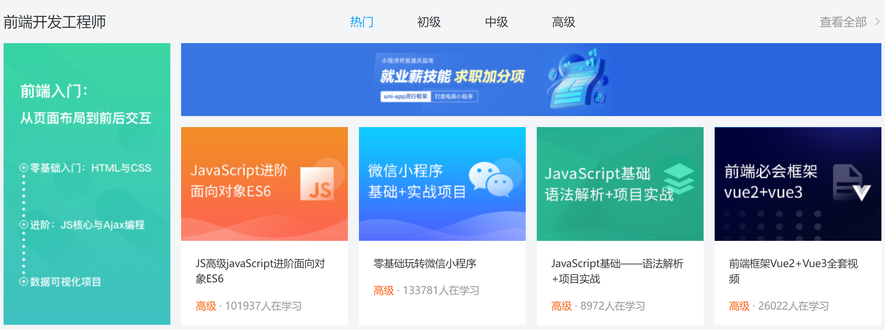

### HTML结构

```html
<!-- 前端 -->
<div class="wrapper">
  <!-- 标题 -->
  <div class="hd">
    <h3>前端开发工程师</h3>
    <ul>
      <li><a href="#" class="active">热门</a></li>
      <li><a href="#">初级</a></li>
      <li><a href="#">中级</a></li>
      <li><a href="#">高级</a></li>
    </ul>
    <a href="#" class="more">查看全部</a>
  </div>
  <div class="bd">
    <div class="left">
      
    </div>
    <div class="right">
      <div class="top"></div>
      <div class="bottom">
        <ul>
          <li>
            <a href="#">
              <div class="pic"></div>
              <div class="text">
                <h4>JS高级javaScript进阶面向对象ES6</h4>
                <p><span>高级</span> · <i>101937</i>人在学习</p>
              </div>
            </a>
          </li>
          <li>
            <a href="#">
              <div class="pic"></div>
              <div class="text">
                <h4>零基础玩转微信小程序</h4>
                <p><span>高级</span> · <i>133781</i>人在学习</p>
              </div>
            </a>
          </li>
          <li>
            <a href="#">
              <div class="pic"></div>
              <div class="text">
                <h4>JavaScript基础——语法解析+项目实战</h4>
                <p><span>高级</span> · <i>8927</i>人在学习</p>
              </div>
            </a>
          </li>
          <li>
            <a href="#">
              <div class="pic"></div>
              <div class="text">
                <h4>前端框架Vue2+Vue3全套视频</h4>
                <p><span>高级</span> · <i>26022</i>人在学习</p>
              </div>
            </a>
          </li>
        </ul>
      </div>
    </div>
  </div>
</div>
```

### CSS样式

```css
/* 前端 */
.hd ul {
  display: flex;
}

.hd li {
  margin-right: 60px;
  font-size: 16px;
}

.hd li .active {
  color: #00a4ff;
}

.bd {
  display: flex;
  justify-content: space-between;
}

.bd .left {
  width: 228px;
  /* background-color: pink; */
}

.bd .right {
  width: 957px;
  /* background-color: pink; */
}

.bd .right .top {
  margin-bottom: 15px;
  height: 100px;
}
```

## 21-版权-布局

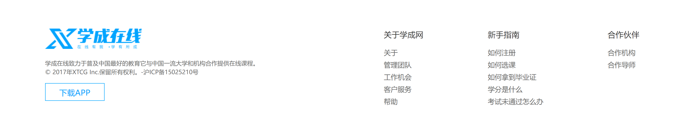

### HTML结构

```html
<!-- 版权 -->
<div class="footer">
  <div class="wrapper">
    <div class="left">left</div>
    <div class="right">right</div>
  </div>
</div>
```

### CSS样式

```css
/* 版权 */
.footer {
  margin-top: 60px;
  padding-top: 60px;
  height: 273px;
  background-color: #fff;
}

.footer .wrapper {
  display: flex;
  justify-content: space-between;
}

.footer .left {
  width: 440px;
  background-color: pink;
}
```

## 22-版权-内容

### HTML结构

```html
<div class="left">
  <a href="#"></a>
  <p>学成在线致力于普及中国最好的教育它与中国一流大学和机构合作提供在线课程。
    © 2017年XTCG Inc.保留所有权利。-沪ICP备15025210号</p>
  <a href="#" class="download">下载APP</a>
</div>
<div class="right">
  <dl>
    <dt>关于学成网</dt>
    <dd><a href="#">关于</a></dd>
    <dd><a href="#">管理团队</a></dd>
    <dd><a href="#">工作机会</a></dd>
    <dd><a href="#">客户服务</a></dd>
    <dd><a href="#">帮助</a></dd>
  </dl>
  <dl>
    <dt>新手指南</dt>
    <dd><a href="#">如何注册</a></dd>
    <dd><a href="#">如何选课</a></dd>
    <dd><a href="#">如何拿到毕业证</a></dd>
    <dd><a href="#">学分是什么</a></dd>
    <dd><a href="#">考试未通过怎么办</a></dd>
  </dl>
  <dl>
    <dt>合作伙伴</dt>
    <dd><a href="#">合作机构</a></dd>
    <dd><a href="#">合作导师</a></dd>
  </dl>
</div>
```

### CSS样式

```css
.footer .left p {
  margin-top: 24px;
  margin-bottom: 14px;
  font-size: 12px;
  line-height: 17px;
  color: #666;
}

.footer .left .download {
  display: block;
  width: 120px;
  height: 36px;
  border: 1px solid #00a4ff;
  text-align: center;
  line-height: 34px;
  font-size: 16px;
  color: #00a4ff;
}

.footer .right {
  display: flex;
}

.footer .right dl {
  margin-left: 130px;
}

.footer .right dt {
  margin-bottom: 12px;
  font-size: 16px;
  line-height: 23px;
}

.footer .right a {
  font-size: 14px;
  color: #666;
  line-height: 24px;
}
```

