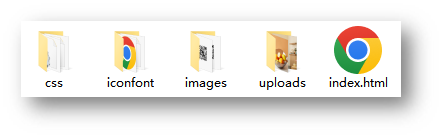
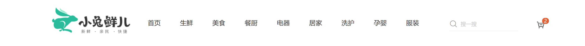

# day09-小兔鲜儿

## 显示和隐藏

~~~html
<!DOCTYPE html>
<html lang="en">

<head>
  <meta charset="UTF-8">
  <meta http-equiv="X-UA-Compatible" content="IE=edge">
  <meta name="viewport" content="width=device-width, initial-scale=1.0">
  <title>Document</title>
  <style>
    .box1 {
      width: 200px;
      height: 200px;
      background-color: pink;
      /* 隐藏盒子： display 不占位置   none  block(常用）*/
      /* display: none; */
      /* 隐藏盒子 visibility 占位置  hidden  visible */
      visibility: hidden;
      /* visibility: visible; */
    }

    .box2 {
      /* 绝对定位 */
      /* position: absolute; */
      /* 记得加上边偏移 */
      /* top: 0; */
      width: 200px;
      height: 200px;
      background-color: purple;
    }
  </style>
</head>

<body>
  <div class="box1"></div>
  <div class="box2"></div>
</body>

</html>
~~~

 

## 01-搭建项目目录



* xtx-pc
  * images 文件夹：存放固定使用的图片素材，例如：logo、样式修饰图等等
  * uploads 文件夹：存放非固定使用的图片素材，例如：商品图、宣传图需要上传的图片
  * iconfont 文件夹：字体图标素材
  * css 文件夹：存放 CSS 文件（link 标签引入）
    * base.css：基础公共样式
    * common.css：各个网页相同模块的重复样式，例如：头部、底部
    * index.css：首页 CSS 样式
  * index.html：首页 HTML 文件

### 引入样式表

```html
<!-- 引入字体图标css文件 -->
  <link rel="stylesheet" href="./iconfont/iconfont.css">
  <!-- 初始化的css文件 -->
  <link rel="stylesheet" href="./css/base.css">
  <!-- 引入公共样式 -->
  <link rel="stylesheet" href="./css/common.css">
  <!-- 引入index css 文件 -->
  <link rel="stylesheet" href="./css/index.css">
```

## 02-网页头部SEO三大标签

SEO：搜索引擎优化，提升网站百度搜索排名

提升SEO的常见方法：

1. 竞价排名
2. 将网页制作成html后缀
3. 标签语义化（在合适的地方使用合适的标签）
4. ……

网页头部 SEO 标签：

* title：网页标题标签
* description：网页描述
* keywords：网页关键词


```html
<!-- meta:desc -->
<meta name="description" content="小兔鲜儿官网，致力于打造全球最大的食品、生鲜电商购物平台。">
<!-- meta:kw -->
<meta name="keywords" content="小兔鲜儿,食品,生鲜,服装,家电,电商,购物">
<title>小兔鲜儿-新鲜、惠民、快捷！</title>
```

## 03-Favicon图标


Favicon 图标：网页图标，出现在浏览器标题栏，增加网站辨识度。

图标：**favicon.ico**，一般存放到网站的**根目录**里面


```html
<!-- link:favicon -->
<link rel="shortcut icon" href="favicon.ico" type="image/x-icon">
```

## 04-版心

> common.css

```css
/* 版心 */
.wrapper {
  margin: 0 auto;
  width: 1240px;
}

/* 声明颜色变量 */
:root {
  /* 灰色变量 */
  --hui: #a1a1a1;
  /* 绿色 */
  --lv: #00BE9A;
}
```

## css变量

~~~html
<!DOCTYPE html>
<html lang="en">

<head>
  <meta charset="UTF-8">
  <meta http-equiv="X-UA-Compatible" content="IE=edge">
  <meta name="viewport" content="width=device-width, initial-scale=1.0">
  <title>Document</title>
  <style>
    /* 1. 声明变量 */
    :root {
      --myColor: blue;
    }

    /* 2. 使用变量 */
    .box {
      color: var(--myColor);
    }

    .box1 {
      background-color: var(--myColor);
    }

    .box2 {
      border: 1px solid var(--myColor);
    }
  </style>
</head>

<body>
  <div class="box">文字</div>
  <div class="box1">文字</div>
  <div class="box2">文字</div>
</body>

</html>
~~~


## 05-快捷导航-布局


### HTML结构

```html
<!-- 快捷导航 -->
<div class="shortcut">
  <div class="wrapper">1</div>
</div>
```

### CSS样式

```css
/* 头部开始 */

/* 快捷导航 */
.shortcut {
  height: 52px;
  background-color: #333;
}

.shortcut .wrapper {
  line-height: 52px;
  /* background-color: pink; */
  display: flex;
  /* 让这个盒子里面的ul 走到右侧 */
  justify-content: flex-end;
}
```

## 06-快捷导航-内容

### HTML结构

```html
<ul>
  <li><a href="#" class="login">请先登录</a></li>
  <li><a href="#">免费注册</a></li>
  <li><a href="#">我的订单</a></li>
  <li><a href="#">会员中心</a></li>
  <li><a href="#">帮助中心</a></li>
  <li><a href="#">在线客服</a></li>
  <li><a href="#"><span class="iconfont icon-mobile-phone"></span>手机版</a></li>
</ul>
```

### CSS样式

```css

.shortcut .wrapper ul {
  display: flex;
}

.shortcut li a {
  font-size: 14px;
  color: #fff;
  padding: 0 15px;
  border-right: 1px solid #999;
}

.shortcut li a:hover {
  /* 变量绿色 */
  color: var(--lv);
}

.shortcut li a i {
  /* 转换为行内块 */
  display: inline-block;
  font-size: 19px;
  /* 让小图标和文字垂直居中 */
  vertical-align: middle;
  margin-top: -3px;
}

.shortcut li:last-child a {
  border-right: 0;
}

```

## 07-头部-布局



### HTML结构

```html
<!-- 头部 -->
<div class="header wrapper">
  <!-- logo -->
  <div class="logo">logo</div>
  <!-- 导航 -->
  <div class="nav">导航</div>
  <!-- 搜索 -->
  <div class="search">搜索</div>
  <!-- 购物车 -->
  <div class="cart">购物车</div>
</div>
```

### CSS样式

```css
/* header 模块 */
.header {
  padding: 22px 0;
  display: flex;
}

```

## 08-头部-logo

### HTML结构

```html
<!-- logo -->
<div class="logo">
  <h1>
    <a href="./index.html" title="小兔鲜儿">小兔鲜儿</a>
  </h1>
</div>
```

### CSS样式

```css
.header .logo {
  width: 200px;
  height: 88px;
  background: pink;
}

.header .logo a {
  display: block;
  height: 88px;
  background: url(../images/logo.png);
  /* 1. 隐藏文字 */
  /* font-size: 0; */
  /* 2. 隐藏文字 淘宝  小米方法 */
  text-indent: -9999em;
  overflow: hidden;
}
```

## 09-头部-导航

### HTML结构

```html
<!-- nav -->
<div class="nav">
  <ul>
    <li><a href=" ">首页</a></li>
    <li><a href="#">生鲜</a></li>
    <li><a href="#">美食</a></li>
    <li><a href="#">餐厨</a></li>
    <li><a href="#">电器</a></li>
    <li><a href="#">居家</a></li>
    <li><a href="#">洗护</a></li>
    <li><a href="#">孕婴</a></li>
    <li><a href="#">服装</a></li>
  </ul>
</div>
```

### CSS样式

```css
/* nav */
.header .nav ul {
  display: flex;
  /* background-color: pink; */
  margin: 25px 0 0 41px;
}

.header .nav li a {
  display: block;
  line-height: 42px;
  margin-right: 42px;
}

.header .nav li a:hover {
  color: var(--lv);
  border-bottom: 2px solid var(--lv);
}

```

## 10-头部-搜索

### HTML结构

```html
<!-- search  -->
<div class="search">
  <i class="iconfont icon-search"></i>
  <input type="text" placeholder="搜一搜">
</div>
```

### CSS样式

```scss

/* search  */
.search {
  position: relative;
  width: 220px;
  height: 40px;
  /* background-color: pink; */
  margin-top: 22px;
}

.search i {
  position: absolute;
  left: 0;
  top: 5px;
  font-size: 20px;
  color: #ccc;
  /* 鼠标变成小手 */
  cursor: pointer;
}

.search input {
  width: 170px;
  height: 40px;
  padding-left: 28px;
  border-bottom: 2px solid #F4F4F4;
  transition: all .3s;
}

/* 修改 placeholder 里面的文字样式 */
.search input::placeholder {
  color: #ccc;
}

/* input获得光标 */
.search input:focus {
  width: 220px;
}

```

## 11-头部-购物车

### HTML结构

```html
<!-- car 车 -->
<div class="car">
  <i class="iconfont icon-cart-full"></i>
  <span>2</span>
</div>
```

### CSS样式

```CSS

/* car  */
.car {
  position: relative;
  margin: 20px 0 0 15px;
}

.car i {
  font-size: 36px;
}

.car span {
  position: absolute;
  top: 0;
  left: 22px;
  padding: 0 8px;
  background-color: #E26237;
  color: #fff;
  border-radius: 11px;
}
```

## 12-底部-布局


### HTML结构

```html
<!-- 底部 -->
<div class="footer">
  <div class="wrapper">
    <!-- 服务 -->
    <div class="service">服务</div>
    <!-- 帮助中心 -->
    <div class="help">帮助中心</div>
    <!-- 版权 -->
    <div class="copyright">版权</div>
  </div>
</div>
```

### CSS样式

```css
/* 底部 */
.footer {
  height: 580px;
  background-color: #F5F5F5;
}

/* 服务 */
.service {
  padding: 60px 0;
  height: 178px;
  border-bottom: 1px solid #E8E8E8;
}

/* 帮助中心 */
.help {
  display: flex;
  justify-content: space-between;
  padding-top: 60px;
  height: 300px;
  background-color: pink;
}
```

## 13-底部-服务区域

### HTML结构

```html
<ul>
  <li>
    <h5></h5>
    <p>价格亲民</p>
  </li>
  <li>
    <h5></h5>
    <p>物流快捷</p>
  </li>
  <li>
    <h5></h5>
    <p>品质新鲜</p>
  </li>
  <li>
    <h5></h5>
    <p>售后无忧</p>
  </li>
</ul>
```

### CSS结构

```css
.service ul {
  display: flex;
  justify-content: space-evenly;
}

.service li {
  display: flex;
  width: 190px;
  height: 58px;
  /* background-color: pink; */
}

.service li h5 {
  margin-right: 20px;
  width: 58px;
  height: 58px;
  background-image: url(../images/sprite.png);
}

.service li p {
  font-size: 28px;
  line-height: 58px;
}

.service li:nth-child(2) h5 {
  background-position: 0 -58px;
}
.service li:nth-child(3) h5 {
  background-position: 0 -116px;
}
.service li:nth-child(4) h5 {
  background-position: 0 -174px;
}
```

## 14-底部-帮助中心-左侧

### HTML结构

```html
<div class="left">
  <dl>
    <dt>购物指南</dt>
    <dd><a href="#">购物流程</a></dd>
    <dd><a href="#">支付方式</a></dd>
    <dd><a href="#">售后规则</a></dd>
  </dl>
  <dl>
    <dt>配送方式</dt>
    <dd><a href="#">配送运费</a></dd>
    <dd><a href="#">配送范围</a></dd>
    <dd><a href="#">配送时间</a></dd>
  </dl>
  <dl>
    <dt>关于我们</dt>
    <dd><a href="#">平台规则</a></dd>
    <dd><a href="#">联系我们</a></dd>
    <dd><a href="#">问题反馈</a></dd>
  </dl>
  <dl>
    <dt>售后服务</dt>
    <dd><a href="#">售后政策</a></dd>
    <dd><a href="#">退款说明</a></dd>
    <dd><a href="#">取消订单</a></dd>
  </dl>
  <dl>
    <dt>服务热线</dt>
    <dd><a href="#">在线客服<span class="iconfont icon-customer-service"></span></a></dd>
    <dd><a href="#">客服电话 400-0000-000</a></dd>
    <dd><a href="#">工作时间 周一至周日 8:00-18:00</a></dd>
  </dl>
</div>
```

### CSS样式

```css
/* left */
.help .left {
  display: flex;
}

.help .left dl {
  margin-right: 84px;
}

.help .left dl:last-child {
  margin-right: 0;
}

.help .left dt {
  margin-bottom: 30px;
  font-size: 18px;
}

.help .left dd {
  margin-bottom: 10px;
}

.help .left a {
  color: #969696;
}

.help .left .iconfont {
  color: #5EB69C;
}
```

## 15-底部-帮助中心-右侧

### HTML结构

```html
<div class="right">
  <ul>
    <li>
      <div class="pic"></div>
      <p>微信公众号</p>
    </li>
    <li>
      <div class="pic"></div>
      <p>APP下载二维码</p>
    </li>
  </ul>
</div>
```

### CSS样式

```css
/* right */
.help .right ul {
  display: flex;
}

.help .right li:first-child {
  margin-right: 55px;
}

.help .right .pic {
  margin-bottom: 10px;
  width: 120px;
  height: 120px;
}

.help .right p {
  color: #969696;
  text-align: center;
}
```

## 16-底部-版权

### HTML结构

```html
<p>
  <a href="#">关于我们</a>|
  <a href="#">帮助中心</a>|
  <a href="#">售后服务</a>|
  <a href="#">配送与验收</a>|
  <a href="#">商务合作</a>|
  <a href="#">搜索推荐</a>|
  <a href="#">友情链接</a>
</p>
<p>CopyRight © 小兔鲜</p>
```

### CSS样式

```css
/* 版权 */
.copyright {
  text-align: center;
}

.copyright p {
  margin-bottom: 10px;
  color: #A1A1A1;
}

.copyright p a {
  margin: 0 10px;
  color: #A1A1A1;
}
```