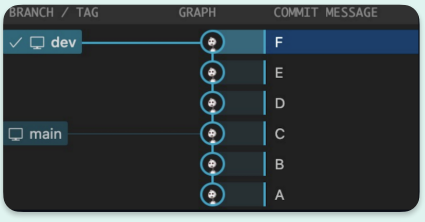
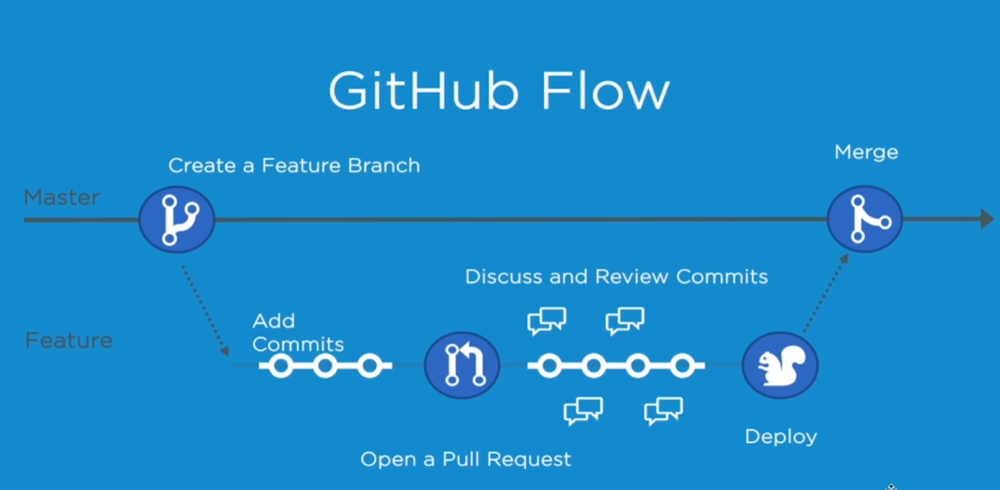

# Git的学习

## Git的初始化配置

> git config --global user.name "Your Name"   **配置用户名**
> 
> git config --global user.email "email地址" **配置邮箱** 
> 
> git config --global credential store **存储配置**

## 创建仓库

> git init <project-name>  
> 创建一个新的本地仓库 （省略project-name则在当前目录创建。）

## Git的工作区域

1. 工作区：就是你在电脑里能实际看到的目录。
2. 暂存区：暂存区也叫索引， 用来临时存放未提交的内容， 一般在.git目录下的index中。
3. 本地仓库：Git在本地的版本库， 仓库信息存储在.git这个隐藏目录中。
4. 远程仓库：托管在远程服务器上的仓库。 常用的有GitHub、 GitLab、 Gitee。

## 文件状态

1. 已修改：修改了但是没有保存到暂存区的文件。
2. 已暂存：修改后已经保存到暂存区的文件。
3. 已提交：把暂存区的文件提交到本地仓库后的状态。

## 添加和提交文件

1. **git status** 查看仓库的状态
2. **git add** 添加到暂存区（也可以使用通配符，例如：git add *.txt 也可以使用目录，例如：git add . ）
3. **git commit -m "message"** 提交所有暂存区的文件到本地仓库
4. **git commit -am "message"** 提交所有已修改的文件到本地仓库
5. **git log** 查看仓库历史提交记录（可以使用--oneline参数查看简洁的提交记录）
6. **git ls-files** 默认情况下，git ls-files 列出所有已跟踪的文件，包括已修改但尚未暂存的文件。

## git reset回退版本  
> 重置当前分支的HEAD为之前的某个提交， 并且删除所有之后的提交。

1. **git reset --hard** 表示重置工作区和暂存区。
2. **git reset --soft** 与mixed基本相似，保留了暂存区的内容。
3. **git reset --mixed** 与soft基本相似，不保留暂存区的内容。（为默认参数）

## 使用git diff 查看差异

1. **git diff** 查看未暂存的文件更新了哪些部分
2. **git diff <commit-id> <commit-id> / git diff HEAD~ HEAD** 查看两个提交之间的差异
3. **git diff HEAD** 查看工作区与版本库之间的差异
4. **git diff --cached / git diff --staged** 查看暂存区与版本库之间的差异
5. **git diff <branch_name> <branch_name>** 比较分支之间的差异

## 使用git rm删除文件
1. **rm file; git add file** 先从工作区删除文件,然后在暂存区删除内容
2. **git rm <file>** 把文件从工作区和暂存区同时删除
3. **git rm --cached <file>** 把文件从暂存区删除，但保留在当前工作区中
4. **git rm -r** * 递归删除某个目录下的所有子目录和文件
5. **git mv <file> <new-file>** 移动一个文件到新的位置（可用作重命名）
> 删除后不要忘记提交

## .gitignore忽略文件
1. **.gitignore** 忽略文件，不需要提交到仓库的文件
2. ***应该忽略哪些文件***
   1. 系统或者软件自动生成的文件
   2. 编译产生的中间文件和结果文件
   3. 运行时生成日志文件、缓存文件、临时文件
   4. 涉及身份、密码、口令、秘钥等敏感信息文件
3. ***.gitignore文件的匹配规则***
   1. 空行或者以#开头的行会被Git忽略。一般空行用于可读性的分隔,#一般用作注释
   2. 使用标准的Blob模式匹配，例如:  
      星号 * 通配任意个字符  
      问号 ? 匹配单个字符  
      中括号[] 表示匹配列表中的单个字符,比如: [abc] 表示a/b/c  
   3. 两个星号 ** 表示匹配任意的中间目录
   4. 中括号可以使用短中线连接，比如:  
      [0-9] 表示任意一位数字,[a-z]表示任意一位小写字母
   5. 感叹号 ! 表示取反

## SSH配置和克隆仓库
1. 生成SSH Key： **ssh-keygen -t rsa -b 4096**  
               私钥文件:*id rsa*  
               公钥文件: *id rsa.pub*
2. 克隆仓库： **git clone repo-address**
3. 推送更新内容： **git push <remote> <branch>**
4. 拉取更新内容： **git pull <remote>**

## 关联本地仓库和远程仓库
1. 添加远程仓库: git remote add <远程仓库别名> <远程仓库地址>  
               git push -u <远程仓库名> <分支名>
2. 查看远程仓库: git remote -v
3. 拉取远程仓库内容： git pull <远程仓库名> <远程分支名>:<本地分支名> （分支名相同可省略冒号后面部分）

## 分支简介和基本操作
1. 查看分支列表 : **git branch**
2. 创建分支 : **git branch branch-name**
3. 切换分支 : **git checkout branch-name** / **git switch branch-name**（推荐）
4. 合并分支 : **git merge branch-name**
<<<<<<< HEAD
5. 删除分支 : *已合并* **git branch -d branch-name** / *未合并* **git branch -D branch-name**
6. 查看分支树形 :  **git log --oneline --graph --decorate --all**
=======
5. 删除分支 ： *已合并* **git branch -d branch-name** / *未合并* **git branch -D branch-name**

## 解决合并冲突
1. 两个分支未修改同一个文件的同一处位置: **Git 自动合并**
2. 两个分支修改了同一个文件的同一处位置: **Git 产生冲突**
3. 解决方法：  
step1 - 手工修改冲突文件，合并冲突内容。  
Step2 - 添加暂存区。 **git add file**  
step3 - 提交修改。 **git commit -m "message"**
4. 中止合并: 当不想继续执行合并操作时可以使用下面的命令来中止合并过程: **git merge --abort**

## 回退和rebase
1. **git checkout -b branch-name ID** 恢复到分支的这个时间点的状态
2. **git rebase branch-name** : rebase 操作可以把本地未push的分叉提交历史整理成直线，看起来更加直观。
   但是，如果多人协作时，不要对已经推送到远程的分支执行rebase操作。  
rebase不会产生新的提交， 而是把当前分支的每一个提交都 “复制”到目标分支上，然后再把当前分支指向目标分支，
   而merge会产生一个新的提交，这个提交有两个分支的所有修改。  
   
3. ***merge***
   1. 优点: 不会破坏原分支的提交历史，方便回溯和查看
   2. 缺点: 会产生额外的提交节点，分支图比较复杂
4. ***rebase***
   1. 优点: 不会新增额外的提交记录，形成线性历史，比较直观和干净
   2. 缺点: 会改变提交历史，改变了当前分支branch out的节点。避免在共享分支使用。

## 工作流模型和分支管理

### **GitFlow** 是一种工作流程模型，用于在Git上管理软件开发项目。
1. **主分支（master/main）** : 代表了项目的稳定版本，每个提交到主分支的代码都应该是经过测试和审核的。
只接受来自hotfix和release的合并请求，不允许直接push修改。
2. **热修复分支（hotfix）** : 用于修复主分支上的紧急问题。热修复分支应该从主分支派生，
并在修复完成后，合并回主分支和开发分支.命名规则: ***hotfix-#issueid-desc***
3. **开发分支（develop）** : 用于日常开发。所有的功能分支、发布分支和修补分支都应该从开发分支派生出来。
4. **功能分支（feature）** : 用于开发单独的功能或者特性。每个功能分支都应该从开发分支派生，
并在开发完成后合并回开发分支。
5. **发布分支（release）** : 用于准备项目发布。发布分支应该从开发分支派生，并在准备好发布版本后合并回主分支和开发分支。

### **GitHub Flow** 工作流程模型示意：

### 分支命名
**推荐使用带有意义的描述性名称来命名分支**
> 版本发布分支/Tag示例 : v1.0.0
> 
> 功能分支示例 : feature-login-page
> 
> 修复分支示例 : hotfix-#issueid-desc

### 分支管理
> 定期合并已经成功验证的分支，及时删除已经合并的分支
> 
> 保持合适的分支数量
> 
> 为分支设置合适的管理权限