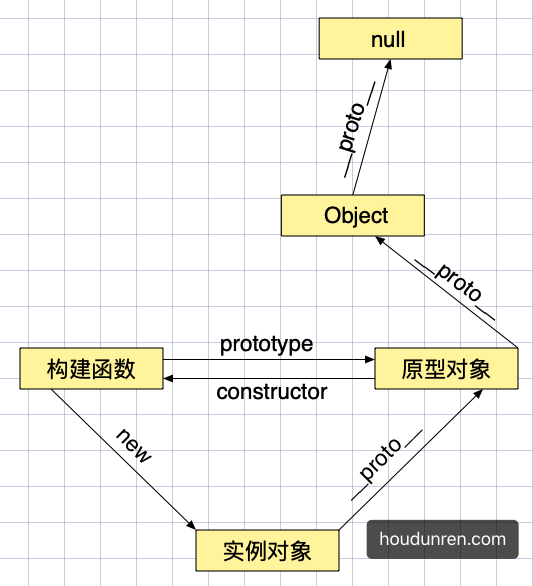

# console.log()

`console.log()` 方法向 Web 控制台输出一条信息。这条信息可能是单个字符串（包括可选的替代字符串），也可能是一个或多个对象。

# 变量提升

解析器会先解析代码，然后把声明的变量的声明提升到最前，这就叫做变量提升。

# TDZ

TDZ 又称暂时性死区，指变量在作用域内已经存在，但必须在`let/const`声明后才可以使用。

# var

使用 `var` 声明的变量存在于最近的函数或全局作用域中，没有块级作用域的机制。

# let

与 `var` 声明的区别是 `let/const` 拥有块作用域

- 建议将`let`在代码块前声明
- 用逗号分隔定义多个

`let`存在块作用域特性，变量只在块域中有效

块内部是可以访问到上层作用域的变量

# const

使用 `const` 用来声明常量，这与其他语言差别不大，比如可以用来声明后台接口的 URI 地址。

- 常量名建议全部大写
- 只能声明一次变量
- 声明时必须同时赋值
- 不允许再次全新赋值
- 可以修改引用类型变量的值
- 拥有块、函数、全局作用域

常量不允许全新赋值

常量的引用类型值可以改变

不同作用域中可以重名定义常量

# Object.freeze

如果冻结变量后，变量也不可以修改了，使用严格模式会报出错误。

# 传值与传址

基本数据类型指数值、字符串等简单数据类型，引用类型指对象数据类型。

基本类型复制是值的复制，互相不受影响。

对于引用类型来讲，变量保存的是引用对象的指针。变量间赋值时其实赋值是变量的指针，这样多个变量就引用的是同一个对象。

# undefined

对声明但未赋值的变量返回类型为 `undefined` 表示值未定义。

对未声明的变量使用会报错，但判断类型将显示 `undefined`。

我们发现未赋值与未定义的变量值都为 `undefined` ，建议声明变量设置初始值，这样就可以区分出变量状态了。

函数参数或无返回值是为`undefined`

# null

`null` 用于定义一个空对象，即如果变量要用来保存引用类型，可以在初始化时将其设置为 null

# 严格模式

严格模式可以让我们及早发现错误，使代码更安全规范，推荐在代码中一直保持严格模式运行。

## 基本差异

1. 变量必须使用关键词声明，未声明的变量不允许赋值
2. 强制声明防止污染全局
3. 关键词不允许做变量使用
4. 变量参数不允许重复定义
5. 能单独为函数设置严格模式
6. 为了在多文件合并时，防止全局设置严格模式对其他没使用严格模式文件的影响，将脚本放在一个执行函数中。

## 解构差异

- 非严格模式可以不使用声明指令，严格模式下必须使用声明。所以建议使用 let 等声明。

# 逻辑与

使用 `&&` 符号表示逻辑与，指符号两端都为 true 时表达式结果为 true。

# 逻辑或

使用 `||` 符号表示逻辑或，指符号左右两端有一方为 true，表达式即成立。

# if

当条件为真时执行表达式代码块。

# switch

可以将 `switch` 理解为 `if` 的另一种结构清晰的写法。

- 如果表达式等于 `case` 中的值，将执行此 `case` 代码段
- `break` 关键字会终止 `switch` 的执行
- 没有任何 `case`匹配时将执行`default` 代码块
- 如果`case`执行后缺少 `break` 则接着执行后面的语句

# while

循环执行语句，需要设置跳出循环的条件否则会陷入死循环状态。

# do/while

后条件判断语句，无论条件是否为真都会先进行循环体。

# for

可以在循环前初始化初始计算变量。

# break/continue

break 用于退出当前循环，continue 用于退出当前循环返回循环起始继续执行。

# label

标签(label) 为程序定义位置，可以使用`continue/break`跳到该位置。

# for/in

用于遍历对象的所有属性，`for/in`主要用于遍历对象，不建议用来遍历数组。

# for/of

用来遍历 Arrays（数组）, Strings（字符串）, Maps（映射）, Sets（集合）等可迭代的数据结构。

与 `for/in` 不同的是 `for/of` 每次循环取其中的值而不是索引。

# typeof

`typeof` 用于返回以下原始类型

- 基本类型：number/string/boolean
- function
- object
- undefined

# instanceof

`instanceof` 运算符用于检测构造函数的 `prototype` 属性是否出现在某个实例对象的原型链上。

也可以理解为是否为某个对象的实例，`typeof`不能区分数组，但`instanceof`则可以。

# String

字符串类型是使用非常多的数据类型，也是相对简单的数据类型。

# 模板字面量

使用 \` ...\` 符号包裹的字符串中可以写入引入变量与表达式

支持换行操作不会产生错误

使用表达式

模板字面量支持嵌套使用

# 标签模板

标签模板是提取出普通字符串与变量，交由标签函数处理

# 获取长度

使用 `length`属性可以获取字符串长度

# 大小写转换

字符串方法`toLowerCase()`和`toUpperCase()`字符串并将所有字符分别转换为小写或大写。

# 移除空白

使用`trim()`删除字符串左右的空白字符

# 获取单字符

根据从 0 开始的位置获取字符

```
console.log('houdunren'.charAt(3))
```

使用数字索引获取字符串

```
console.log('houdunren'[3])
```

# 截取字符串

使用 `slice`、`substr`、`substring` 函数都可以截取字符串。

- slice、substring 第二个参数为截取的结束位置
- substr 第二个参数指定获取字符数量

# 查找字符串

从开始获取字符串位置，检测不到时返回 `-1`

```
console.log('houdunren.com'.indexOf('o')); //1
console.log('houdunren.com'.indexOf('o', 3)); //11 从第3个字符向后搜索
```

从结尾来搜索字符串位置

```
console.log('houdunren.com'.lastIndexOf('o')); //11
console.log('houdunren.com'.lastIndexOf('o', 7)); //1 从第7个字符向前搜索
```

search() 方法用于检索字符串中指定的子字符串，也可以使用正则表达式搜索

```
let str = "houdunren.com";
console.log(str.search("com")); //10
console.log(str.search(/\.com/i)); //9
```

`includes` 字符串中是否包含指定的值，第二个参数指查找开始位置

```
console.log('houdunren.com'.includes('o')); //true
console.log('houdunren.com'.includes('h', 11)); //true
```

`startsWith` 是否是指定位置开始，第二个参数为查找的开始位置。

```
console.log('houdunren.com'.startsWith('h')); //true
console.log('houdunren.com'.startsWith('o', 1)); //true
```

`endsWith` 是否是指定位置结束，第二个参数为查找的结束位置。

```
console.log('houdunren.com'.endsWith('com')); //true
console.log('houdunren.com'.endsWith('o', 2)); //true
```

下面是查找关键词的示例

```
const words = ["php", "css"];
const title = "我爱在后盾人学习php与css知识";
const status = words.some(word => {
  return title.includes(word);
});
console.log(status); //true
```

# 替换字符串

`replace` 方法用于字符串的替换操作

```
let name = "houdunren.com";
web = name.replace("houdunren", "hdcms");
console.log(web); //hdcms.com
```

使用字符串替换来生成关键词链接

```
const word = ["php", "css"];
const string = "我喜欢在后盾人学习php与css知识";
const title = word.reduce((pre, word) => {
  return pre.replace(word, `<a href="?w=${word}">${word}</a>`);
}, string);
document.body.innerHTML += title;
```

# 重复生成

下例是根据参数重复生成星号

```
function star(num = 3) {
	return '*'.repeat(num);
}
console.log(star());
```

下面是模糊后三位电话号码

```
let phone = "98765432101";
console.log(phone.slice(0, -3) + "*".repeat(3));
```

# 类型转换

分隔字母

```
let name = "hdcms";
console.log(name.split(""));
```

将字符串转换为数组

```
console.log("1,2,3".split(",")); //[1,2,3]
```

隐式类型转换会根据类型自动转换类型

```
let hd = 99 + '';
console.log(typeof hd); //string
```

使用 `String` 构造函数可以显示转换字符串类型

```
let hd = 99;
console.log(typeof String(hd));
```

js 中大部分类型都是对象，可以使用类方法 `toString`转化为字符串

```
let hd = 99;
console.log(typeof hd.toString()); //string

let arr = ['hdcms', '后盾人'];
console.log(typeof arr.toString()); //string
```

# Boolean

布尔类型包括 `true` 与 `false` 两个值，开发中使用较多的数据类型。

## 声明定义

使用对象形式创建布尔类型

```
console.log(new Boolean(true)); //true
console.log(new Boolean(false)); //false
```

但建议使用字面量创建布尔类型

```
let hd =true;
```

## 隐式转换

基本上所有类型都可以隐式转换为 Boolean 类型。

|   数据类型    |   true   |   false   |
|:---------:|:--------:|:---------:|
|  String   |  非空字符串   |   空字符串    |
|  Number   | 非 0 的数值  |  0 、NaN   |
|   Array   | 数组不参与比较时 | 参与比较的空数组  |
|  Object   |   所有对象   |           |
| undefined |    无     | undefined |
|   null    |    无     |   null    |
|    NaN    |    无     |    NaN    |

当与 boolean 类型比较时，会将两边类型统一为数字 1 或 0。

- 如果使用 Boolean 与数值比较时，会进行隐式类型转换 true 转为 1，false 转为 0。
- 字符串在与 Boolean 比较时，两边都为转换为数值类型后再进行比较。
- 数组的表现与字符串原理一样，会先转换为数值
- 引用类型的 Boolean 值为真，如对象和数组

# 显式转换

使用 `!!` 转换布尔类型

使用 `Boolean` 函数可以显式转换为布尔类型

# Number

Number 用于表示整数和浮点数，数字是 `Number`实例化的对象，可以使用对象提供的丰富方法。

# NaN

表示无效的数值

NaN 不能使用 `==` 比较，使用以下代码来判断结果是否正确

```
var res = 2 / 'houdunren';
if (Number.isNaN(res)) {
	console.log('Error');
}
```

也可以使用 `Object.is` 方法判断两个值是否完全相同

```
var res = 2 / 'houdunren';
console.log(Object.is(res, NaN));
```

# 类型转换

## Number

使用 Number 函数基本上可以转换所有类型

## parseInt

提取字符串开始去除空白后的数字转为整数。

## parseFloat

转换字符串为浮点数，忽略字符串前面空白字符。

> 比如从表单获取的数字是字符串类型需要类型转换才可以计算，下面使用乘法进行隐式类型转换。

```
<input type="text" name="num" value="66">
<script>
  let num = document.querySelector("[name='num']").value;
  console.log(num + 5); //665

  console.log(num * 1 + 5); //71
</script>
```

# 舍入操作

使用 `toFixed` 可对数值舍入操作，参数指定保存的小数位

```
console.log(1.556.toFixed(2)); //1.56
```

# Math

`Math`
对象提供了众多方法用来进行数学计算,介绍常用的方法，更多方法使用请查看 [MDN 官网](https://developer.mozilla.org/en-US/docs/Web/JavaScript/Reference/Global_Objects/Math)
了解。

## 取极限值

使用 `min` 与 `max` 可以取得最小与最大值。

使用`apply` 来从数组中取值

## 舍入处理

取最接近的向上整数

```
console.log(Math.ceil(1.111)); //2
```

得到最接近的向下整数

```
console.log(Math.floor(1.555)); //1
```

四舍五入处理

```
console.log(Math.round(1.5)); //2
```

## random

`random` 方法用于返回 >=0 且 <1 的随机数（包括 0 但不包括 1）。

# Date

网站中处理日期时间是很常用的功能，通过 `Date` 类型提供的丰富功能可以非常方便的操作。

## 声明日期

获取当前日期时间

```
let now = new Date();
console.log(now);
console.log(typeof date); //object
console.log(now * 1); //获取时间戳

//直接使用函数获取当前时间
console.log(Date());
console.log(typeof Date()); //string

//获取当前时间戳单位毫秒
console.log(Date.now());
```

计算脚本执行时间

```
const start = Date.now();
for (let i = 0; i < 2000000; i++) {}
const end = Date.now();
console.log(end - start);
```

也可以使用控制台测试

```
console.time("testFor");
for (let i = 0; i < 20000000; i++) {}
console.timeEnd("testFor");
```

根据指定的日期与时间定义日期对象

```
let now = new Date('2028-02-22 03:25:02');
console.log(now);

now = new Date(2028, 4, 5, 1, 22, 16);
console.log(now);
```

使用展示运算符处理更方便

```
let info = [2020, 2, 20, 10, 15, 32];
let date = new Date(...info);
console.dir(date);
```

## 类型转换

将日期转为数值类型就是转为时间戳单位是毫秒

```
let hd = new Date("2020-2-22 10:33:12");
console.log(hd * 1);

console.log(Number(hd));

console.log(hd.valueOf())

console.log(date.getTime());
```

有时后台提供的日期为时间戳格式，下面是将时间戳转换为标准日期的方法

```
const param = [1990, 2, 22, 13, 22, 19];
const date = new Date(...param);
const timestamp = date.getTime();
console.log(timestamp);
console.log(new Date(timestamp));
```

## 对象方法

格式化输出日期

```
let time = new Date();
console.log(
  `${time.getFullYear()}-${time.getMonth()}-${time.getDate()} ${time.getHours()}:${time.getMinutes()}:${time.getSeconds()}`
);
```

封装函数用于复用

```
function dateFormat(date, format = "YYYY-MM-DD HH:mm:ss") {
  const config = {
    YYYY: date.getFullYear(),
    MM: date.getMonth() + 1,
    DD: date.getDate(),
    HH: date.getHours(),
    mm: date.getMinutes(),
    ss: date.getSeconds()
  };
  for (const key in config) {
    format = format.replace(key, config[key]);
  }
  return format;
}
console.log(dateFormat(new Date(), "YYYY年MM月DD日"));
```

更多系统提供的日期时间方法请查看 [MDN 官网](https://developer.mozilla.org/zh-CN/docs/Web/JavaScript/Reference/Global_Objects/Date)

## moment.js

Moment.js 是一个轻量级的 JavaScript 时间库，它方便了日常开发中对时间的操作，提高了开发效率。

更多使用方法请访问[中文官网](http://momentjs.cn)或 [英文官网](https://momentjs.com)

# 声明数组

数组是多个变量值的集合，数组是`Array` 对象的实例，所以可以像对象一样调用方法。

# 创建数组

使用对象方式创建数组

```
console.log(new Array(1, '后盾人', 'hdcms')); //[1, "后盾人", "hdcms"]
```

使用字面量创建是推荐的简单作法

```
const array = ["hdcms", "houdunren"];
```

多维数组定义

```
const array = [["hdcms"], ["houdunren"]];
console.log(array[1][0]);
```

数组是引用类型可以使用const声明并修改它的值

```
const array = ["hdcms", "houdunren"];
array.push("houdunwang");
console.log(array);
```

使用原型的 `length`属性可以获取数组元素数量

数组可以设置任何值

下面直接设置 3 号数组，会将 1/2 索引的数组定义为空值

```
let hd = ["后盾人"];
hd[3] = "hdcms";
console.log(hd.length); //4
```

声明多个空元素的数组

```
let hd = new Array(3);
console.log(hd.length); //3
console.log(hd);
```

# Array.of

使用`Array.of` 与 `new Array` 不同是设置一个参数时不会创建空元素数组

```
let hd = Array.of(3);
console.log(hd); //[3]

hd = Array.of(1, 2, 3);
console.log(hd); //[1, 2, 3]
```

# 类型检测

检测变量是否为数组类型

```
console.log(Array.isArray([1, "后盾人", "hdcms"])); //true
console.log(Array.isArray(9)); //false
```

# 类型转换

可以将数组转换为字符串也可以将其他类型转换为数组。

# 字符串

大部分数据类型都可以使用`.toString()` 函数转换为字符串。

```
console.log(([1, 2, 3]).toString()); // 1,2,3
```

也可以使用函数 `String` 转换为字符串。

```
console.log(String([1, 2, 3]));
```

或使用`join`连接为字符串

```
console.log([1, 2, 3].join("-"));//1-2-3
```

# Array.from

使用`Array.from`可将类数组转换为数组，类数组指包含 `length` 属性或可迭代的对象。

第一个参数为要转换的数据，第二个参数为类似于`map` 函数的回调方法

```
let str = '后盾人';
console.log(Array.from(str)); //["后", "盾", "人"]
```

为对象设置length属性后也可以转换为数组，但要下标为数值或数值字符串

```
let user = {
  0: '后盾人',
  '1': 18,
  length: 2
};
console.log(Array.from(user)); //["后盾人", 18]
```

DOM 元素转换为数组后来使用数组函数，第二个参数类似于`map` 函数的方法，可对数组元素执行函数处理。

```
<body>
    <button message="后盾人">button</button>
    <button message="hdcms">button</button>
</body>

<script>
    let btns = document.querySelectorAll('button');
    console.log(btns); //包含length属性
    Array.from(btns, (item) => {
        item.style.background = 'red';
    });
</script>
```

# 展开语法

## 数组合并

使用展开语法来合并数组相比 `concat` 要更简单，使用`...` 可将数组展开为多个值。

```
let a = [1, 2, 3];
let b = ['a', '后盾人', ...a];
console.log(b); //["a", "后盾人", 1, 2, 3]
```

## 函数参数

使用展示语法可以替代 `arguments` 来接收任意数量的参数

```
function hd(...args) {
  console.log(args);
}
hd(1, 2, 3, "后盾人"); //[1, 2, 3, "后盾人"]
```

也可以用于接收部分参数

```
function hd(site, ...args) {
  console.log(site, args); //后盾人 (3) [1, 2, 3]
}
hd("后盾人", 1, 2, 3);
```

## 节点转换

可以将 DOM 节点转为数组，下面例子不可以使用 filter 因为是节点列表

```
<body>
    <button message="后盾人">button</button>
    <button message="hdcms">button</button>
</body>

<script>
    let btns = document.querySelectorAll('button');
    btns.map((item) => {
        console.log(item); //TypeError: btns.filter is not a function
    })
</script>
```

使用展开语法后就可以使用数据方法

```
<body>
  <div>hdcms</div>
  <div>houdunren</div>
</body>

<script>
  let divs = document.querySelectorAll("div");
  [...divs].map(function(div) {
    div.addEventListener("click", function() {
      this.classList.toggle("hide");
    });
  });
</script>
```

学习后面章节后也可以使用原型处理

```
<body>
    <button message="后盾人">button</button>
    <button message="hdcms">button</button>
</body>

<script>
    let btns = document.querySelectorAll('button');
    Array.prototype.map.call(btns, (item) => {
        item.style.background = 'red';
    });
</script>
```

# 解构赋值

解构是一种更简洁的赋值特性，可以理解为分解一个数据的结构

- 建设使用 `var/let/const` 声明

字符串解构

```
const [...a] = "hdcms";
console.log(a); //Array(5);['h', 'd', 'c', 'm', 's']
```

函数参数

- 数组参数的使用

```
function hd([a, b]) {
	console.log(a, b); // 后盾人 hdcms
}
hd(['后盾人', 'hdcms']);
```

# 管理元素

使用从 0 开始的索引来改变数组

```
let arr = [1, "后盾人", "hdcms"];
arr[1] = '后盾人教程';
console.log(arr); //[1, "后盾人教程", "hdcms"]
```

向数组追加元素

```
let arr = [1, "后盾人", "hdcms"];
arr[arr.length] = 'houdunren.com';
console.log(arr); //[1, "后盾人", "hdcms", "houdunren.com"]
```

## 扩展语法

使用展示语法批量添加元素

```
let arr = ["后盾人", "hdcms"];
let hd = ["houdunren"];
hd.push(...arr);
console.log(hd); //["houdunren", "后盾人", "hdcms"]
```

## push

压入元素，直接改变元数组，返回值为数组元素数量

```
let arr = ["后盾人", "hdcms"];
console.log(arr.push('向军大叔', 'houdunren')); //4
console.log(arr); //["后盾人", "hdcms", "向军大叔", "houdunren"]
```

根据区间创建新数组

```
function rangeArray(begin, end) {
  const array = [];
  for (let i = begin; i <= end; i++) {
    array.push(i);
  }
  return array;
}
console.log(rangeArray(1, 6));
```

## pop

从末尾弹出元素，直接改变元数组，返回值为弹出的元素

```
let arr = ["后盾人", "hdcms"];
console.log(arr.pop()); //hdcms
console.log(arr); //["后盾人"]
```

## shift

从数组前面取出一个元素

```
let arr = ["后盾人", "hdcms"];
console.log(arr.shift()); //后盾人
console.log(arr); //["hdcms"]
```

## unshift

从数组前面添加元素

```
let arr = ["后盾人", "hdcms"];
console.log(arr.unshift('向军大叔', 'houdunren')); //4
console.log(arr); //["向军大叔", "houdunren", "后盾人", "hdcms"]
```

## fill

使用`fill` 填充数组元素

```
console.dir(Array(4).fill("后盾人")); //["后盾人", "后盾人", "后盾人", "后盾人"]
```

指定填充位置

```
console.log([1, 2, 3, 4].fill("后盾人", 1, 2)); //[1, "后盾人", 3, 4]
```

## slice

使用 `slice` 方法从数组中截取部分元素组合成新数组（并不会改变原数组），不传第二个参数时截取到数组的最后元素。

```
let arr = [0, 1, 2, 3, 4, 5, 6];
console.log(arr.slice(1, 3)); // [1,2]
```

不设置参数是为获取所有元素

```
let arr = [0, 1, 2, 3, 4, 5, 6];
console.log(arr.slice()); //[0, 1, 2, 3, 4, 5, 6]
```

## splice

使用 `splice` 方法可以添加、删除、替换数组中的元素，会对原数组进行改变，返回值为删除的元素。

删除数组元素第一个参数为从哪开始删除，第二个参数为删除的数量。

```
let arr = [0, 1, 2, 3, 4, 5, 6];
console.log(arr.splice(1, 3)); //返回删除的元素 [1, 2, 3]
console.log(arr); //删除数据后的原数组 [0, 4, 5, 6]
```

通过指定第三个参数来设置在删除位置添加的元素

```
let arr = [0, 1, 2, 3, 4, 5, 6];
console.log(arr.splice(1, 3, 'hdcms', '后盾人')); //[1, 2, 3]
console.log(arr); //[0, "hdcms", "后盾人", 4, 5, 6]
```

向末尾添加元素

```
let arr = [0, 1, 2, 3, 4, 5, 6];
console.log(arr.splice(arr.length, 0, 'hdcms', '后盾人')); //[]
console.log(arr); // [0, 1, 2, 3, 4, 5, 6, "hdcms", "后盾人"]
```

向数组前添加元素

```
let arr = [0, 1, 2, 3, 4, 5, 6];
console.log(arr.splice(0, 0, 'hdcms', '后盾人')); //[]
console.log(arr); //["hdcms", "后盾人", 0, 1, 2, 3, 4, 5, 6]
```

数组元素位置调整函数

```
function move(array, before, to) {
  if (before < 0 || to >= array.length) {
    console.error("指定位置错误");
    return;
  }
  const newArray = [...array];
  const elem = newArray.splice(before, 1);
  newArray.splice(to, 0, ...elem);
  return newArray;
}
const array = [1, 2, 3, 4];
console.table(move(array, 0, 3)); //[2, 3, 4, 1]
```

## 清空数组

将数组值修改为`[]`可以清空数组，**如果有多个引用时数组在内存中存在被其他变量引用**。

```
let user = [{ name: "hdcms" }, { name: "后盾人" }];
let cms = user;
user = [];
console.log(user); // []
console.log(cms); // [{ name: "hdcms" }, { name: "后盾人" }]
```

将数组`length`设置为 0 也可以清空数组

```
let user = [{ name: "hdcms" }, { name: "后盾人" }];
let cms = user;
user.length = 0;
console.log(user); // []
console.log(cms); // []
```

使用`splice`方法删除所有数组元素

```
let user = [{ name: "hdcms" }, { name: "后盾人" }];
let cms = user;
user.splice(0, user.length);
console.log(user);
console.log(user);
```

使用`pop/shift`删除所有元素，来清空数组

```
let user = [{ name: "hdcms" }, { name: "后盾人" }];
let cms = user;
while (user.pop()) {}
console.log(user);
console.log(user);
```

# 合并拆分

## join

使用`join`连接成字符串

```
let arr = [1, "后盾人", "hdcms"];
console.log(arr.join('-')); //1-后盾人-hdcms 使用join可以指定转换的连接方式
```

## split

`split` 方法用于将字符串分割成数组，类似`join`方法的反函数。

```
let price = "99,78,68";
console.log(price.split(",")); //["99", "78", "68"]
```

## concat

`concat`方法用于连接两个或多个数组，元素是值类型的是复制操作，如果是引用类型还是指向同一对象

```
let array = ["hdcms", "houdunren"];
let hd = [1, 2];
let cms = [3, 4];
console.log(array.concat(hd, cms)); //["hdcms", "houdunren", 1, 2, 3, 4]
```

也可以使用扩展语法实现连接

```
console.log([...array, ...hd, ...cms]);
```

## copyWithin

使用 `copyWithin` 从数组中复制一部分到同数组中的另外位置。

语法说明

```
array.copyWithin(target, start, end)
```

参数说明

| 参数     | 描述                                          |
|--------|---------------------------------------------|
| target | 必需。复制到指定目标索引位置。                             |
| start  | 可选。元素复制的起始位置。                               |
| end    | 可选。停止复制的索引位置 (默认为 array.length)。如果为负值，表示倒数。 |

```
const arr = [1, 2, 3, 4];
console.log(arr.copyWithin(2, 0, 2)); //[1, 2, 1, 2]
```

# 查找元素

## indexOf

使用 `indexOf` 从前向后查找元素出现的位置，如果找不到返回 -1。

```
let arr = [7, 3, 2, 8, 2, 6];
console.log(arr.indexOf(2)); // 2 从前面查找2出现的位置
```

如下面代码一下，使用 `indexOf` 查找字符串将找不到，因为`indexOf` 类似于`===`是严格类型约束。

```
let arr = [7, 3, 2, '8', 2, 6];
console.log(arr.indexOf(8)); // -1
```

第二个参数用于指定查找开始位置

```
let arr = [7, 3, 2, 8, 2, 6];
//从第二个元素开始向后查找
console.log(arr.indexOf(2, 3)); //4
```

## lastIndexOf

使用 `lastIndexOf` 从后向前查找元素出现的位置，如果找不到返回 -1。

第二个参数用于指定查找开始位置

## includes

使用 `includes` 查找字符串返回值是布尔类型更方便判断

我们来实现一个自已经的`includes`函数，来加深对`includes`方法的了解

```
function includes(array, item) {
  for (const value of array)
    if (item === value) return true;
  return false;
}

console.log(includes([1, 2, 3, 4], 3)); //true
```

## find

find 方法找到后会把值返回出来

- 如果找不到返回值为`undefined`

返回第一次找到的值，不继续查找

```
let arr = ["hdcms", "houdunren", "hdcms"];

let find = arr.find(function(item) {
  return item == "hdcms";
});

console.log(find); //hdcms
```

使用`includes`等不能查找引用类型，因为它们的内存地址是不相等的

```
const user = [{ name: "李四" }, { name: "张三" }, { name: "后盾人" }];
const find = user.includes({ name: "后盾人" });
console.log(find); // false
```

`find` 可以方便的查找引用类型

```
const user = [{ name: "李四" }, { name: "张三" }, { name: "后盾人" }];
const find = user.find(user => (user.name = "后盾人"));
console.log(find); //{name: "后盾人"}
```

## findIndex

`findIndex` 与 `find` 的区别是返回索引值，参数也是 : 当前值，索引，操作数组。

- 查找不到时返回 `-1`

## find 原理

下面使用自定义函数

```
let arr = [1, 2, 3, 4, 5];
function find(array, callback) {
  for (const value of array) {
    if (callback(value) === true) return value;
  }
  return undefined;
}
let res = find(arr, function(item) {
  return item == 2;
});
console.log(res); // 2
```

下面添加原型方法实现

```
Array.prototype.findValue = function(callback) {
  for (const value of this) {
    if (callback(value) === true) return value;
  }
  return undefined;
};

let re = arr.findValue(function(item) {
  return item == 2;
});
console.log(re); // 2
```

# 数组排序

## reverse

反转数组顺序

```
let arr = [1, 4, 2, 9];
console.log(arr.reverse()); //[9, 2, 4, 1]
```

## sort

`sort`每次使用两个值进行比较 `Array.sort((a,b)=>a-b`

- 返回负数 a 排在 b 前面，从小到大
- 返回正数 b 排在 a 前面，从大到小
- 返回 0 时不动

默认从小于大排序数组元素

```
let arr = [1, 4, 2, 9];
console.log(arr.sort()); //[1, 2, 4, 9]
```

使用排序函数从大到小排序，参数一与参数二比较，返回正数为降序负数为升序

```
let arr = [1, 4, 2, 9];

console.log(arr.sort(function (v1, v2) {
	return v2 - v1;
})); //[9, 4, 2, 1]
```

下面是按课程点击数由高到低排序

```
let lessons = [
  { title: "媒体查询响应式布局", click: 78 },
  { title: "FLEX 弹性盒模型", click: 12 },
  { title: "MYSQL多表查询随意操作", click: 99 }
];

let sortLessons = lessons.sort((v1, v2) => v2.click - v1.click);
console.log(sortLessons);
```

## 排序原理

```
let arr = [1, 5, 3, 9, 7];
function sort(array, callback) {
  for (const n in array) {
    for (const m in array) {
      if (callback(array[n], array[m]) < 0) {
        let temp = array[n];
        array[n] = array[m];
        array[m] = temp;
      }
    }
  }
  return array;
}
arr = sort(arr, function(a, b) {
  return a - b;
});
console.table(arr);
```

# 循环遍历

## for

根据数组长度结合`for` 循环来遍历数组

```
let lessons = [
	{title: '媒体查询响应式布局',category: 'css'},
    {title: 'FLEX 弹性盒模型',category: 'css'},
	{title: 'MYSQL多表查询随意操作',category: 'mysql'}
];

for (let i = 0; i < lessons.length; i++) {
  lessons[i] = `后盾人: ${lessons[i].title}`;
}
console.log(lessons);
```

## forEach

`forEach`使函数作用在每个数组元素上，但是没有返回值。

下面例子是截取标签的五个字符。

```
let lessons = [
	{title: '媒体查询响应式布局',category: 'css'},
    {title: 'FLEX 弹性盒模型',category: 'css'},
	{title: 'MYSQL多表查询随意操作',category: 'mysql'}
];

lessons.forEach((item, index, array) => {
    item.title = item.title.substr(0, 5);
});
console.log(lessons);
```

## for/in

遍历时的 key 值为数组的索引

```
let lessons = [
	{title: '媒体查询响应式布局',category: 'css'},
  {title: 'FLEX 弹性盒模型',category: 'css'},
	{title: 'MYSQL多表查询随意操作',category: 'mysql'}
];

for (const key in lessons) {
    console.log(`标题: ${lessons[key].title}`);
}
```

## for/of

与 `for/in` 不同的是 `for/of` 每次循环取其中的值而不是索引。

```
let lessons = [
	{title: '媒体查询响应式布局',category: 'css'},
  {title: 'FLEX 弹性盒模型',category: 'css'},
	{title: 'MYSQL多表查询随意操作',category: 'mysql'}
];

for (const item of lessons) {
  console.log(`
    标题: ${item.title}
    栏目: ${item.category == "css" ? "前端" : "数据库"}
  `);
}
```

使用数组的迭代对象遍历获取索引与值（有关迭代器知识后面章节会讲到）

```
const hd = ['houdunren', 'hdcms'];
const iterator = hd.entries();
console.log(iterator.next()); //value:{0:0,1:'houdunren'}
console.log(iterator.next()); //value:{0:1,1:'hdcms'}
```

这样就可以使用解构特性与 `for/of` 遍历并获取索引与值了

```
const hd = ["hdcms", "houdunren"];

for (const [key, value] of hd.entries()) {
  console.log(key, value); //这样就可以遍历了
}
```

## 迭代器方法

数组中可以使用多种迭代器方法，迭代器后面章节会详解。

## keys

通过迭代对象获取索引

```
const hd = ["houdunren", "hdcms"];
const keys = hd.keys();
console.log(keys.next()); // {value: 0, done: false}
console.log(keys.next()); // {value: 1, done: false}
console.log(keys.next()); // {value: undefined, done: true}
```

获取数组所有键

```
"use strict";
const arr = ["a", "b", "c", "后盾人"];

for (const key of arr.keys()) {
  console.log(key); //0 1 2 3
}
```

## values

通过迭代对象获取值

```
const hd = ["houdunren", "hdcms"];
const values = hd.values();
console.log(values.next()); // {value: 'houdunren', done: false}
console.log(values.next()); // {value: 'hdcms', done: false}
console.log(values.next()); // {value: undefined, done: true}
```

获取数组的所有值

```
"use strict";
const arr = ["a", "b", "c", "后盾人"];

for (const value of arr.values()) {
  console.log(value); // a b c 后盾人
}
```

## entries

返回数组所有键值对，下面使用解构语法循环

```
const arr = ["a", "b", "c", "后盾人"];
for (const [key, value] of arr.entries()) {
  console.log(key, value); // 0 'a'  1 'b'  2 'c'  3 '后盾人'
}
```

解构获取内容（对象章节会详细讲解）

```
const hd = ["houdunren", "hdcms"];
const iterator = hd.entries();

let {done,value: [k, v]} = iterator.next();

console.log(v); // houdunren
```

# 扩展语法

## every

`every` 用于递归的检测元素，要所有元素操作都要返回真结果才为真。

查看班级中同学的 JS 成绩是否都及格

```
const user = [
  { name: "李四", js: 89 },
  { name: "马六", js: 55 },
  { name: "张三", js: 78 }
];
const resust = user.every(user => user.js >= 60);
console.log(resust); // false
```

标题的关键词检查

```
let words = ['后盾', '北京', '培训'];
let title = '后盾人不断分享技术教程';

let state = words.every(function (item, index, array) {
  return title.indexOf(item) >= 0;
});

if (state == false) console.log('标题必须包含所有关键词'); // 标题必须包含所有关键词
```

## some

使用 `some` 函数可以递归的检测元素，如果有一个返回 true，表达式结果就是真。第一个参数为元素，第二个参数为索引，第三个参数为原数组。

下面是使用 `some` 检测规则关键词的示例，如果匹配到一个词就提示违规。

```
let words = ['后盾', '北京', '武汉'];
let title = '后盾人不断分享技术教程'

let state = words.some(function (item, index, array) {
	return title.indexOf(item) >= 0;
});

if (state) console.log('标题含有违规关键词'); // 标题含有违规关键词
```

## filter

使用 `filter` 可以过滤数据中元素，下面是获取所有在 CSS 栏目的课程。

```
let lessons = [
  {title: '媒体查询响应式布局',category: 'css'},
  {title: 'FLEX 弹性盒模型',category: 'css'},
  {title: 'MYSQL多表查询随意操作',category: 'mysql'}
];

let cssLessons = lessons.filter(function (item, index, array) {
  if (item.category.toLowerCase() == 'css') {
    return true;
  }
});

console.log(cssLessons);
```

我们来写一个过滤元素的方法来加深些技术

```
function except(array, excepts) {
  const newArray = [];
  for (const elem of array)
    if (!excepts.includes(elem)) newArray.push(elem);
  return newArray;
}

const array = [1, 2, 3, 4];
console.log(except(array, [2, 3])); //[1,4]
```

## map

使用 `map` 映射可以在数组的所有元素上应用函数，用于映射出新的值。

获取数组所有标题组合的新数组

```
let lessons = [
  {title: '媒体查询响应式布局',category: 'css'},
  {title: 'FLEX 弹性盒模型',category: 'css'},
  {title: 'MYSQL多表查询随意操作',category: 'mysql'}
];

console.log(lessons.map(item => item.title)); // ['媒体查询响应式布局', 'FLEX 弹性盒模型', 'MYSQL多表查询随意操作']
```

为所有标题添加上 `后盾人`

```
let lessons = [
  {title: '媒体查询响应式布局',category: 'css'},
  {title: 'FLEX 弹性盒模型',category: 'css'},
  {title: 'MYSQL多表查询随意操作',category: 'mysql'}
];

lessons = lessons.map(function (item, index, array) {
    item.title = `[后盾人] ${item['title']}`;
    return item;
});
console.log(lessons);
```

## reduce

使用 `reduce` 与 `reduceRight` 函数可以迭代数组的所有元素，`reduce` 从前开始 `reduceRight` 从后面开始。

第一个参数是执行函数，第二个参数为初始值

- 传入第二个参数时将所有元素循环一遍
- 不传第二个参数时从第二个元素开始循环

函数参数说明如下

| 参数    | 说明            |
|-------|---------------|
| prev  | 上次调用回调函数返回的结果 |
| cur   | 当前的元素值        |
| index | 当前的索引         |
| array | 原数组           |

统计元素出现的次数

```
function countArrayELem(array, elem) {
  return array.reduce((total, cur) => (total += cur == elem ? 1 : 0), 0);
}

let numbers = [1, 2, 3, 1, 5];
console.log(countArrayELem(numbers, 1)); //2
```

取数组中的最大值

```
function arrayMax(array) {
  return array.reduce(
  	(max, elem) => (max > elem ? max : elem), array[0]
  );
}

console.log(arrayMax([1, 3, 2, 9])); // 9
```

取价格最高的商品

```
let cart = [
  { name: "iphone", price: 12000 },
  { name: "imac", price: 25000 },
  { name: "ipad", price: 3600 }
];

function maxPrice(array) {
  return array.reduce(
    (goods, elem) => (goods.price > elem.price ? goods : elem),
    array[0]
  );
}
console.log(maxPrice(cart)); // {name: 'imac', price: 25000}
```

计算购物车中的商品总价

```
let cart = [
  { name: "iphone", price: 12000 },
  { name: "imac", price: 25000 },
  { name: "ipad", price: 3600 }
];

const total = cart.reduce(
	(total, goods) => total += goods.price, 0
);
console.log(total); //40600
```

获取价格超过 1 万的商品名称

```
let goods = [
  { name: "iphone", price: 12000 },
  { name: "imac", price: 25000 },
  { name: "ipad", price: 3600 }
];

function getNameByPrice(array, price) {
  return array.reduce((goods, elem) => {
    if (elem.price > price) {
      goods.push(elem);
    }
    return goods;
  }, []).map(elem => elem.name);
}
console.table(getNameByPrice(goods, 10000));
```

使用 `reduce` 实现数组去重

```
let arr = [1, 2, 6, 2, 1];
let filterArr = arr.reduce((pre, cur, index, array) => {
  if (pre.includes(cur) === false) {
      pre = [...pre, cur];
  }
  return pre;
}, [])
console.log(filterArr); // [1,2,6]
```

# Symbol

Symbol用于防止属性名冲突而产生的，比如向第三方对象中添加属性时。

Symbol 的值是唯一的，独一无二的不会重复的

## 基础知识

```
let hd = Symbol();
let edu = Symbol();
console.log(hd); //symbol
console.log(hd == edu); //false
```

Symbol 不可以添加属性

```
let hd = Symbol();
hd.name = "后盾人";
console.log(hd.name); //undefined
```

## 描述参数

可传入字符串用于描述Symbol，方便在控制台分辨Symbol

```
let hd = Symbol("is name");
let edu = Symbol("这是一个测试");

console.log(hd); //Symbol(is name)
console.log(edu.toString()); //Symbol(这是一个测试)
```

传入相同参数Symbol也是独立唯一的，因为参数只是描述而已，但使用 `Symbol.for`则不会

```
let hd = Symbol("后盾人");
let edu = Symbol("后盾人");
console.log(hd == edu); //false
```

使用`description`可以获取传入的描述参数

```
let hd = Symbol("后盾人");
console.log(hd.description); //后盾人
```

## Symbol.for

根据描述获取Symbol，如果不存在则新建一个Symbol

- 使用Symbol.for会在系统中将Symbol登记
- 使用Symbol则不会登记

```
let hd = Symbol.for("后盾人");
let edu = Symbol.for("后盾人");
console.log(hd == edu); //true
```

## Symbol.keyFor

`Symbol.keyFor` 根据使用`Symbol.for`登记的Symbol返回描述，如果找不到返回`undefined` 。

```
let hd = Symbol.for("后盾人");
console.log(Symbol.keyFor(hd)); //后盾人

let edu = Symbol("houdunren");
console.log(Symbol.keyFor(edu)); //undefined
```

## 对象属性

Symbol 是独一无二的所以可以保证对象属性的唯一。

- Symbol 声明和访问使用 `[]`（变量）形式操作
- 也不能使用 `.` 语法因为 `.`语法是操作字符串属性的。

下面写法是错误的，会将`symbol` 当成**字符串**`symbol`处理

```
let symbol = Symbol("后盾人");
let obj = {
  symbol: "hdcms.com"
};
console.log(obj); // {symbol: 'hdcms.com'}
```

正确写法是以`[]` 变量形式声明和访问

```
let symbol = Symbol("后盾人");
let obj = {
  [symbol]: "houdunren.com"
};
console.log(obj[symbol]); //houdunren.com
```

# 实例操作

## 缓存操作

使用`Symbol`可以解决在保存数据时由于名称相同造成的耦合覆盖问题。

```
class Cache {
  static data = {};
  static set(name, value) {
    this.data[name] = value;
  }
  static get(name) {
    return this.data[name];
  }
}

let user = {
  name: "后盾人",
  key: Symbol("缓存")
};

let cart = {
  name: "购物车",
  key: Symbol("购物车")
};

Cache.set(user.key, user);
Cache.set(cart.key, cart);
console.log(Cache.get(user.key)); // {name: '后盾人', key: Symbol(缓存)}
```

## 遍历操作

Symbol 不能使用 `for/in`、`for/of` 遍历操作

```
let symbol = Symbol("后盾人");
let obj = {
  name: "hdcms.com",
  [symbol]: "houdunren.com"
};

for (const key in obj) {
  console.log(key); //name
}

for (const key of Object.keys(obj)) {
  console.log(key); //name
}
```

可以使用 `Object.getOwnPropertySymbols` 获取所有`Symbol`属性

```
let symbol = Symbol("后盾人");
let obj = {
  name: "hdcms.com",
  [symbol]: "houdunren.com"
};
for (const key of Object.getOwnPropertySymbols(obj)) {
  console.log(key); // Symbol(后盾人)
}
```

也可以使用 `Reflect.ownKeys(obj)` 获取所有属性包括`Symbol`

```
let symbol = Symbol("后盾人");
let obj = {
  name: "hdcms.com",
  [symbol]: "houdunren.com"
};
for (const key of Reflect.ownKeys(obj)) {
  console.log(key); // name  Symbol(后盾人)
}
```

如果对象属性不想被遍历，可以使用`Symbol`保护

```
const site = Symbol("网站名称");
class User {
  constructor(name) {
    this[site] = "后盾人";
    this.name = name;
  }
  getName() {
    return `${this[site]}-${this.name}`;
  }
}
const hd = new User("向军大叔");
console.log(hd.getName());
for (const key in hd) {
  console.log(key); // 后盾人-向军大叔  name
}
```

# Set

用于存储任何类型的唯一值，无论是基本类型还是对象引用。

- 只能保存值没有键名
- 严格类型检测如字符串数字不等于数值型数字
- 值是唯一的
- 遍历顺序是添加的顺序，方便保存回调函数

## 基本使用

对象可以属性最终都会转为字符串

```
let obj = { 1: "hdcms", "1": "houdunren" };
console.table(obj); //{1:"houdunren"}
```

使用对象做为键名时，会将对象转为字符串后使用

```
let obj = { 1: "hdcms", "1": "houdunren" };
console.table(obj);

let hd = { [obj]: "后盾人" };
console.table(hd);

console.log(hd[obj.toString()]);
console.log(hd["[object Object]"]); // 后盾人
```

使用数组做初始数据

```
let hd = new Set(['后盾人', 'hdcms']);
console.log(hd.values()); //{"后盾人", "hdcms"}
```

Set 中是严格类型约束的，数值`1`与字符串`1`属于两个不同的值

使用 `add` 添加元素，不允许重复添加值

```
let hd = new Set();

hd.add('houdunren');
hd.add('hdcms');
hd.add('hdcms')

console.log(hd.values()); //SetIterator {"houdunren", "hdcms"}
```

## 获取数量

获取元素数量

```
let hd = new Set(['后盾人', 'hdcms']);
console.log(hd.size); //2
```

## 元素检测

检测元素是否存在

```
let hd = new Set();
hd.add('hdcms');
console.log(hd.has('hdcms'));//true
```

## 删除元素

使用 `delete` 方法删除单个元素，返回值为`boolean`类型

```
let hd = new Set();
hd.add("hdcms");
hd.add("houdunren");

console.log(hd.delete("hdcms")); //true

console.log(hd.values());
console.log(hd.has("hdcms")); //false
```

使用 `clear` 删除所有元素

```
let hd = new Set();
hd.add('hdcms');
hd.add('houdunren');
hd.clear();
console.log(hd.values());
```

## 数组转换

可以使用`点语法` 或 `Array.form` 静态方法将Set类型转为数组，这样就可以使用数组处理函数了

```
const set = new Set(["hdcms", "houdunren"]);
console.log([...set]); //["hdcms", "houdunren"]
console.log(Array.from(set)); //["hdcms", "houdunren"]
```

移除Set中大于5的数值

```
let hd = new Set("123456789");
hd = new Set([...hd].filter(item => item < 5));
console.log(hd);  // {'1', '2', '3', '4'}
```

## 去除重复

去除字符串重复

```
console.log([...new Set("houdunren")].join(""));//houdnre
```

去除数组重复

```
const arr = [1, 2, 3, 5, 2, 3];
console.log(...new Set(arr)); // 1,2,4,5
```

## 遍历数据

使用 `keys()/values()/entries()` 都可以返回迭代对象，因为`set`类型只有值所以 `keys`与`values` 方法结果一致。

```
const hd = new Set(["hdcms", "houdunren"]);
console.log(hd.values()); //SetIterator {"hdcms", "houdunren"}
console.log(hd.keys()); //SetIterator {"hdcms", "houdunren"}
console.log(hd.entries()); //SetIterator {"hdcms" => "hdcms", "houdunren" => "houdunren"}
```

可以使用 `forEach` 遍历Set数据，默认使用 `values` 方法创建迭代器。

为了保持和遍历数组参数统一，函数中的item与key是一样的。

```
let arr = [7, 6, 2, 8, 2, 6];
let set = new Set(arr);
//使用forEach遍历
set.forEach((item,key) => console.log(item,key));
```

也可以使用 `forof` 遍历Set数据，默认使用 `values` 方法创建迭代器

```
//使用for/of遍历
let set = new Set([7, 6, 2, 8, 2, 6]);

for (const iterator of set) {
	console.log(iterator);
}
```

## 交集

获取两个集合中共同存在的元素

```
let hd = new Set(['hdcms', 'houdunren']);
let cms = new Set(['后盾人', 'hdcms']);
let newSet = new Set(
	[...hd].filter(item => cms.has(item))
);
console.log(newSet); //{"hdcms"}
```

## 差集

在集合a中出现但不在集合b中出现元素集合

```
let hd = new Set(['hdcms', 'houdunren']);
let cms = new Set(['后盾人', 'hdcms']);
let newSet = new Set(
	[...hd].filter(item => !cms.has(item))
);
console.log(newSet); //{"houdunren"}
```

## 并集

将两个集合合并成一个新的集合，由于Set特性当然也不会产生重复元素。

```
let hd = new Set(['hdcms', 'houdunren']);
let cms = new Set(['后盾人', 'hdcms']);
let newSet = new Set([...hd, ...cms]);
console.log(newSet);  // {'hdcms', 'houdunren', '后盾人'}
```

# WeakSet

WeakSet结构同样不会存储重复的值，它的成员必须只能是对象类型的值。

- 垃圾回收不考虑WeakSet，即被WeakSet引用时引用计数器不加一，所以对象不被引用时不管WeakSet是否在使用都将删除
- 因为WeakSet 是弱引用，由于其他地方操作成员可能会不存在，所以不可以进行`forEach( )`遍历等操作
- 也是因为弱引用，WeakSet 结构没有keys( )，values( )，entries( )等方法和size属性
- 因为是弱引用所以当外部引用删除时，希望自动删除数据时使用 `WeakMap`

## 声明定义

以下操作由于数据不是对象类型将产生错误

```
new WeakSet(["hdcms", "houdunren"]); //Invalid value used in weak set

new WeakSet("hdcms"); //Invalid value used in weak set
```

WeakSet的值必须为对象类型

```
new WeakSet([["hdcms"], ["houdunren"]]);
```

将DOM节点保存到`WeakSet`

```
document.querySelectorAll("button").forEach(item => Wset.add(item));
```

## 基本操作

下面是WeakSet的常用指令

```
const hd = new WeakSet();
const arr = ["hdcms"];
//添加操作
hd.add(arr);
console.log(hd.has(arr));  // true

//删除操作
hd.delete(arr);

//检索判断
console.log(hd.has(arr));  // false
```

## 垃圾回收

WeaSet保存的对象不会增加引用计数器，如果一个对象不被引用了会自动删除。(我自己测试发现不会自动删除，这里打个？)

- 下例中的数组被 `arr` 引用了，引用计数器+1
- 数据又添加到了 hd 的WeaSet中，引用计数还是1
- 当 `arr` 设置为null时，引用计数-1 此时对象引用为0
- 当垃圾回收时对象被删除，这时WakeSet也就没有记录了

```
const hd = new WeakSet();
let arr = ["hdcms"];
hd.add(arr);
console.log(hd.has(arr));

arr = null;
console.log(hd); //WeakSet {Array(1)}

setTimeout(() => {
  console.log(hd); //WeakSet {}
}, 1000);
```

# Map

Map是一组键值对的结构，用于解决以往不能用对象做为键的问题

- 具有极快的查找速度
- 函数、对象、基本类型都可以作为键或值

## 声明定义

可以接受一个数组作为参数，该数组的成员是一个表示键值对的数组。

```
let m = new Map([
  ['houdunren', '后盾人'],
  ['hdcms', '开源系统']
]);

console.log(m.get('houdunren')); //后盾人
```

使用`set` 方法添加元素，支持链式操作

```
let map = new Map();
let obj = {
  name: "后盾人"
};

map.set(obj, "houdunren.com").set("name", "hdcms");

console.log(map.entries()); //MapIterator {{…} => "houdunren.com", "name" => "hdcms"}
```

使用构造函数`new Map`创建的原理如下

```
const hd = new Map();
const arr = [["houdunren", "后盾人"], ["hdcms", "开源系统"]];

arr.forEach(([key, value]) => {
  hd.set(key, value);
});
console.log(hd);
```

对于键是对象的`Map`， 键保存的是内存地址，值相同但内存地址不同的视为两个键。

```
let arr = ["后盾人"];
const hd = new Map();
hd.set(arr, "houdunren.com");
console.log(hd.get(arr)); //houdunren.com
console.log(hd.get(["后盾人"])); //undefined
```

## 获取数量

获取数据数量

```
console.log(map.size);
```

## 元素检测

检测元素是否存在

```
console.log(map.has(obj1));
```

## 读取元素

```
let map = new Map();

let obj = {
	name: '后盾人'
}

map.set(obj, 'houdunren.com');
console.log(map.get(obj));
```

## 删除元素

使用 `delete()` 方法删除单个元素

```
let map = new Map();
let obj = {
	name: '后盾人'
}

map.set(obj, 'houdunren.com');
console.log(map.get(obj));

map.delete(obj);
console.log(map.get(obj));
```

使用`clear`方法清除Map所有元素

## 遍历数据

使用 `keys()/values()/entries()` 都可以返回可遍历的迭代对象。

```
let hd = new Map([["houdunren", "后盾人"], ["hdcms", "开源系统"]]);
console.log(hd.keys()); //MapIterator {"houdunren", "hdcms"}
console.log(hd.values()); //MapIterator {"后盾人", "开源系统"}
console.log(hd.entries()); //MapIterator {"houdunren" => "后盾人", "hdcms" => "开源系统"}
```

可以使用`keys/values` 函数遍历键与值

```
let hd = new Map([["houdunren", "后盾人"], ["hdcms", "开源系统"]]);
for (const key of hd.keys()) {
  console.log(key);
}
for (const value of hd.values()) {
  console.log(value);
}
```

使用`for/of`遍历操作，直接遍历Map 等同于使用`entries()` 函数

```
let hd = new Map([["houdunren", "后盾人"], ["hdcms", "开源系统"]]);
for (const [key, value] of hd) {
  console.log(`${key}=>${value}`);  // houdunren=>后盾人   hdcms=>开源系统
}
```

使用`forEach`遍历操作

```
let hd = new Map([["houdunren", "后盾人"], ["hdcms", "开源系统"]]);
hd.forEach((value, key) => {
  console.log(`${key}=>${value}`);  // houdunren=>后盾人   hdcms=>开源系统
});
```

## 数组转换

可以使用`展开语法` 或 `Array.form` 静态方法将Set类型转为数组，这样就可以使用数组处理函数了

```
let hd = new Map([["houdunren", "后盾人"], ["hdcms", "开源系统"]]);

console.log(...hd); //(2) ["houdunren", "后盾人"] (2) ["hdcms", "开源系统"]
console.log(...hd.entries()); //(2) ["houdunren", "后盾人"] (2) ["hdcms", "开源系统"]
console.log(...hd.values()); //后盾人 开源系统
console.log(...hd.keys()); //houdunren hdcms
```

检索包含`后盾人`的值组成新Map

```
let hd = new Map([["houdunren", "后盾人"], ["hdcms", "开源系统"]]);

let newArr = [...hd].filter(function(item) {
  return item[1].includes("后盾人");
});

hd = new Map(newArr);
console.log(...hd.values());  // 后盾人
```

## 节点集合

map的key可以为任意类型，下面使用DOM节点做为键来记录数据。

```
<body>
  <div desc="后盾人">houdunren</div>
  <div desc="开源系统">hdcms</div>
</body>

<script>
  const divMap = new Map();
  const divs = document.querySelectorAll("div");

  divs.forEach(div => {
    divMap.set(div, {
      content: div.getAttribute("desc")
    });
  });
  divMap.forEach((config, elem) => {
    elem.addEventListener("click", function() {
      alert(divMap.get(this).content);
    });
  });
</script>
```

# WeakMap

WeakMap 对象是一组键/值对的集

- 键名必须是对象
- WeaMap对键名是弱引用的，键值是正常引用
- 垃圾回收不考虑WeaMap的键名，不会改变引用计数器，键在其他地方不被引用时即删除
- 因为WeakMap 是弱引用，由于其他地方操作成员可能会不存在，所以不可以进行`forEach( )`遍历等操作
- 也是因为弱引用，WeakMap 结构没有keys( )，values( )，entries( )等方法和 size 属性
- 当键的外部引用删除时，希望自动删除数据时使用 `WeakMap`

## 声明定义

以下操作由于键不是对象类型将产生错误

```
new WeakSet("hdcms"); //TypeError: Invalid value used in weak set
```

将DOM节点保存到`WeakSet`

```
<body>
  <div>houdunren</div>
  <div>hdcms</div>
</body>
<script>
  const hd = new WeakMap();
  document
    .querySelectorAll("div")
    .forEach(item => hd.set(item, item.innerHTML));
  console.log(hd); //WeakMap {div => "hdcms", div => "houdunren"}
</script>
```

## 基本操作

下面是WeakSet的常用指令

```
const hd = new WeakMap();
const arr = ["hdcms"];
//添加操作
hd.set(arr, "houdunren");
console.log(hd.has(arr)); //true

//删除操作
hd.delete(arr);

//检索判断
console.log(hd.has(arr)); //false
```

## 垃圾回收

WakeMap的键名对象不会增加引用计数器，如果一个对象不被引用了会自动删除。 (我自己测试发现不会自动删除，这里打个？)

- 下例当`hd`删除时内存即清除，因为WeakMap是弱引用不会产生引用计数
- 当垃圾回收时因为对象被删除，这时WakeMap也就没有记录了

```
let map = new WeakMap();
let hd = {};
map.set(hd, "hdcms");
hd = null;
console.log(map);

setTimeout(() => {
  console.log(map);
}, 1000);
```

# 函数进阶

## 基础知识

函数是将复用的代码块封装起来的模块，在 JS 中函数还有其他语言所不具有的特性。

## 声明定义

在 JS 中函数也是对象函数是`Function`类的创建的实例，下面的例子可以方便理解函数是对象。

```
let hd = new Function("title", "console.log(title)");
hd('后盾人');
```

标准语法是使用函数声明来定义函数

```
function hd(num) {
	return ++num;
}
console.log(hd(3));
```

对象字面量属性函数简写

```
let user = {
  name: null,
  getName: function (name) {
  	return this.name;
  },
  //简写形式
  setName(value) {
  	this.name = value;
  }
}
user.setName('后盾人');
console.log(user.getName()); // 后盾人
```

全局函数会声明在 window 对象中，这不正确建议使用后面章节的模块处理

当我们定义了 `screenX` 函数后就覆盖了 window.screenX 方法

```
function screenX() {
  return "后盾人";
}
console.log(screenX()); //后盾人
```

使用`let/const`时不会压入 window

```
let hd = function() {
  console.log("后盾人");
};
window.hd(); //window.hd is not a function
```

## 匿名函数

函数是对象所以可以通过赋值来指向到函数对象的指针，当然指针也可以传递给其他变量，注意后面要以`;`
结束。下面使用函数表达式将 `匿名函数` 赋值给变量

```
let hd = function(num) {
  return ++num;
};

console.log(hd instanceof Object); //true

let cms = hd;
console.log(cms(3));
```

标准声明的函数优先级更高，解析器会优先提取函数并放在代码树顶端，所以标准声明函数位置不限制，所以下面的代码可以正常执行。

```
console.log(hd(3));
function hd(num) {
	return ++num;
};
```

程序中使用匿名函数的情况非常普遍

```
function sum(...args) {
  return args.reduce(function (a, b) {
            return a + b;
        });
}
console.log(sum(1, 2, 3));  // 6
```

## 立即执行

立即执行函数指函数定义时立即执行

可以用来定义私有作用域防止污染全局作用域

```
"use strict";
(function () {
    var web = 'houdunren';
})();
console.log(web); //web is not defined
```

使用 `let/const` 有块作用域特性，所以使用以下方式也可以产生私有作用域

```
{
	let web = 'houdunren';
}
console.log(web);
```

## 函数提升

函数也会提升到前面，优先级行于`var`变量提高

```
console.log(hd()); //后盾人
function hd() {
	return '后盾人';
}
```

变量函数定义不会被提升

```
console.log(hd()); //后盾人

function hd() {
	return '后盾人';
}
var hd = function () {
	return 'hdcms.com';
}
```

## 形参实参

形参是在函数声明时设置的参数，实参指在调用函数时传递的值。

- 形参数量大于实参时，没有传参的形参值为 undefined
- 实参数量大于形参时，多于的实参将忽略并不会报错

```
// n1,n2 为形参
function sum(n1, n2) {
	return n1+n2;
}
// 参数 2,3 为实参
console.log(sum(2, 3)); //5
```

当没传递参数时值为 undefined

```
function sum(n1, n2) {
  return n1 + n2;
}
console.log(sum(2)); //NaN
```

## 默认参数

下面通过排序来体验新版默认参数的处理方式，下例中当不传递 type 参数时使用默认值 asc。

```
function sortArray(arr, type = 'asc') {
	return arr.sort((a, b) => type == 'asc' ? a - b : b - a);
}
console.log(sortArray([1, 3, 2, 6], 'desc'));
```

默认参数要放在最后面

## 函数参数

函数可以做为参数传递，这也是大多数语言都支持的语法规则。

```
<body>
    <button>订阅</button>
</body>
<script>
    document.querySelector('button').addEventListener('click', function () {
        alert('感谢订阅');
    })
</script>
```

函数可以做为参数传递

```
function filterFun(item) {
	return item <= 3;
}
let hd = [1, 2, 3, 4, 5].filter(filterFun);
console.log(hd); //[1,2,3]
```

## arguments

arguments 是函数获得到所有参数集合，下面是使用 `arguments` 求和的例子

```
function sum() {
  return [...arguments].reduce((total, num) => {
    return (total += num);
  }, 0);
}
console.log(sum(2, 3, 4, 2, 6)); //17
```

更建议使用展示语法

```
function sum(...args) {
 return args.reduce((a, b) => a + b);
}
console.log(sum(2, 3, 4, 2, 6)); //17
```

## 箭头函数

箭头函数是函数声明的简写形式，在使用递归调用、构造函数、事件处理器时不建议使用箭头函数。

## 递归调用

递归指函数内部调用自身的方式。

- 主要用于数量不确定的循环操作
- 要有退出时机否则会陷入死循环

下面通过阶乘来体验递归调用

```
function factorial(num = 3) {
	return num == 1 ? num : num * factorial(--num);
}
console.log(factorial(5)); //120
```

累加计算方法

```
function sum(...num) {
	return num.length == 0 ? 0 : num.pop() + sum(...num);
}
console.log(sum(1, 2, 3, 4, 5, 7, 9)); //31
```

递归打印倒三角

```
*****
****
***
**
*

function star(row = 5) {
  if (row == 0) return "";
  document.write("*".repeat(row) + "<br/>");
  star(--row);
}
star();
```

使用递归修改课程点击数

```
let lessons = [
  {
    title: "媒体查询响应式布局",
    click: 89
  },
  {
    title: "FLEX 弹性盒模型",
    click: 45
  },
  {
    title: "GRID 栅格系统",
    click: 19
  },
  {
    title: "盒子模型详解",
    click: 29
  }
];
function change(lessons, num, i = 0) {
  if (i == lessons.length) {
    return lessons;
  }
  lessons[i].click += num;
  return change(lessons, num, ++i);
}
console.table(change(lessons, 100));
```

## 回调函数

在某个时刻被其他函数调用的函数称为回调函数，比如处理键盘、鼠标事件的函数。

使用回调函数递增计算

```
let hd = ([1, 2, 3]).map(item => item + 10);
console.log(hd);  // [11, 12, 13]
```

## 展开语法

展示语法或称点语法体现的就是`收/放`特性，做为值时是`放`，做为接收变量时是`收`。

使用展示语法可以替代 `arguments` 来接收任意数量的参数

```
function hd(...args) {
  console.log(args);
}
hd(1, 2, 3, "后盾人"); //[1, 2, 3, "后盾人"]
```

也可以用于接收部分参数

```
function hd(site, ...args) {
  console.log(site, args); //后盾人 (3) [1, 2, 3]
}
hd("后盾人", 1, 2, 3);
```

使用 `...` 可以接受传入的多个参数合并为数组，多个参数时`...参数`必须放后面，下面计算购物车商品折扣。

```
function sum(discount = 0, ...prices) {
  let total = prices.reduce((pre, cur) => pre + cur);
  return total * (1 - discount);
}
console.log(sum(0.1, 100, 300, 299));
```

# this

调用函数时 `this` 会隐式传递给函数指函数调用时的关联对象，也称之为函数的上下文。

## 函数调用

全局环境下`this`就是 window 对象的引用

```
<script>
  console.log(this == window); //true
</script>
```

使用严格模式时在全局函数内`this`为`undefined`

```
var hd = '后盾人';
function get() {
  "use strict"
  return this.hd;
}
console.log(get());
//严格模式将产生错误 Cannot read property 'name' of undefined
```

## 方法调用

函数为对象的方法时`this` 指向该对象

可以使用多种方式创建对象，下面是使用构造函数创建对象

函数当被 `new` 时即为构造函数，一般构造函数中包含属性与方法。函数中的上下文指向到实例对象。

- 构造函数主要用来生成对象，里面的 this 默认就是指当前对象

```
function User() {
  this.name = "后盾人";
  this.say = function() {
    console.log(this); //User {name: "后盾人", say: ƒ}
    return this.name;
  };
}
let hd = new User();
console.log(hd.say()); //后盾人
```

## 对象字面量

- 下例中的 hd 函数不属于对象方法所以指向`window`
- show 属于对象方法执向 `obj`对象

```
let obj = {
  site: "后盾人",
  show() {
    console.log(this.site); //后盾人
    console.log(`this in show method: ${this}`); //this in show method: [object Object]
    function hd() {
      console.log(typeof this.site); //undefined
      console.log(`this in hd function: ${this}`); //this in hd function: [object Window]
    }
    hd();
  }
};
obj.show();
```

在方法中使用函数时有些函数可以改变 this 如`forEach`，当然也可以使用后面介绍的`apply/call/bind`

```
let Lesson = {
  site: "后盾人",
  lists: ["js", "css", "mysql"],
  show() {
    return this.lists.map(function(title) {
      return `${this.site}-${title}`;
    }, this);
  }
};
console.log(Lesson.show());
```

也可以在父作用域中定义引用`this`的变量

```
let Lesson = {
    site: "后盾人",
    lists: ["js", "css", "mysql"],
    show() {
      const self = this;
      return this.lists.map(function(title) {
        return `${self.site}-${title}`;
      });
    }
  };
  console.log(Lesson.show());
```

## 箭头函数

箭头函数没有`this`, 也可以理解为箭头函数中的`this` 会继承定义函数时的上下文，可以理解为和外层函数指向同一个 `this`。

- 如果想使用函数定义时的上下文中的 this，那就使用箭头函数

事件中使用箭头函数结果不是我们想要的

- 事件函数可理解为对象`onclick`设置值，所以函数声明时`this`为当前对象
- 但使用箭头函数时`this`为声明函数上下文
- 使用`handleEvent`绑定事件处理器时，`this`指向当前对象而不是 DOM 元素。

# apply/call/bind

改变 this 指针，也可以理解为对象借用方法，就现像生活中向邻居借东西一样的事情。

## 原理分析

构造函数中的`this`默认是一个空对象，然后构造函数处理后把这个空对象变得有值。

```
function User(name) {
  this.name = name;
}
let hd = new User("后盾人");
```

可以改变构造函数中的空对象，即让构造函数 this 指向到另一个对象。

```
function User(name) {
  this.name = name;
}

let hdcms = {};
User.call(hdcms, "HDCMS");
console.log(hdcms.name); //HDCMS
```

## apply/call

call 与 apply 用于显示的设置函数的上下文，两个方法作用一样都是将对象绑定到 this，只是在传递参数上有所不同。

- apply 用数组传参
- call 需要分别传参
- 与 bind 不同 call/apply 会立即执行函数

语法使用介绍

```
function show(title) {
    alert(`${title+this.name}`);
}
let lisi = {
    name: '李四'
};
let wangwu = {
    name: '王五'
};
show.call(lisi, '后盾人');
show.apply(wangwu, ['HDCMS']);
```

使用 `call` 设置函数上下文

```
<body>
    <button message="后盾人">button</button>
    <button message="hdcms">button</button>
</body>
<script>
    function show() {
        alert(this.getAttribute('message'));
    }
    let bts = document.getElementsByTagName('button');
    for (let i = 0; i < bts.length; i++) {
        bts[i].addEventListener('click', () => show.call(bts[i]));
    }
</script>
```

找数组中的数值最大值

```
let arr = [1, 3, 2, 8];
console.log(Math.max(arr)); //NaN
console.log(Math.max.apply(Math, arr)); //8
console.log(Math.max(...arr)); //8
```

实现构造函数属性继承(function/20.html)

## bind

bind()是将函数绑定到某个对象，比如 a.bind(hd) 可以理解为将 a 函数绑定到 hd 对象上即 hd.a()。

- 与 call/apply 不同 bind 不会立即执行
- bind 是复制函数形为会返回新函数

bind 是复制函数行为

```
let a = function() {};
let b = a;
console.log(a === b); //true
//bind是新复制函数
let c = a.bind();
console.log(a == c); //false
```

绑定参数注意事项

```
function hd(a, b) {
  return this.f + a + b;
}

//使用bind会生成新函数
let newFunc = hd.bind({ f: 1 }, 3);

//1+3+2 参数2赋值给b即 a=3,b=2
console.log(newFunc(2));
```

在事件中使用`bind`

```
<body>
  <button>后盾人</button>
</body>
<script>
  document.querySelector("button").addEventListener(
    "click",
    function(event) {
      console.log(event.target.innerHTML + this.url);
    }.bind({ url: "houdunren.com" })
  );
</script>
```

# 作用域

全局作用域只有一个，每个函数又都有作用域（环境）。

- 编译器运行时会将变量定义在所在作用域
- 使用变量时会从当前作用域开始向上查找变量
- 作用域就像攀亲亲一样，晚辈总是可以向上辈要些东西

## 使用规范

作用域链只向上查找，找到全局 window 即终止，应该尽量不要在全局作用域中添加变量。


函数被执行后其环境变量将从内存中删除。下面函数在每次执行后将删除函数内部的 total 变量。

```
function count() {
  let total = 0;
}
count();
```

函数每次调用都会创建一个新作用域

```
let site = '后盾人';

function a() {
  let hd = 'houdunren.com';

  function b() {
      let cms = 'hdcms.com';
      console.log(hd);
      console.log(site);
  }
  b();
}
a();
```

如果子函数被使用时父级环境将被保留

```
function hd() {
  let n = 1;
  return function() {
    let b = 1;
    return function() {
      console.log(++n);
      console.log(++b);
    };
  };
}
let a = hd()();
a(); //2,2
a(); //3,3
```

构造函数也是很好的环境例子，子函数被外部使用父级环境将被保留

```
function User() {
  let a = 1;
  this.show = function() {
    console.log(a++);
  };
}
let a = new User();
a.show(); //1
a.show(); //2
let b = new User();
b.show(); //1
```

## let/const

使用 `let/const` 可以将变量声明在块作用域中（放在新的环境中，而不是全局中）

```
{
	let a = 9;
}
console.log(a); //ReferenceError: a is not defined
if (true) {
	var i = 1;
}
console.log(i);//1
```

也可以通过下面的定时器函数来体验

```
for (let i = 0; i < 10; i++) {
  setTimeout(() => {
    console.log(i);
  }, 500);
}
```

在 `for` 循环中使用`let/const` 会在每一次迭代中重新生成不同的变量

```
let arr = [];
for (let i = 0; i < 10; i++) {
	arr.push(() => i);
}
console.log(arr[3]()); //3 如果使用var声明将是10
```

在没有`let/const` 的历史中使用以下方式产生作用域

```
//自行构建闭包
var arr = [];
for (var i = 0; i < 10; i++) {
  (function (a) {
      arr.push(()=>a);
  })(i);
}
console.log(arr[3]()); //3
```

# 闭包使用

闭包指子函数可以访问外部作用域变量的函数特性，即使在子函数作用域外也可以访问。如果没有闭包那么在处理事件绑定，异步请求时都会变得困难。

- JS 中的所有函数都是闭包
- 闭包一般在子函数本身作用域以外执行，即延伸作用域

## 基本示例

前面在讲作用域时已经在使用闭包特性了，下面再次重温一下闭包。

```
function hd() {
  let name = '后盾人';
  return function () {
  	return name;
  }
}
let hdcms = hd();
console.log(hdcms()); //后盾人
```

使用闭包返回数组区间元素

```
let arr = [3, 2, 4, 1, 5, 6];
function between(a, b) {
  return function(v) {
    return v >= a && v <= b;
  };
}
console.log(arr.filter(between(3, 5)));
```

下面是在回调函数中使用闭包，当点击按钮时显示当前点击的是第几个按钮。

```
<body>
  <button message="后盾人">button</button>
  <button message="hdcms">button</button>
</body>
<script>
  var btns = document.querySelectorAll("button");
  for (let i = 0; i < btns.length; i++) {
    btns[i].onclick = (function(i) {
      return function() {
        alert(`点击了第${i + 1}个按钮`);
      };
    })(i);
  }
</script>
```

## 移动动画

计时器中使用闭包来获取独有变量 (JavaScript/closure/13.html)

## 闭包排序

使用闭包按指定字段排序 (JavaScript/closure/14.html)

## 闭包问题

### 内存泄漏

闭包特性中上级作用域会为函数保存数据，从而造成的如下所示的内存泄漏问题

```
<body>
  <div desc="houdunren">在线学习</div>
  <div desc="hdcms">开源产品</div>
</body>
<script>
  let divs = document.querySelectorAll("div");
  divs.forEach(function(item) {
    item.addEventListener("click", function() {
      console.log(item.getAttribute("desc"));
    });
  });
</script>
```

下面通过清除不需要的数据解决内存泄漏问题

```
let divs = document.querySelectorAll("div");
divs.forEach(function(item) {
  let desc = item.getAttribute("desc");
  item.addEventListener("click", function() {
    console.log(desc);
  });
  item = null;
});
```

### this 指向

this 总是指向调用该函数的对象，即函数在搜索 this 时只会搜索到当前活动对象。

下面是函数因为是在全局环境下调用的，所以 this 指向 window，这不是我们想要的。

```
let hd = {
  user: "后盾人",
  get: function() {
    return function() {
      return this.user;
    };
  }
};
console.log(hd.get()()); //undefined
```

使用箭头函数解决这个问题

```
let hd = {
  user: "后盾人",
  get: function() {
    return () => this.user;
  }
};
console.log(hd.get()()); //后盾人
```

# 对象

## 基础知识

对象是包括属性与方法的数据类型，JS 中大部分类型都是对象如 `String/Number/Math/RegExp/Date` 等等。

传统的函数编程会有错中复杂的依赖很容易创造意大利式面条代码。

**面向过程编程**

```
let name = "向军";
let grade = [
  { lesson: "js", score: 99 },
  { lesson: "mysql", score: 85 }
];
function average(grade, name) {
  const total = grade.reduce((t, a) => t + a.score, 0);
  return name + ":" + total / grade.length + "分";
}
console.log(average(grade, name));
```

**面向对象编程**

下面使用对象编程的代码结构清晰，也减少了函数的参数传递，也不用担心函数名的覆盖

```
let user = {
  name: "后盾人",
  grade: [
    { lesson: "js", score: 99 },
    { lesson: "mysql", score: 85 }
  ],
  average() {
    const total = this.grade.reduce((t, a) => t + a.score, 0);
    return this.name + ":" + total / grade.length + "分";
  }
};
console.log(user.average());
```

### OOP

- 对象是属性和方法的集合即封装
- 将复杂功能隐藏在内部，只开放给外部少量方法，更改对象内部的复杂逻辑不会对外部调用造成影响即抽象
- 继承是通过代码复用减少冗余代码
- 根据不同形态的对象产生不同结果即多态

### 基本声明

使用字面量形式声明对象是最简单的方式

```
let obj = {
  name: '后盾人',
  get:function() {
  	return this.name;
  }
}
console.log(obj.get()); //后盾人
```

属性与方法简写

```
let name = "后盾人";
let obj = {
  name,
  get() {
    return this.name;
  }
};
console.log(obj.get()); //后盾人
```

其实字面量形式在系统内部也是使用构造函数 `new Object`创建的

```
let hd = {};
let houdunren = new Object();
console.log(hd, houdunren);
console.log(hd.constructor);
console.log(houdunren.constructor);
```

### 操作属性

使用点语法获取

```
let user = {
  name: "向军"
};
console.log(user.name);
```

使用`[]` 获取

```
console.log(user["name"]);
```

可以看出使用`.`操作属性更简洁，`[]`主要用于通过变量定义属性的场景

```
let user = {
  name: "向军"
};
let property = "name";
console.log(user[property]);
```

如果属性名不是合法变量名就必须使用扩号的形式了

```
let user = {};
user["my-age"] = 28;
console.log(user["my-age"]);
```

对象和方法的属性可以动态的添加或删除。

```
const hd = {
  name: "后盾人"
};
hd.age = "10";
hd.show = function() {
  return `${this.name}已经${this.age}岁了`;
};
console.log(hd.show());
console.log(hd);

delete hd.show;
delete hd.age;

console.log(hd);
console.log(hd.age); //undefined
```

### 对象方法

定义在对象中的函数我们称为方法

### 引用特性

对象和函数、数组一样是引用类型，即复制只会复制引用地址。

```
let hd = { name: "后盾人" };
let cms = hd;
cms.name = "hdcms";
console.log(hd.name); //hdcms
```

对象做为函数参数使用时也不会产生完全赋值，内外共用一个对象

```
let user = { age: 22 };
function hd(user) {
  user.age += 10;
}
hd(user);
console.log(user.age); //32
```

对多的比较是对内存地址的比较所以使用 `==` 或 `===` 一样

```
let hd = {};
let xj = hd;
let cms = {};
console.log(hd == xj); //true
console.log(hd === xj); //true
console.log(hd === cms); //false
```

### this

`this` 指当前对象的引用，始终建议在代码内部使用`this` 而不要使用对象名，不同对象的 `this` 只指向当前对象。

### 展开语法

使用`...`可以展示对象的结构，下面是实现对象合并的示例

```
let hd = { name: "后盾人", web: "houdurnen.com" };
let info = { ...hd, site: "hdcms" };
console.log(info);
```

下面是函数参数合并的示例

```
function upload(params) {
  let config = {
    type: "*.jpeg,*.png",
    size: 10000
  };
  params = { ...config, ...params };
  console.log(params);
}
upload({ size: 999 });
```

## 对象转换

对象直接参与计算时，系统会根据计算的场景在 `string/number/default` 间转换。

- 如果声明需要字符串类型，调用顺序为 `toString > valueOf`
- 如果场景需要数值类型，调用顺序为 `valueOf > toString`
- 声明不确定时使用 `default` ，大部分对象的 `default` 会当数值使用

### Symbol.toPrimitive

内部自定义`Symbol.toPrimitive`方法用来处理所有的转换场景

```
let hd = {
  num: 1,
  [Symbol.toPrimitive]: function() {
    return this.num;
  }
};
console.log(hd + 3); //4
```

### valueOf/toString

可以自定义`valueOf` 与 `toString` 方法用来转换，转换并不限制返回类型。

```
let hd = {
  name: "后盾人",
  num: 1,
  valueOf: function() {
    console.log("valueOf");
    return this.num;
  },
  toString: function() {
    console.log("toString");
    return this.name;
  }
};
console.log(hd + 3); //valueOf 4
console.log(`${hd}向军`); //toString 后盾人向军
```

## 解构赋值

解构是一种更简洁的赋值特性，可以理解为分解一个数据的结构，在数组章节已经介绍过。

- 使用 `var/let/const` 声明

下面是基本使用语法

```
//对象使用
let info = {name:'后盾人',url:'houdunren.com'};
let {name:n,url:u} = info
console.log(n); // 后盾人

//如果属性名与变量相同可以省略属性定义
let {name,url} = {name:'后盾人',url:'houdunren.com'};
console.log(name); // 后盾人
```

函数返回值直接解构到变量

```
function hd() {
  return {
    name: '后盾人',
    url: 'houdunren.com'
  };
}
let {name: n,url: u} = hd();
console.log(n); // 后盾人
```

函数传参

```
"use strict";
function hd({ name, age }) {
  console.log(name, age); //向军大叔 18
}
hd({ name: "向军", age: 18 });
```

系统函数解构练习

```
const {random} =Math;
console.log(random());
```

### 严格模式

非严格模式可以不使用声明指令，严格模式下必须使用声明。所以建议使用 `let` 等声明。

```
// "use strict";
({name,url} = {name:'后盾人',url:'houdunren.com'});
console.log(name, url);
```

### 简洁定义

如果属性名与赋值的变量名相同可以更简洁

```
let web = { name: "后盾人",url: "houdunren.com" };
let { name, url } = web;
console.log(name); //后盾人
```

只赋值部分变量

```
let [,url]=['后盾人','houdunren.com'];
console.log(url);//houdunren.com

let {name}= {name:'后盾人',url:'houdunren.com'};
console.log(name); //后盾人
```

可以直接使用变量赋值对象属性

```
let name = "后盾人",url = "houdunren.com";
//标准写法如下
let hd = { name: name, url: url };
console.log(hd);  //{name: "后盾人", url: "houdunren.com"}

//如果属性和值变量同名可以写成以下简写形式
let opt = { name, url };
console.log(opt); //{name: "后盾人", url: "houdunren.com"}
```

### 嵌套解构

可以操作多层复杂数据结构

```
const hd = {
  name:'后盾人',
  lessons:{
    title:'JS'
  }
}
const {name,lessons:{title}}  = hd;
console.log(name,title); //后盾人 JS
```

### 默认值

为变量设置默认值

```
let [name, site = 'hdcms'] = ['后盾人'];
console.log(site); //hdcms

let {name,url,user='向军大叔'}= {name:'后盾人',url:'houdunren.com'};
console.log(name,user);//向军大叔
```

使用默认值特性可以方便的对参数预设

```
function createElement(options) {
  let {
    width = '200px',
    height = '100px',
    backgroundColor = 'red'
  } = options;

  const h2 = document.createElement('h2');
  h2.style.width = width;
  h2.style.height = height;
  h2.style.backgroundColor = backgroundColor;
  document.body.appendChild(h2);
}
createElement({
	backgroundColor: 'green'
});
```

### 函数参数

数组参数的使用

```
function hd([a, b]) {
	console.log(a, b);
}
hd(['后盾人', 'hdcms']);
```

对象参数使用方法

```
function hd({name,url,user='向军大叔'}) {
	console.log(name,url,user);
}
hd({name:'后盾人','url':'houdunren.com'}); //后盾人 houdunren.com 向军大叔
```

对象解构传参

```
function user(name, { sex, age } = {}) {
  console.log(name, sex, age); //向军大叔 男 18
}
user("向军大叔", { sex: "男", age: 18 });
```

## 属性管理

### 添加属性

可以为对象添加属性

```
let obj = {name: "后盾人"};
obj.site = "houdunren.com";
console.log(obj);
```

### 删除属性

使用`delete` 可以删除属性（后面介绍的属性特性章节可以保护属性不被删除）

```
let obj = { name: "后盾人" };
delete obj.name;
console.log(obj.name); //undefined
```

### 检测属性

`hasOwnProperty`检测对象自身是否包含指定的属性，不检测原型链上继承的属性。

```
let obj = { name: '后盾人'};
console.log(obj.hasOwnProperty('name')); //true
```

下面通过数组查看

```
let arr = ["后盾人"];
console.log(arr);
console.log(arr.hasOwnProperty("length")); //true
console.log(arr.hasOwnProperty("concat")); //false
console.log("concat" in arr); //true
```

使用 `in` 可以在原型对象上检测

```
let obj = {name: "后盾人"};
let hd = {
  web: "houdunren.com"
};

//设置hd为obj的新原型
Object.setPrototypeOf(obj, hd);
console.log(obj);

console.log("web" in obj); //true
console.log(obj.hasOwnProperty("web")); //false
```

### 获取属性名

使用 `Object.getOwnPropertyNames` 可以获取对象的属性名集合

```
let hd = { name: '后盾人', year: 2010 }
const names = Object.getOwnPropertyNames(hd)
console.log(names)
// ["name", "year"]
```

### assign

以往我们使用类似`jQuery.extend` 等方法设置属性，现在可以使用 `Object.assign` 静态方法

从一个或多个对象复制属性

```
"use strict";
let hd = { a: 1, b: 2 };
hd = Object.assign(hd, { f: 1 }, { m: 9 });
console.log(hd); //{a: 1, b: 2, f: 1, m: 9}
```

### 计算属性

对象属性可以通过表达式计算定义，这在动态设置属性或执行属性方法时很好用。

```
let id = 0;
const user = {
  [`id-${id++}`]: id,
  [`id-${id++}`]: id,
  [`id-${id++}`]: id
};
console.log(user); // {id-0: 1, id-1: 2, id-2: 3}
```

使用计算属性为文章定义键名 (JavaScript/object/13.html)

### 传值操作

对象是引用类型赋值是传址操作，后面会介绍对象的深、浅拷贝操作

```
let user = {
	name: '后盾人'
};
let hd = {
	stu: user
};
hd.stu.name = 'hdcms';
console.log(user.name);//hdcms
```

## 遍历对象

### 获取内容

使用系统提供的 API 可以方便获取对象属性与值

```
const hd = {
  name: "后盾人",
  age: 10
};
console.log(Object.keys(hd)); //["name", "age"]
console.log(Object.values(hd)); //["后盾人", 10]
console.table(Object.entries(hd)); //[["name","后盾人"],["age",10]]
```

### for/in

使用 `for/in`遍历对象属性

```
const hd = {
  name: "后盾人",
  age: 10
};
for (let key in hd) {
  console.log(key, hd[key]);
}
```

### for/of

`for/of`用于遍历迭代对象，不能直接操作对象。但`Object`对象的`keys/values/entries`方法返回的是迭代对象。 (
JavaScript/object/14.html)

```
const hd = {
  name: "后盾人",
  age: 10
};
for (const key of Object.keys(hd)) {
  console.log(key);
}
```

## 对象拷贝

对象赋值时复制的内存地址，所以一个对象的改变直接影响另一个

```
let obj = {
  name: '后盾人',
  user: {
  	name: 'hdcms'
  }
}
let a = obj;
let b = obj;
a.name = 'lisi';
console.log(b.name); //lisi
```

### 浅拷贝

使用`for/in`执行对象拷贝

```
let obj = {name: "后盾人"};

let hd = {};
for (const key in obj) {
  hd[key] = obj[key];
}

hd.name = "hdcms";
console.log(hd); // {name: 'hdcms'}
console.log(obj); // {name: '后盾人'}
```

`Object.assign` 函数可简单的实现浅拷贝，它是将两个对象的属性叠加后面对象属性会覆盖前面对象同名属性。

```
let user = {
	name: '后盾人'
};
let hd = {
	stu: Object.assign({}, user)
};
hd.stu.name = 'hdcms';
console.log(user.name);//后盾人
```

使用展示语法也可以实现浅拷贝

```
let obj = {
  name: "后盾人"
};
let hd = { ...obj };
hd.name = "hdcms";
console.log(hd); // {name: 'hdcms'}
console.log(obj); // {name: '后盾人'}
```

### 深拷贝

浅拷贝不会将深层的数据复制

```
let obj = {
    name: '后盾人',
    user: {
        name: 'hdcms'
    }
}
let a = obj;
let b = obj;

function copy(object) {
    let obj = {}
    for (const key in object) {
        obj[key] = object[key];
    }
    return obj;
}
let newObj = copy(obj);
newObj.name = 'hdcms';
newObj.user.name = 'houdunren.com';
console.log(newObj);
console.log(obj);
```

深拷贝完全的复制一个对象，两个对象是完全独立的对象

```
let obj = {
  name: "后盾人",
  user: {
    name: "hdcms"
  },
  data: []
};

function copy(object) {
  let obj = object instanceof Array ? [] : {};
  for (const [k, v] of Object.entries(object)) {
    obj[k] = typeof v == "object" ? copy(v) : v;
  }
  return obj;
}

let hd = copy(obj);
hd.data.push("向军");
console.log(JSON.stringify(hd, null, 2));
console.log(JSON.stringify(obj, null, 2));
```

## 构建函数

对象可以通过内置或自定义的构造函数创建。

### 工厂函数

在函数中返回对象的函数称为工厂函数，工厂函数有以下优点

- 减少重复创建相同类型对象的代码
- 修改工厂函数的方法影响所有同类对象

使用字面量创建对象需要复制属性与方法结构

```
const xj = {
  name: "向军",
  show() {
    console.log(this.name);
  }
};
const hd = {
  name: "后盾人",
  show() {
    console.log(this.name);
  }
};
```

使用工厂函数可以简化这个过程

```
function stu(name) {
  return {
    name,
    show() {
      console.log(this.name);
    }
  };
}
const lisi = stu("李四");
lisi.show(); //李四
const xj = stu("向军");
xj.show();  //向军
```

### 构造函数

和工厂函数相似构造函数也用于创建对象，它的上下文为新的对象实例。

- 构造函数名每个单词首字母大写即`Pascal` 命名规范
- `this`指当前创建的对象
- 不需要返回`this`系统会自动完成
- 需要使用`new`关键词生成对象

```
function Student(name) {
  this.name = name;
  this.show = function() {
    console.log(this.name);
  };
  //不需要返回，系统会自动返回
  // return this;
}
const lisi = new Student("李四");
lisi.show();  // 李四
const xj = new Student("向军");
xj.show();  // 向军
```

如果构造函数返回对象，实例化后的对象将是此对象

```
function ArrayObject(...values) {
  const arr = new Array();
  arr.push.apply(arr, values);
  arr.string = function(sym = "|") {
    return this.join(sym);
  };
  return arr;
}
const array = new ArrayObject(1, 2, 3);
console.log(array);
console.log(array.string("-"));
```

### 严格模式

在严格模式下方法中的`this`值为 undefined，这是为了防止无意的修改 window 对象

```
"use strict";
function User() {
  this.show = function() {
    console.log(this);
  };
}
let hd = new User();
hd.show(); //User  {show: ƒ}

let xj = hd.show;
xj(); //undefined
```

### 内置构造

JS 中大部分数据类型都是通过构造函数创建的。

```
const num = new Number(99);
console.log(num.valueOf());

const string = new String("后盾人");
console.log(string.valueOf());

const boolean = new Boolean(true);
console.log(boolean.valueOf());

const date = new Date();
console.log(date.valueOf() * 1);

const regexp = new RegExp("\\d+");
console.log(regexp.test(99));

let hd = new Object();
hd.name = "后盾人";
console.log(hd);
```

字面量创建的对象，内部也是调用了`Object`构造函数

```
const hd = {
  name: "后盾人"
};
console.log(hd.constructor); //ƒ Object() { [native code] }

//下面是使用构造函数创建对象
const hdcms = new Object();
hdcms.title = "开源内容管理系统";
console.log(hdcms);  // {title: '开源内容管理系统'}
```

### 对象函数

在`JS`中函数也是一个对象

```
function hd(name) {}

console.log(hd.toString());
console.log(hd.length);
```

函数是由系统内置的 `Function` 构造函数创建的

```
function hd(name) {}

console.log(hd.constructor); // ƒ Function() { [native code] }
```

下面是使用内置构造函数创建的函数

```
const User = new Function(`name`,`
  this.name = name;
  this.show = function() {
    return this.name;
  };
`
);

const lisi = new User("李四");
console.log(lisi.show());  // 李四青年
```

## 抽象特性

将复杂功能隐藏在内部，只开放给外部少量方法，更改对象内部的复杂逻辑不会对外部调用造成影响即抽象。

将复杂功能隐藏在内部，只开放给外部少量方法，更改对象内部的复杂逻辑不会对外部调用造成影响即抽象。

### 问题分析

下例将对象属性封装到构造函数内部

```
function User(name, age) {
  this.name = name;
  this.age = age;
  this.info = function() {
    return this.age > 50 ? "中年人" : "年轻人";
  };
  this.about = function() {
    return `${this.name}是${this.info()}`;
  };
}
let lisi = new User("李四", 22);
console.log(lisi.about());  // 李四是年轻人
```

### 抽象封装

上例中的方法和属性仍然可以在外部访问到，比如 `info`方法只是在内部使用，不需要被外部访问到这会破坏程序的内部逻辑。

下面使用闭包特性将对象进行抽象处理

```
function User(name, age) {
  let data = { name, age };
  let info = function() {
    return data.age > 50 ? "中年人" : "年轻人";
  };
  this.message = function() {
    return `${data.name}是${info()}`;
  };
}
let lisi = new User("后盾人", 22);
console.log(lisi.message());
```

## 属性特征

JS 中可以对属性的访问特性进行控制。

### 查看特征

使用 `Object.getOwnPropertyDescriptor`查看对象属性的描述。

```
"use strict";
const user = {
  name: "向军",
  age: 18
};
let desc = Object.getOwnPropertyDescriptor(user, "name"`);
console.log(JSON.stringify(desc, null, 2));
```

使用 `Object.getOwnPropertyDescriptors`查看对象所有属性的描述

```
let desc = Object.getOwnPropertyDescriptors(user);
```

属性包括以下四种特性

| 特性           | 说明                                     | 默认值       |
|--------------|----------------------------------------|-----------|
| configurable | 能否使用 delete、能否需改属性特性、或能否修改访问器属性        | true      |
| enumerable   | 对象属性是否可通过 for-in 循环，或 Object.keys() 读取 | true      |
| writable     | 对象属性是否可修改                              | true      |
| value        | 对象属性的默认值                               | undefined |

### 设置特征

使用`Object.defineProperty` 方法修改属性特性，通过下面的设置属性 name 将不能被遍历、删除、修改。

```
"use strict";
const user = {
  name: "向军"
};
Object.defineProperty(user, "name", {
  value: "后盾人",
  writable: false,
  enumerable: false,
  configurable: false
});
```

通过执行以下代码对上面配置进行测试，请分别打开注释进行测试

```
// 不允许修改
// user.name = "向军"; //Error

// 不能遍历
// console.log(Object.keys(user));

//不允许删除
// delete user.name;
// console.log(user);

//不允许配置
// Object.defineProperty(user, "name", {
//   value: "后盾人",
//   writable: true,
//   enumerable: false,
//   configurable: false
// });
```

使用 `Object.defineProperties` 可以一次设置多个属性，具体参数和上面介绍的一样。

```
"use strict";
let user = {};
Object.defineProperties(user, {
  name: { value: "向军", writable: false },
  age: { value: 18 }
});
console.log(user);
user.name = "后盾人"; //TypeError
```

### 禁止添加

`Object.preventExtensions` 禁止向对象添加属性

```
"use strict";
const user = {
  name: "向军"
};
Object.preventExtensions(user);
user.age = 18; //Error
```

`Object.isExtensible` 判断是否能向对象中添加属性

```
"use strict";
const user = {
  name: "向军"
};
Object.preventExtensions(user);
console.log(Object.isExtensible(user)); //false
```

### 封闭对象

`Object.seal()`方法封闭一个对象，阻止添加新属性并将所有现有属性标记为 `configurable: false`

```
"use strict";
const user = {
  name: "后盾人",
  age: 18
};

Object.seal(user);
console.log(
  JSON.stringify(Object.getOwnPropertyDescriptors(user), null, 2)
);

Object.seal(user);
console.log(Object.isSealed(user));
delete user.name; //Error
```

`Object.isSealed` 如果对象是密封的则返回 `true`，属性都具有 `configurable: false`。

```
"use strict";
const user = {
  name: "向军"
};
Object.seal(user);
console.log(Object.isSealed(user)); //true
```

### 冻结对象

`Object.freeze` 冻结对象后不允许添加、删除、修改属性，writable、configurable 都标记为`false`

```
"use strict";
const user = {
  name: "向军"
};
Object.freeze(user);
user.name = "后盾人"; //Error
```

`Object.isFrozen()`方法判断一个对象是否被冻结

```
"use strict";
const user = {
  name: "向军"
};
Object.freeze(user);
console.log(Object.isFrozen(user)); // true
```

## 属性访问器

getter 方法用于获得属性值，setter 方法用于设置属性，这是 JS 提供的存取器特性即使用函数来管理属性。

- 用于避免错误的赋值
- 需要动态监测值的改变
- 属性只能在访问器和普通属性任选其一，不能共同存在

### getter/setter

向对是地用户的年龄数据使用访问器监控控制

```
"use strict";
const user = {
  data: { name: '后盾人', age: null },
  set age(value) {
    if (typeof value != "number" || value > 100 || value < 10) {
      throw new Error("年龄格式错误");
    }
    this.data.age = value;
  },
  get age() {
    return `年龄是: ${this.data.age}`;
  }
};
user.age = 99;
console.log(user.age);
```

下面使用 getter 设置只读的课程总价

```
let Lesson = {
  lists: [
    { name: "js", price: 100 },
    { name: "mysql", price: 212 },
    { name: "vue.js", price: 98 }
  ],
  get total() {
    return this.lists.reduce((t, b) => t + b.price, 0);
  }
};
console.log(Lesson.total); //410
Lesson.total = 30; //无效
console.log(Lesson.total); //410
```

下面通过设置站网站名称与网址体验`getter/setter`批量设置属性的使用

```
const web = {
  name: "后盾人",
  url: "houdunren.com",
  get site() {
    return `${this.name} ${this.url}`;
  },
  set site(value) {
    [this.name, this.url] = value.split(",");
  }
};
web.site = "后盾人,hdcms.com";
console.log(web.site);
```

下面是设置 token 储取的示例，将业务逻辑使用`getter/setter`处理更方便，也方便其他业务的复用。

```
let Request = {
  get token() {
    let con = localStorage.getItem('token');
    if (!con) {
    	alert('请登录后获取token')
    } else {
    	return con;
    }
  },
  set token(con) {
  	localStorage.setItem('token', con);
  }
};
// Request.token = 'houdunren'
console.log(Request.token);
```

定义内部私有属性

```
"use strict";
const user = {
  get name() {
    return this._name;
  },
  set name(value) {
    if (value.length <= 3) {
      throw new Error("用户名不能小于三位");
    }
    this._name = value;
  }
};
user.name = "后盾人教程";
console.log(user.name);
```

### 访问器描述符

使用 `defineProperty` 可以模拟定义私有属性，从而使用面向对象的抽象特性。 (JavaScript/object/31.html)

上面的代码也可以使用语法糖 `class`定义。 (JavaScript/object/31.html)

### 闭包访问器

下面结合闭包特性对属性进行访问控制

- 下例中访问器定义在函数中，并接收参数 v
- 在 get() 中通过闭包返回 v
- 在 set() 中修改了 v，这会影响 get()访问的闭包数据 v

```
let data = {
  name: 'houdunren.com',
}
for (const [key, value] of Object.entries(data)) {
  observer(data, key, value)
}

function observer(data, key, v) {
  Object.defineProperty(data, key, {
    get() {
      return v
    },
    set(newValue) {
      v = newValue
    },
  })
}
data.name = '后盾人'
console.dir(data.name) //后盾人
```

## 代理拦截

代理（拦截器）是对象的访问控制，`setter/getter` 是对单个对象属性的控制，而代理是对整个对象的控制。

- 读写属性时代码更简洁
- 对象的多个属性控制统一交给代理完成
- 严格模式下 `set` 必须返回布尔值

### 使用方法

```
"use strict";
const hd = { name: "后盾人" };
const proxy = new Proxy(hd, {
  get(obj, property) {
    return obj[property];
  },
  set(obj, property, value) {
    obj[property] = value;
    return true;
  }
});
proxy.age = 10;
console.log(hd);  // {name: '后盾人', age: 10}
```

### 代理函数

如果代理以函数方式执行时，会执行代理中定义 `apply` 方法。

- 参数说明：函数，上下文对象，参数

下面使用 `apply` 计算函数执行时间

```
function factorial(num) {
  return num == 1 ? 1 : num * factorial(num - 1);
}
let proxy = new Proxy(factorial, {
  apply(func, obj, args) {
    console.time("run");
    func.apply(obj, args);
    console.timeEnd("run");
  }
});
proxy.apply(this, [1, 2, 3]);
```

### 截取字符

下例中对数组进行代理，用于截取标题操作

```
const stringDot = {
  get(target, key) {
    const title = target[key].title;
    const len = 5;
    return title.length > len
      ? title.substr(0, len) + ".".repeat(3)
      : title;
  }
};
const lessons = [
  {
    title: "媒体查询响应式布局",
    category: "css"
  },
  {
    title: "FLEX 弹性盒模型",
    category: "css"
  },
  {
    title: "MYSQL多表查询随意操作",
    category: "mysql"
  }
];
const stringDotProxy = new Proxy(lessons, stringDot);
console.log(stringDotProxy[0]);
```

### 双向绑定

通过代理实现`vue` 等前端框架的数据绑定特性特性。 (JavaScript/object/36.html)

### 表单验证

(JavaScript/object/38.html)

## JSON

- json 是一种轻量级的数据交换格式，易于人阅读和编写。
- 使用`json` 数据格式是替换 `xml` 的最佳方式，主流语言都很好的支持`json` 格式。所以 `json` 也是前后台传输数据的主要格式。
- json 标准中要求使用双引号包裹属性，虽然有些语言不强制，但使用双引号可避免多程序间传输发生错误语言错误的发生。

### 声明定义

基本结构

```
let hd = {
  "title": "后盾人",
  "url": "houdunren.com",
  "teacher": {
  	"name": "向军大叔",
  }
}
console.log(hd.teacher.name);
```

数组结构

```
let lessons = [
  {
    "title": '媒体查询响应式布局',
    "category": 'css',
    "click": 199
  },
  {
    "title": 'FLEX 弹性盒模型',
    "category": 'css',
    "click": 12
  },
  {
    "title": 'MYSQL多表查询随意操作',
    "category": 'mysql',
    "click": 89
  }
];

console.log(lessons[0].title);  // 媒体查询响应式布局
```

### 序列化

序列化是将 `json` 转换为字符串，一般用来向其他语言传输使用。

```
let hd = {
  "title": "后盾人",
  "url": "houdunren.com",
  "teacher": {
  	"name": "向军大叔",
  }
}
console.log(JSON.stringify(hd));
//{"title":"后盾人","url":"houdunren.com","teacher":{"name":"向军大叔"}}
```

根据第二个参数指定保存的属性

```
console.log(JSON.stringify(hd, ['title', 'url']));
//{"title":"后盾人","url":"houdunren.com"}
```

第三个是参数用来控制 TAB 数量，如果字符串则为前导字符。

```
let hd = {
  "title": "后盾人",
  "url": "houdunren.com",
  "teacher": {
  	"name": "向军大叔",
  }
}
console.log(JSON.stringify(hd, null, 4));
```

为数据添加 `toJSON` 方法来自定义返回格式

```
let hd = {
    "title": "后盾人",
    "url": "houdunren.com",
    "teacher": {
        "name": "向军大叔",
    },
    "toJSON": function () {
        return {
            "title": this.url,
            "name": this.teacher.name
        };
    }
}
console.log(JSON.stringify(hd)); //{"title":"houdunren.com","name":"向军大叔"}
```

### 反序列化

使用 `JSON.parse` 将字符串 `json` 解析成对象

```
let hd = {
  "title": "后盾人",
  "url": "houdunren.com",
  "teacher": {
  	"name": "向军大叔",
  }
}
let jsonStr = JSON.stringify(hd);
console.log(JSON.parse(jsonStr));
```

使用第二个参数函数来对返回的数据二次处理

```
let hd = {
  title: "后盾人",
  url: "houdunren.com",
  teacher: {
    name: "向军大叔"
  }
};
let jsonStr = JSON.stringify(hd);
console.log(
  JSON.parse(jsonStr, (key, value) => {
    if (key == "title") {
      return `[推荐] ${value}`;
    }
    return value;
  })
);
```

## Reflect

Reflect 是一个内置的对象，它提供拦截 JavaScript 操作的方法

- `Reflect`并非一个构造函数，所以不能通过 new 运算符对其进行调用

# 原型与继承

## 原型基础

### 原型对象

每个对象都有一个原型`prototype`对象，通过函数创建的对象也将拥有这个原型对象。原型是一个指向对象的指针。

- 可以将原型理解为对象的父亲，对象从原型对象继承来属性
- 原型就是对象除了是某个对象的父母外没有什么特别之处
- 所有函数的原型默认是 `Object`的实例，所以可以使用`toString/toValues/isPrototypeOf` 等方法的原因
- 使用原型对象为多个对象共享属性或方法
- 如果对象本身不存在属性或方法将到原型上查找
- 使用原型可以解决，通过构建函数创建对象时复制多个函数造成的内存占用问题
- 原型包含 `constructor` 属性，指向构造函数
- 对象包含 `__proto__` 指向他的原型对象

下例使用的就是数组原型对象的 `concat` 方法完成的连接操作

```
let hd = ["a"];
console.log(hd.concat("b"));
console.log(hd);
```

默认情况下创建的对象都有原型

```
let hd = { name: "后盾人" };
console.log(hd);
```

以下 x、y 的原型都为元对象 Object，即 JS 中的根对象

```
let x = {};
let y = {};
console.log(Object.getPrototypeOf(x) == Object.getPrototypeOf(y)); //true
```

也可以创建一个极简对象（纯数据字典对象）没有原型（原型为null)  

```
let hd = { name: 3 };
console.log(hd.hasOwnProperty("name"));

let xj = Object.create(null, {
  name: {
    value: "向军"
  }
});
console.log(xj.hasOwnProperty("name")); //Error

//Object.keys是静态方法，不是原型方法所以是可以使用的
console.log(Object.keys(xj));
```

函数拥有多个原型，`prototype` 用于实例对象使用，`__proto__`用于函数对象使用

```
function User() {}
User.__proto__.view = function() {
  console.log("User function view method");
};
User.view();  // User function view method

User.prototype.show = function() {
  console.log("后盾人");
};
let hd = new User();
hd.show();  // 后盾人
console.log(User.prototype == hd.__proto__);  // true
```

下面是原型关系分析，与方法继承的示例 

```
let hd = new Object();
hd.name = "后盾人";
Object.prototype.show = function() {
  console.log("hodunren.com");
};
hd.show();

function User() {}
let xj = new User();  // hodunren.com
xj.show();  // hodunren.com
User.show();  // hodunren.com
```

下面是使用构造函数创建对象的原型体现 

- 构造函数拥有原型
- 创建对象时构造函数把原型赋予对象

```
function User() {}
let xj = new User();
console.log(xj.__proto__ == User.prototype);  // true
```

下面使用数组会产生多级继承即原型链 

```
let hd = [];
console.log(hd);
console.log(hd.__proto__ == Array.prototype);

let str = "";
console.log(str.__proto__ == String.prototype);
```

下面使用 `setPrototypeOf` 与 `getPrototypeOf` 获取与设置原型

```
let hd = {};
let parent = { name: "parent" };
Object.setPrototypeOf(hd, parent);
console.log(hd);
console.log(Object.getPrototypeOf(hd));
```

使用自定义构造函数创建的对象的原型体现 

```
function User() {}
let hd = new User();
console.log(hd);
```

`constructor` 存在于 `prototype` 原型中，用于指向构建函数的引用。

```
function hd() {
  this.show = function() {
    return "show method";
  };
}
const obj = new hd(); //true
console.log(obj instanceof hd);

const obj2 = new obj.constructor();
console.dir(obj2.show()); //show method
```

使用对象的 `constructor` 创建对象

```
function User(name, age) {
  this.name = name;
  this.age = age;
}

function createByObject(obj, ...args) {
  const constructor = Object.getPrototypeOf(obj).constructor;
  return new constructor(...args);
}

let hd = new User("后盾人");
let xj = createByObject(hd, "向军", 12);
console.log(xj);  // User {name: '向军', age: 12}
```

## 原型链

通过引用类型的原型，继承另一个引用类型的属性与方法，这就是实现继承的步骤。 

```
let obj = {
  name: "后盾人"
};
let hd = {
  web: "houdunren"
};
let cms = {
  soft: "hdcms"
};
//让obj继承hd，即设置obj的原型为hd
Object.setPrototypeOf(obj, hd);
Object.setPrototypeOf(hd, cms);
console.log(obj.web);
console.log(Object.getPrototypeOf(hd) == cms); //true
```

## 原型检测

instanceof 检测构造函数的 `prototype` 属性是否出现在某个实例对象的原型链上

```
function A() {}
function B() {}
function C() {}

const c = new C();
B.prototype = c;
const b = new B();
A.prototype = b;
const a = new A();

console.dir(a instanceof A); //true
console.dir(a instanceof B); //true
console.dir(a instanceof C); //true
console.dir(b instanceof C); //true
console.dir(c instanceof B); //false
```

使用`isPrototypeOf`检测一个对象是否是另一个对象的原型链中

```
const a = {};
const b = {};
const c = {};

Object.setPrototypeOf(a, b);
Object.setPrototypeOf(b, c);

console.log(b.isPrototypeOf(a)); //true
console.log(c.isPrototypeOf(a)); //true
console.log(c.isPrototypeOf(b)); //true
```

## 属性遍历

使用`in` 检测原型链上是否存在属性，使用 `hasOwnProperty` 只检测当前对象

```
let a = { url: "houdunren" };
let b = { name: "后盾人" };
Object.setPrototypeOf(a, b);
console.log("name" in a);  // true
console.log(a.hasOwnProperty("name"));  // false
console.log(a.hasOwnProperty("url"));  // true
```

使用 `for/in` 遍历时同时会遍历原型上的属性如下例

```
let hd = { name: "后盾人" };
let xj = Object.create(hd, {
  url: {
    value: "houdunren.com",
    enumerable: true
  }
});
for (const key in xj) {
  console.log(key);  // url name
}
```

`hasOwnProperty` 方法判断对象是否存在属性，而不会查找原型。所以如果只想遍历对象属性使用以下代码

```
let hd = { name: "后盾人" };
let xj = Object.create(hd, {
  url: {
    value: "houdunren.com",
    enumerable: true
  }
});
for (const key in xj) {
  if (xj.hasOwnProperty(key)) {
    console.log(key);  // url
  }
}
```

### 借用原型

使用 `call` 或 `apply` 可以借用其他原型方法完成功能。

下面的 xj 对象不能使用`max`方法，但可以借用 hd 对象的原型方法

```
let hd = {
  data: [1, 2, 3, 4, 5]
};
Object.setPrototypeOf(hd, {
  max: function() {
    return this.data.sort((a, b) => b - a)[0];
  }
});
console.log(hd.max());  // 5

let xj = {
  lessons: { js: 100, php: 78, node: 78, linux: 125 },
  get data() {
    return Object.values(this.lessons);
  }
};
console.log(hd.__proto__.max.apply(xj));  // 125
```

上例中如果方法可以传参，那就可以不在 `xj` 对象中定义 `getter` 方法了

```
let hd = {
  data: [1, 2, 3, 4, 5]
};
Object.setPrototypeOf(hd, {
  max: function(data) {
    return data.sort((a, b) => b - a)[0];
  }
});
console.log(hd.max(hd.data));  //5

let xj = {
  lessons: { js: 100, php: 78, node: 78, linux: 125 }
};
console.log(hd.__proto__.max.call(xj, Object.values(xj.lessons)));  //125
```

因为 `Math.max` 就是获取最大值的方法，所以代码可以再次优化

```
let hd = {
  data: [1, 2, 3, 4, 5]
};
console.log(Math.max.apply(null, Object.values(hd.data)));  // 5

let xj = {
  lessons: { js: 100, php: 78, node: 78, linux: 125 }
};
console.log(Math.max.apply(xj, Object.values(xj.lessons)));  // 125
```

下面是获取设置了 `class` 属性的按钮，但 DOM 节点不能直接使用数组的`filter` 等方法，但借用数组的原型方法就可以操作了。

```
<body>
  <button message="后盾人" class="red">后盾人</button>
  <button message="hdcms">hdcms</button>
</body>
<script>
  let btns = document.querySelectorAll("button");
  btns = Array.prototype.filter.call(btns, item => {
    return item.hasAttribute("class");
  });
</script>
```

### this

`this` 不受原型继承影响，`this` 指向调用属性时使用的对象。

```
let hd = {
  name: "后盾人"
};
let houdunren = {
  name: "向军",
  show() {
    return this.name;
  }
};
hd.__proto__ = houdunren;
console.log(hd.show()); //后盾人
```

## 原型总结

### prototype

函数也是对象也有原型，函数有 `prototype` 属性指向他的原型

为构造函数设置的原型指，当使用构造函数创建对象时把这个原型赋予给这个对象

```
function User(name) {
  this.name = name;
}
User.prototype = {
  show() {
    return this.name;
  }
};
let xj = new User("向军");
console.log(xj.show()); //向军
```

函数默认`prototype` 指包含一个属性 `constructor` 的对象，`constructor` 指向当前构造函数

```
function User(name) {
  this.name = name;
}
let xj = new User("向军");
console.log(xj);  // User {name: '向军'}
console.log(User.prototype.constructor == User); //true
console.log(xj.__proto__ == User.prototype); //true

let lisi = new xj.constructor("李四");
console.log(lisi.__proto__ == xj.__proto__); //true
```

原型中保存引用类型会造成对象共享属性，所以一般只会在原型中定义方法。

```
function User() {}
User.prototype = {
  lessons: ["JS", "VUE"]
};
const lisi = new User();
const wangwu = new User();

lisi.lessons.push("CSS");

console.log(lisi.lessons); //["JS", "VUE", "CSS"]
console.log(wangwu.lessons); //["JS", "VUE", "CSS"]
```

为 Object 原型对象添加方法，将影响所有函数 (JavaScript/prototype/20.html)

了解了原型后可以为系统对象添加方法，比如为字符串添加了一截断函数。

- 不能将系统对象的原型直接赋值

```
String.prototype.truncate = function (len = 5) {
	return this.length <= len ? this : this.substr(0, len) + '...';
}
console.log('后盾人每天不断视频教程'.truncate(3)); //后盾人...
```

### Object.create

使用`Object.create`创建一个新对象时使用现有对象做为新对象的原型对象 

```
let user = {
  show() {
    return this.name;
  }
};

let hd = Object.create(user);
hd.name = "向军";
console.log(hd.show()); // 向军
```

强以在设置时使用第二个参数设置新对象的属性

```
let user = {
  show() {
    return this.name;
  }
};
let hd = Object.create(user, {
  name: {
    value: "后盾人"
  }
});
console.log(hd);  // {name: '后盾人'}
```

### __proto__

在实例化对象上存在 __proto__ 记录了原型，所以可以通过对象访问到原型的属性或方法。

- `__proto__` 不是对象属性，理解为`prototype` 的 `getter/setter` 实现，他是一个非标准定义
- `__proto__` 内部使用`getter/setter` 控制值，所以只允许对象或 `null`
- 建议使用 `Object.setPrototypeOf` 与`Object.getProttoeypOf` 替代 `__proto__`

下面修改对象的 `__proto__` 是不会成功的，因为`__proto__` 内部使用`getter/setter` 控制值，所以只允许对象或 `null`

```
let xj = {};
xj.__proto__ = "向军";
console.log(xj);
```

下面定义的`__proto__` 就会成功，因为这是一个极简对象，没有原型对象所以不会影响`__proto__`赋值。

```
let hd = Object.create(null);
hd.__proto__ = "向军";
console.log(hd); //{__proto__: "向军"}
```

### 使用建议

通过前介绍我们知道可以使用多种方式设置原型，下面是按时间顺序的排列

1. `prototype` 构造函数的原型属性
2. `Object.create` 创建对象时指定原型
3. `__proto__` 声明自定义的非标准属性设置原型，解决之前通过 `Object.create` 定义原型，而没提供获取方法
4. `Object.setPrototypeOf` 设置对象原型

这几种方式都可以管理原型，一般以我个人情况来讲使用 `prototype` 更改构造函数原型，使用 `Object.setPrototypeOf`
与 `Object.getPrototypeOf` 获取或设置原型。

## 构造函数

### 原型属性

构造函数在被`new` 时把构造函数的原型（prototype）赋值给新对象。如果对象中存在属性将使用对象属性，不再原型上查找方法。

- 构造函数只会产生一个原型对象

```
function hd() {
  this.show = function() {
    return "show in object";
  };
}
hd.prototype.show = function() {
  return "show in prototype";
};
const obj = new hd();
console.log(obj.show());  // show in object
```

对象的原型引用构造函数的原型对象，是在创建对象时确定的，当构造函数原型对象改变时会影响后面的实例对象。

```
function hd() {}
hd.prototype.name = "hdcms";
const obj1 = new hd();
console.log(obj1.name); //hdcms

hd.prototype = {
  name: "后盾人"
};
const obj2 = new hd();
console.dir(obj2.name); //后盾人
```

### constructor

构造函数的原型中包含属性 `constructor` 指向该构造函数，以下代码说明了这一点

```
function User(name) {
  this.name = name;
}
let hd = new User("后盾人");
let xj = new hd.constructor("向军");
console.log(xj);  // User {name: '向军'}
```

以下代码直接设置了构造函数的原型将造成 `constructor` 丢失

```
function User(name) {
  this.name = name;
}
User.prototype = {
  show: function() {}
};

let hd = new User("后盾人");
let xj = new hd.constructor("向军");
console.log(xj); //String {"向军"}
```

正确的做法是要保证原型中的 `constructor`指向构造函数

```
function User(name) {
  this.name = name;
}
User.prototype = {
  constructor: User,
  show: function() {}
};

let hd = new User("后盾人");
let xj = new hd.constructor("向军");
console.log(xj);
```

### 使用优化

使用构造函数会产生函数复制造成内存占用，及函数不能共享的问题。

```
function User(name) {
  this.name = name;
  this.get = function() {
    return this.name;
  };
}
let lisi = new User("小明");
let wangwu = new User("王五");
console.log(lisi.get == wangwu.get); //false
```

体验通过原型定义方法不会产生函数复制

```
function User(name) {
  this.name = name;
}
User.prototype.get = function() {
  return "后盾人" + this.name;
};
let lisi = new User("小明");

let wangwu = new User("王五");
console.log(lisi.get == wangwu.get); //true
//通过修改原型方法会影响所有对象调用，因为方法是共用的
lisi.__proto__.get = function() {
  return "后盾人" + this.name;
};
console.log(lisi.get());  // 后盾人小明
console.log(wangwu.get());  // 后盾人王五
```

下面演示使用原型为多个实例共享属性

```
function User(name, age) {
  this.name = name;
  this.age = age;
  this.show = () => {
  	return `你在${this.site}的姓名:${this.name}，年龄:${this.age}`;
  }
}
User.prototype.site = '后盾人';
let lisi = new User('李四', 12);
let xiaoming = new User('小明', 32);

console.log(lisi.show()); //你在后盾人的姓名:李四，年龄:12
console.log(xiaoming.show()); //你在后盾人的姓名:小明，年龄:32
```

将方法定义在原型上为对象共享，解决通过构造函数创建对象函数复制的内存占用问题

使用`Object.assign`一次设置原型方法来复用，后面会使用这个功能实现 Mixin 模式

```
function User(name, age) {
  this.name = name;
  this.age = age;
}
Object.assign(User.prototype, {
  getName() {
      return this.name;
  },
  getAge() {
      return this.age;
  }
});
let lisi = new User('李四', 12);
let xiaoming = new User('小明', 32);
console.log(lisi.getName()); //李四
console.log(lisi.__proto__)
```

下面为 `Stu` 更改了原型为`User` 的实例对象，`lisi`是通过构造函数`Stu`创建的实例对象

- `lisi`在执行`getName` 方法时会从自身并向上查找原型，这就是原型链特性
- 当然如果把 `getName` 添加到对象上，就不继续追溯原型链了

```
"use strict";
function User() {}
User.prototype.getName = function() {
  return this.name;
};

function Stu(name) {
  this.name = name;
}
Stu.prototype = new User();
const lisi = new Stu("李四");

console.log(lisi.__proto__);  // User {}
console.log(lisi.getName());  // 李四
```

## 继承与多态

当对象中没使用的属性时，JS 会从原型上获取这就是继承在 JavaScript 中的实现。

### 继承实现

下面使用Object.create 创建对象，做为Admin、Member的原型对象来实现继承。 

```
function User() {}
User.prototype.getUserName = function() {};

function Admin() {}
Admin.prototype = Object.create(User.prototype);
Admin.prototype.role = function() {};

function Member() {}
Member.prototype = Object.create(User.prototype);
Member.prototype.email = function() {};
console.log(new Admin());
console.log(new Member());
```

不能使用以下方式操作，因为这样会改变 User 的原型方法，这不是继承，这是改变原型

```
...
function User() {}
User.prototype.getUserName = function() {};

function Admin() {}
Admin.prototype = User.prototype;
Admin.prototype.role = function() {};
...
```

### 构造函数

有多种方式通过构造函数创建对象

```
function Admin() {}
console.log(Admin == Admin.prototype.constructor); //true

let hd = new Admin.prototype.constructor();
console.log(hd);

let xj = new Admin();
console.log(xj);
```

因为有时根据得到的对象获取构造函数，然后再创建新对象所以需要保证构造函数存在，但如果直接设置了 `Admin.prototype`
属性会造成`constructor`丢失，所以需要再次设置`constructor`值。

```
function User() {}
function Admin() {}

Admin.prototype = Object.create(User.prototype);
Admin.prototype.role = function() {};

let xj = new Admin();
console.log(xj.constructor); //constructor丢失，返回User构造函数

Admin.prototype.constructor = Admin;

let hd = new Admin();
console.log(hd.constructor); //正确返回Admin构造函数

//现在可以通过对象获取构造函数来创建新对象了
console.log(new hd.constructor());
```

使用`Object.defineProperty`定义来禁止遍历 `constructor` 属性

```
function User() {}
function Admin(name) {
  this.name = name;
}

Admin.prototype = Object.create(User.prototype);

Object.defineProperty(Admin.prototype, "constructor", {
  value: Admin,
  enumerable: false //禁止遍历
});

let hd = new Admin("后盾人");
for (const key in hd) {
  console.log(key);  // name
}
```

完全重写构建函数原型，只对后面应用对象有效

```
function User() {}
const lisi = new User();
User.prototype = {
  show() {
    return "prototype show";
  }
};
const wangwu = new User();
console.log(wangwu.show());

console.log(lisi.show()); // lisi.show is not a function
```

### 方法重写

下而展示的是子类需要重写父类方法的技巧。

```
function Person() {}
Person.prototype.getName = function() {
  console.log("parent method");
};

function User(name) {}
User.prototype = Object.create(Person.prototype);
User.prototype.constructor = User;

User.prototype.getName = function() {
  //调用父级同名方法
  Person.prototype.getName.call(this);
  console.log("child method");
};
let hd = new User();
hd.getName();  //parent method    child method
```

### 多态

根据多种不同的形态产生不同的结果，下而会根据不同形态的对象得到了不同的结果。 (JavaScript/prototype/30.html)

## 深挖继承

继承是为了复用代码，继承的本质是将原型指向到另一个对象。

### 构造函数

我们希望调用父类构造函数完成对象的属性初始化，但像下面这样使用是不会成功的。因为此时 `this` 指向了 `window`，无法为当前对象声明属性。

```
function User(name) {
  this.name = name;
  console.log(this);// Window
}
User.prototype.getUserName = function() {
  return this.name;
};

function Admin(name) {
  User(name);
}
Admin.prototype = Object.create(User.prototype);

let xj = new Admin("向军大叔");
console.log(xj.getUserName()); //undefined
```

解决上面的问题是使用 `call/apply` 为每个生成的对象设置属性

```
function User(name) {
  this.name = name;
  console.log(this); // Admin
}
User.prototype.getUserName = function() {
  return this.name;
};

function Admin(name) {
  User.call(this, name);
}
Admin.prototype = Object.create(User.prototype);

let xj = new Admin("向军大叔");
console.log(xj.getUserName()); //向军大叔
```

### 原型工厂

原型工厂是将继承的过程封装，使用继承业务简单化。

```
function extend(sub, sup) {
  sub.prototype = Object.create(sup.prototype);
  sub.prototype.constructor = sub;
}

function Access() {}
function User() {}
function Admin() {}
function Member() {}

extend(User, Access); //User继承Access
extend(Admin, User); //Admin继承User
extend(Member, Access); //Member继承Access

Access.prototype.rules = function() {};
User.prototype.getName = function() {};

console.log(new Admin()); // 继承关系: Admin>User>Access>Object
console.log(new Member()); //继承关系：Member>Access>Object
```

### 对象工厂

在原型继承基础上，将对象的生成使用函数完成，并在函数内部为对象添加属性或方法。

```
function User(name, age) {
  this.name = name;
  this.age = age;
}
User.prototype.show = function() {
  console.log(this.name, this.age);
};

function Admin(name, age) {
  let instance = Object.create(User.prototype);
  User.call(instance, name, age);
  instance.role=function(){
    console.log('admin.role');
  }
  return instance;
}
let hd = Admin("后盾人", 19);
hd.show();  // 后盾人 19

function member(name, age) {
  let instance = Object.create(User.prototype);
  User.call(instance, name, age);
  return instance;
}
let lisi = member("李四", 28);
lisi.show();  // 李四 28
```

### Mixin 模式

`JS`不能实现多继承，如果要使用多个类的方法时可以使用`mixin`混合模式来完成。

- `mixin` 类是一个包含许多供其它类使用的方法的类
- `mixin` 类不用来继承做为其它类的父类

示例(JavaScript/prototype/34.html)中 `Admin`需要使用 `Request.prototype` 与 `Credit` 的功能，因为`JS`
是单继承，我们不得不将无关的类连接在一下，显然示例的代码实现并不佳

(JavaScript/prototype/35.html)分拆功能使用 Mixin 实现多继承，使用代码结构更清晰。只让 `Admin` 继承 `User` 原型

- `super` 是在 `mixin` 类的原型中查找，而不是在 `User` 原型中 (JavaScript/prototype/36.html)

### 实例操作

使用 `call/apply` 制作选项卡 (JavaScript/prototype/39.html)

# 类

## 基础知识

为了和其他语言继承形态一致，JS提供了`class` 关键词用于模拟传统的 `class` ，但底层实现机制依然是原型继承。

`class` 只是语法糖为了让类的声明与继承更加简洁清晰。

### 声明定义

可以使用类声明和赋值表达式定义类，推荐使用类声明来定义类

```
//类声明
class User {
}
console.log(new Article());
```

```
let Article = class {
};
console.log(new User());
```

类方法间不需要逗号

```
class User {
  show() {}
  get() {
    console.log("get method");
  }
}
const hd = new User();
hd.get();
```

### 构造函数

使用 `constructor` 构造函数传递参数，下例中`show`为构造函数方法，`getName`为原型方法

- `constructor` 会在 new 时自动执行

```
class User {
  constructor(name) {
    this.name = name;
    this.show = function() {};
  }
  getName() {
    return this.name;
  }
}
const xj = new User("向军大叔");
console.log(xj);
```

构造函数用于传递对象的初始参数，但不是必须定义的，如果不设置系统会设置如下类型

- 子构造器中调用完`super` 后才可以使用 `this`
- 至于 `super` 的概念会在后面讲到

```
constructor(...args) {
  super(...args);
}
```

### 原理分析

类其实是函数

```
class User {
}
console.log(typeof User); //function
```

`constructor` 用于定义函数代码，下面是与普通函数的对比，结构是一致的

```
class User {
  constructor(name) {
    this.name = name;
  }
  show() {}
}
console.dir(User);
console.log(User == User.prototype.constructor); //true

//下面是对比的普通函数
function Hd(name) {
  this.name = name;
}
console.dir(Hd);
console.log(Hd == Hd.prototype.constructor); //true
```

在类中定义的方法也保存在函数原型中

```
class User {
  constructor(name) {
    this.name = name;
  }
  show() {}
}
console.dir(User);
console.log(Object.getOwnPropertyNames(User.prototype)); //["constructor", "show"]
```

所以下面定义的类

```
class User {
  constructor(name) {
    this.name = name;
  }
  show() {
    console.log(this.name);
  }
}
```

与下面使用函数的定义是一致的

```
function User(name) {
  this.name = name;
}
Hd.prototype.show = function() {
  console.log(this.name);
};
```

### 属性定义

在 `class` 中定义的属性为每个`new` 出的对象独立创建，下面定义了 `site` 与 `name` 两个对象属性

```
class User {
  site = "后盾人";
  constructor(name) {
    this.name = name;
  }
  show() {
    console.log(this.site + ":" + this.name);
  }
}
let hd = new User("向军");
hd.show();  // 后盾人:向军
```

### 函数差异

`class` 是使用函数声明类的语法糖，但也有些区别

`class` 中定义的方法不能枚举

```
class User {
  constructor(name) {
    this.name = name;
  }
  show() {
    console.log(this.name);
  }
}
let xj = new User("向军");
//不会枚举出show属性
for (const key in xj) {
  console.log(key);  // name
}

function Hd(name) {
  this.name = name;
}
Hd.prototype.show = function() {
  console.log(this.name);
};
let obj = new Hd("后盾人");
for (const key in obj) {
  console.log(key);  // name show
}
```

### 严格模式

`class` 默认使用`strict` 严格模式执行(JavaScript/class/6.html)

## 静态访问

### 静态属性

静态属性即为类设置属性，而不是为生成的对象设置，下面是原理实现

```
function User() {}
User.site = "后盾人";
console.dir(User);

const hd = new User();
console.log(hd.site); //undefiend
console.log(User.site); //后盾人
```

在 `class` 中为属性添加 `static` 关键字即声明为静态属性

- 可以把为所有对象使用的值定义为静态属性

```
class Request {
  static HOST = "https://www.houdunren.com";
  
  query(api) {
    return Request.HOST + "/" + api;
  }
}
let request = new Request();
console.log(request.query("article"));  // https://www.houdunren.com/article
```

### 静态方法

指通过类访问不能使用对象访问的方法，比如系统的`Math.round()`就是静态方法

- 一般来讲方法不需要对象属性参与计算就可以定义为静态方法

下面是静态方法实现原理

```
function User() {
  this.show = function() {
    return "this is a object function";
  };
}
User.show = function() {
  return "welcome to houdunren";
};
const xj = new User();
console.dir(xj.show()); //this is a object function
console.dir(User.show()); //welcome to houdunren
```

在 `class` 内声明的方法前使用 `static` 定义的方法即是静态方法

```
class User {
  constructor(name) {
    this.name = name;
  }
  static create(name) {
    return new User(name);
  }
}
const xj = User.create("向军大叔");
console.log(xj);  // User {name: '向军大叔'}
```

使用静态方法在课程类中的使用(JavaScript/class/9.html)

## 访问器

使用访问器可以对对象的属性进行访问控制，下面是使用访问器对私有属性进行管理。

### 语法介绍

- 使用访问器可以管控属性，有效的防止属性随意修改
- 访问器就是在函数前加上 `get/set`修饰，操作属性时不需要加函数的扩号，直接用函数名

```
class User {
  constructor(name) {
    this.data = { name };
  }
  get name() {
    return this.data.name;
  }
  set name(value) {
    if (value.trim() == "") throw new Error("invalid params");
    this.data.name = value;
  }
}
let hd = new User("向军大叔");
hd.name = "后盾人";
console.log(hd.name);  // 后盾人
```

## 访问控制

设置对象的私有属性有多种方式，包括后面章节介绍的模块封装。

### public

`public` 指不受保护的属性，在类的内部与外部都可以访问到

```
class User {
  url = "houdunren.com";
  constructor(name) {
    this.name = name;
  }
}
let hd = new User("后盾人");
console.log(hd.name, hd.url);  // 后盾人 houdunren.com
```

### protected

protected是受保护的属性修释，不允许外部直接操作，但可以继承后在类内部访问，有以下几种方式定义

### 命名保护

将属性定义为以 `_`开始，来告诉使用者这是一个私有属性，请不要在外部使用。

- 外部修改私有属性时可以使用访问器 `setter` 操作
- 但这只是提示，就像吸烟时烟盒上的吸烟有害健康，但还是可以抽的

```
class Article {
  _host = "https://houdunren.com";

  set host(url) {
    if (!/^https:\/\//i.test(url)) {
      throw new Error("网址错误");
    }
    this._host = url;
  }
  
  lists() {
    return `${this._host}/article`;
  }
}
let article = new Article();
console.log(article.lists()); //https://houdunren.com/article
article.host = "https://hdcms.com";
console.log(article.lists()); //https://hdcms.com/article
```

继承时是可以使用的

```
class Common {
  _host = "https://houdunren.com";
  set host(url) {
    if (!/^https:\/\//i.test(url)) {
      throw new Error("网址错误");
    }
    this._host = url;
  }
}
class Article extends Common {
  lists() {
    return `${this._host}/article`;
  }
}
let article = new Article();
console.log(article.lists()); //https://houdunren.com/article
article.host = "https://hdcms.com";
console.log(article.lists()); //https://hdcms.com/article
```

### Symbol

下面使用 `Symbol`定义私有访问属性，即在外部通过查看对象结构无法获取的属性

```
const protecteds = Symbol();
class Common {
  constructor() {
    this[protecteds] = {};
    this[protecteds].host = "https://houdunren.com";
  }
  set host(url) {
    if (!/^https?:/i.test(url)) {
      throw new Error("非常网址");
    }
    this[protecteds].host = url;
  }
  get host() {
    return this[protecteds].host;
  }
}
class User extends Common {
  constructor(name) {
    super();
    this[protecteds].name = name;
  }
  get name() {
    return this[protecteds].name;
  }
}
let hd = new User("后盾人");
hd.host = "https://www.hdcms.com";
// console.log(hd[Symbol()]);
console.log(hd.name);  // 后盾人
```

### WeakMap

**WeakMap** 是一组键/值对的集，下面利用`WeakMap`类型特性定义私有属性

```
const _host = new WeakMap();
class Common {
  constructor() {
    _host.set(this, "https://houdunren.com");
  }
  set host(url) {
    if (!/^https:\/\//i.test(url)) {
      throw new Error("网址错误");
    }
    _host.set(this, url);
  }
}
class Article extends Common {
  constructor() {
    super();
  }
  lists() {
    return `${_host.get(this)}/article`;
  }
}
let article = new Article();
console.log(article.lists()); //https://houdunren.com/article
article.host = "https://hdcms.com";
console.log(article.lists()); //https://hdcms.com/article
```

也可以统一定义私有属性

```
const protecteds = new WeakMap();
class Common {
  constructor() {
    protecteds.set(this, {
      host: "https://houdunren.com",
      port: "80"
    });
  }
  set host(url) {
    if (!/^https:\/\//i.test(url)) {
      throw new Error("网址错误");
    }
    protecteds.set(this, { ...protecteds.get(this), host: url });
  }
}
class Article extends Common {
  constructor() {
    super();
  }
  lists() {
    return `${protecteds.get(this).host}/article`;
  }
}
let article = new Article();
console.log(article.lists()); //https://houdunren.com/article
article.host = "https://hdcms.com";
console.log(article.lists()); //https://hdcms.com/article
```

### private

`private` 指私有属性，只在当前类可以访问到，并且不允许继承使用

- 为属性或方法名前加 `#` 为声明为私有属性
- 私有属性只能在声明的类中使用

下面声明私有属性 `#host` 与私有方法 `check` 用于检测用户名

```
class User {
  //private
  #host = "https://houdunren.com";
  constructor(name) {
    this.name = name ;
    this.#check(name);
  }
  set host(url) {
    if (!/^https?:/i.test(url)) {
      throw new Error("非常网址");
    }
    this.#host = url;
  }
  get host() {
    return this.#host;
  }
  #check = () => {
    if (this.name.length <= 5) {
      throw new Error("用户名长度不能小于五位");
    }
    return true;
  };
}
let hd = new User("后盾人在线教程");
hd.host = "https://www.hdcms.com";
console.log(hd.host);  // https://www.hdcms.com
```

### 属性保护

保护属性并使用访问器控制

```
const protecteds = Symbol("protected");
class User {
  constructor(name) {
    this[protecteds] = { name };
  }
  get name() {
    return this[protecteds].name;
  }
  set name(value) {
    if (value.trim() == "") throw new Error("invalid params");
    this[protecteds].name = value;
  }
}
let hd = new User("向军大叔");
hd.name = "后盾人";
console.log(hd.name);  // 后盾人
console.log(Object.keys(hd));  // []
```

## 详解继承

### 属性继承

属性继承的原型如下

```
function User(name) {
  this.name = name;
}
function Admin(name) {
  User.call(this, name); 
}
let hd = new Admin("后盾人");
console.log(hd);  // Admim {name: '后盾人'}
```

这就解释了为什么在子类构造函数中要先执行`super`

```
class User {
  constructor(name) {
    this.name = name;
  }
}
class Admin extends User {
  constructor(name) {
    super(name);
  }
}
let hd = new Admin("后盾人");
console.log(hd);  // Admin {name: '后盾人'}
```

### 继承原理

`class` 继承内部使用原型继承

```
class User {
  show() {
    console.log("user.show");
  }
}
class Admin extends User {
  info() {
    this.show();
  }
}
let hd = new Admin();
console.dir(hd);
```

### 方法继承

原生的继承主要是操作原型链，实现起来比较麻烦，使用 `class` 就要简单的多了。

- 继承时必须在子类构造函数中调用 super() 执行父类构造函数
- super.show() 执行父类方法

下面是子类继承了父类的方法`show`

```
class Person {
  constructor(name) {
    this.name = name;
  }
  show() {
    return `后盾人会员: ${this.name}`;
  }
}
class User extends Person {
  constructor(name) {
    super(name);
  }
  run() {
    return super.show();
  }
}
const xj = new User("向军");
console.dir(xj.run());  // 后盾人会员: 向军
```

可以使用 `extends` 继承表达式返回的类

```
function controller() {
  return class {
    show() {
      console.log("user.show");
    }
  };
}
class Admin extends controller() {
  info() {
    this.show();
  }
}
let hd = new Admin();
console.dir(hd);
```

### super

表示从当前原型中执行方法，

- super 一直指向当前对象

下面是使用 `this` 模拟`super`，会有以下问题

- 但`this`指向当前对象，结果并不是 `admin`的`name`值

```
let user = {
  name: "user",
  show() {
    return this.name;
  }
};
let admin = {
  __proto__: user,
  name: "admin",
  show() {
    return this.__proto__.show();
  }
};
console.log(admin.show());  // user
```

为了解决以上问题，需要调用父类方法时传递`this`

```
let user = {
  name: "user",
  show() {
    return this.name;
  }
};
let admin = {
  __proto__: user,
  name: "admin",
  show() {
    return this.__proto__.show.call(this);
  }
};
console.log(admin.show());  // admin
```

上面看似结果正常，但如果是多层继承时，会出现新的问题

- 因为始终传递的是当前对象`this` ，造成从 `this` 原型循环调用

```
let common = {
  show() {
    console.log("common.init");
  }
};
let user = {
  __proto__: common,
  name: "user",
  show() {
    return this.__proto__.show.call(this);
  }
};
let admin = {
  __proto__: user,
  name: "admin",
  get() {
    return this.__proto__.show.call(this);
  }
};
console.log(admin.get());
```

为了解决以上问题 js 提供了 `super` 关键字

- 使用 `super` 调用时，在所有继承中 `this` 始终为调用对象
- `super` 是用来查找当前对象的原型，而不像上面使用 `this` 查找原型造成死循环
- 也就是说把查询原型方法的事情交给了 `super`，`this` 只是单纯的调用对象在各个继承中使用

```
let common = {
  show() {
    return this.name;
  }
};
let user = {
  __proto__: common,
  name: "user",
  show() {
    return super.show(this);
  }
};
let admin = {
  __proto__: user,
  name: "admin",
  get() {
    return super.show();
  }
};
console.log(admin.get());
```

`super` 只能在类或对象的方法中使用，而不能在函数中使用，下面将产生错误

```
let user = {
  name: "user",
  show() {
    return this.name;
  }
};
let admin = {
  __proto__: user,
  name: "admin",
  get: function() {
    return super.show();
  }
};
console.log(admin.get()); //Uncaught SyntaxError: 'super' keyword unexpected here
```

### constructor

`super` 指调父类引用，在构造函数`constructor` 中必须先调用`super()`

- `super()` 指调用父类的构造函数
- 必须在 `constructor` 函数里的`this` 调用前执行 `super()`

```
class User {
  constructor(name) {
    this.name = name;
  }
  show() {
    console.log(this.name);
  }
}
class Admin extends User {
  constructor(name) {
    super(name);
  }
}
let hd = new Admin("后盾人");
hd.show();  // 后盾人
```

`constructor` 中先调用 `super` 方法的原理如下

```
function Parent(name) {
  this.name = name;
}
function User(...args) {
  Parent.apply(this, args);
}
User.prototype = Object.create(User.prototype)
User.prototype.constructor = User;
const hd = new User("后盾人");
console.log(hd.name);  // 后盾人
```

### 父类方法

使用`super` 可以执行父类方法

- 不添加方法名是执调用父类构造函数

```
class User {
  constructor(name) {
    this.name = name;
  }
  getName() {
    return this.name;
  }
}
class Admin extends User {
  constructor(name) {
    super(name);
  }
}
const hd = new Admin("后盾人");
console.log(hd.getName());  // 后盾人
```

下面是通过父类方法获取课程总价

```
class Controller {
  sum() {
    return this.data.reduce((t, c) => t + c.price, 0);
  }
} 
class Lesson extends Controller {
  constructor(lessons) {
    super();
    this.data = lessons;
  }
  info() {
    return {
      totalPrice: super.sum(),
      data: this.data
    };
  }
}
let data = [
  { name: "js", price: 100 },
  { name: "mysql", price: 212 },
  { name: "vue.js", price: 98 }
];
const hd = new Lesson(data);
console.log(hd.info().totalPrice);  // 410
```

### 方法覆盖

子类存在父类同名方法时使用子类方法

```
class User {
  constructor(name) {
    this.name = name;
  }
  say() {
    return this.name;
  }
}
class Admin extends User {
  constructor(name) {
    super(name);
  }
  say() {
    return "后盾人：" + super.say();
  }
}
const xj = new Admin("向军");
console.log(xj.say());  // 后盾人：向军
```

下面是覆盖父类方法，只获取课程名称

```
class Controller {
  say() {
    return this.name;
  }
  total() {
    return this.data.reduce((t, c) => t + c.price, 0);
  }
  getByKey(key) {
    return this.data.filter(item => item.name.includes(key));
  }
}
class Lesson extends Controller {
  constructor(lessons) {
    super();
    this.data = lessons;
  }
  getByKey(key) {
    return super.getByKey(key).map(item => item.name);
  }
}
let data = [
  { name: "js", price: 100 },
  { name: "mysql", price: 212 },
  { name: "vue.js", price: 98 }
];
const hd = new Lesson(data);
console.log(hd.getByKey("js"));  // ['js', 'vue.js']
```

### 静态继承

静态的属性和方法也是可以被继承使用的，下面是原理分析

```
function User() {}
User.site = "后盾人";
User.url = function() {
  return "houdunren.com";
};
function Admin() {}
Admin.__proto__ = User;
console.dir(Admin);
console.log(Admin.url());  // houdunren.com
```

下面使用 `class` 来演示静态继承

```
class User {
  static site = "后盾人";
  static host() {
    return "houdunren.com";
  }
}
class Admin extends User {}
console.dir(Admin);
console.log(Admin.host());  // houdunren.com
```

### 对象检测

#### instanceof

使用 `instanceof` 用于检测，下面是在原型中的分析（已经在原型与继承中讲过）

```
function User() {}
function Admin() {}
Admin.prototype = Object.create(User.prototype);
let hd = new Admin();
console.log(hd instanceof Admin); //true
console.log(hd instanceof User); //true

console.log(hd.__proto__ == Admin.prototype);
console.log(hd.__proto__.__proto__ == User.prototype);
```

下面是递归检测原型的代码，帮助分析 `instanceof` 的原理

```
function checkPrototype(obj, constructor) {
  if (!obj.__proto__) return false;
  if (obj.__proto__ == constructor.prototype) return true;
  return checkPrototype(obj.__proto__, constructor);
}
```

`class` 内部实现就是基于原型，所以使用`instanceof` 判断和上面原型是一样的

```
class User {}
class Admin extends User {}
let hd = new Admin();
console.log(hd instanceof Admin);  // true
console.log(hd instanceof User);  // true
```

#### isPrototypeOf

使用 `isPrototypeOf` 判断一个对象是否在另一个对象的原型链中，下面是原理分析

```
const a = {};
const b = {
  __proto__: a
};
const c = {
  __proto__: b
};
console.log(a.isPrototypeOf(b)); //true
console.log(a.isPrototypeOf(c)); //true
```

下面在使用 `class` 语法中使用

```
class User {}
class Admin extends User {}
let hd = new Admin();
console.log(Admin.prototype.isPrototypeOf(hd));  // true
console.log(User.prototype.isPrototypeOf(hd));  // true
```

### 继承内置类

使用原型扩展内置类

```
function Arr(...args) {
  args.forEach(item => this.push(item));
  this.first = function() {
    return this[0];
  };
  this.max = function() {
    return this.data.sort((a, b) => b - a)[0];
  };
}
let a = [1, 23];
Arr.prototype = Object.create(Array.prototype);
let arr = new Arr("后盾人", 2, 3);
console.log(arr.first());  // 后盾人
```

使用 `class`扩展内置类

```
class NewArr extends Array {
  constructor(...args) {
    super(...args);
  }
  first() {
    return this[0];
  }
  add(value) {
    this.push(value);
  }
  remove(value) {
    let pos = this.findIndex(curValue => {
      return curValue == value;
    });
    this.splice(pos, 1);
  }
}
let hd = new NewArr(5, 3, 2, 1);
console.log(hd.length); //4
console.log(hd.first()); //5

hd.add("houdunren");
console.log(hd.join(",")); //5,3,2,1,houdunren

hd.remove("3");
console.log(hd.join(",")); //5,2,1,houdunren
```

### mixin

`JS`不能实现多继承，如果要使用多个类的方法时可以使用`mixin`混合模式来完成]

- `mixin` 类是一个包含许多供其它类使用的方法的类
- `mixin` 类不用来继承做为其它类的父类

```
const Tool = {
  max(key) {
    return this.data.sort((a, b) => b[key] - a[key])[0];
  }
};

class Lesson {
  constructor(lessons) {
    this.lessons = lessons;
  }
  get data() {
    return this.lessons;
  }
}

Object.assign(Lesson.prototype, Tool);
const data = [
  { name: "js", price: 100 },
  { name: "mysql", price: 212 },
  { name: "vue.js", price: 98 }
];
let hd = new Lesson(data);
console.log(hd.max("price"));  // {name: 'mysql', price: 212}
```

### 动画示例(JavaScript/class/31.html)

# 模块设计

## 模块设计

### 使用分析

项目变大时需要把不同的业务分割成多个文件，这就是模块的思想。模块是比对象与函数更大的单元，使用模块组织程序便于维护与扩展。

生产环境中一般使用打包工具如 `webpack` 构建，他提供更多的功能。但学习完本章节后会再学习打包工具会变得简单。

- 模块就是一个独立的文件，里面是函数或者类库
- 虽然 JS 没有命名空间的概念，使用模块可以解决全局变量冲突
- 模块需要隐藏内部实现，只对外开发接口
- 模块可以避免滥用全局变量，造成代码不可控
- 模块可以被不同的应用使用，提高编码效率

### 实现原理

在过去 JS 不支持模块时我们使用`AMD/CMD（浏览器端使用`）、`CommonJS（Node.js使用）`、`UMD(两者都支持)`等形式定义模块。

AMD 代表性的是 `require.js`，CMD 代表是淘宝的 `seaJS` 框架。

下面通过定义一个类似 `require.js` 的 AMD 模块管理引擎，来体验模块的工作原理。

```
let module = (function() {
  //模块列表集合
  const moduleLists = {};
  function define(name, modules, action) {
    modules.map((m, i) => {
      modules[i] = moduleLists[m];
    });
    //执行并保存模块
    moduleLists[name] = action.apply(null, modules);
  }

  return { define };
})();

//声明模块不依赖其它模块
module.define("hd", [], function() {
  return {
    show() {
      console.log("hd module show");
    }
  };
});

//声明模块时依赖其它模块
module.define("xj", ["hd"], function(hd) {
  hd.show();  // hd module show
});
```

## 基础知识

### 标签使用

在浏览器中使用以下语法靠之脚本做为模块使用，这样就可以在里面使用模块的代码了。

在 html 文件中导入模块，需要定义属性 `type="module"`

```
<script type="module"></script>
```

模块路径

在浏览器中引用模块必须添加路径如`./` ，但在打包工具如`webpack`中则不需要，因为他们有自己的存放方式。

```
<script type="module">
  import { hd } from "./3.js";
</script>
```

### 延迟解析

模块总是会在所有 html 解析后才执行，下面的模块代码可以看到后加载的 `button` 按钮元素。

- 建议为用户提供加载动画提示，当模块运行时再去掉动画

```
<body>
  <script type="module">
    console.log(document.querySelector("button")); //Button
  </script>
  <script>
    console.log(document.querySelector("button")); //undefined
  </script>
  <button>后盾人</button>
</body>
```

### 严格模式

模块默认运行在严格模式，以下代码没有使用声明语句将报错

```
<script type="module">
	hd = "houdunren"; // Error
</script>
```

下面的 `this` 也会是 `undefined`

```
<script>
  console.log(this); //Window
</script>
<script type="module">
  console.log(this); //undefiend
</script>
```

### 作用域

模块都有独立的顶级作用域，下面的模块不能互相访问

```
<script type="module">
  let hd = "houdunren.com";
</script>

<script type="module">
  alert(hd); // Error
</script>
```

单独文件作用域也是独立的，下面的模块 `1.2.js` 不能访问模块 `1.1.js` 中的数据

```
<script type="module" src="1.1.js"></script>
<script type="module" src="1.2.js"></script>

文件内容如下
# 1.1.js
let hd = "houdunren";

# 1.2.js
console.log(hd)
```

### 预解析

模块在导入时只执行一次解析，之后的导入不会再执行模块代码，而使用第一次解析结果，并共享数据。

- 可以在首次导入时完成一些初始化工作
- 如果模块内有后台请求，也只执行一次即可

引入多入`hd.js` 脚本时只执行一次

```
<script type="module" src="hd.js"></script>
<script type="module" src="hd.js"></script>

#hd.js内容如下
console.log("houdunren.com");
```

下面在导入多次 `hd.js` 时只解析一次

```
<script type="module">
  import "./hd.js";
  import "./hd.js";
</script>

# hd.js内容如下
console.log("houdunren.com");
```

## 导入导出

ES6 使用基于文件的模块，即一个文件一个模块。

- 使用`export` 将开发的接口导出
- 使用`import` 导入模块接口
- 使用`*` 可以导入全部模块接口
- 导出是以引用方式导出，无论是标量还是对象，即模块内部变量发生变化将影响已经导入的变量

### 导出模块

没有导出的变量都是模块私有的。

下面是对定义的 `hd.js` 模块，分别导出内容

```
export const site = "后盾人";
export const func = function() {
  return "is a module function";
};
export class User {
  show() {
    console.log("user.show");
  }
}
```

下面定义了`hd.js` 模块，并使用指量导出

```
const site = "后盾人";
const func = function() {
  return "is a module function";
};
class User {
  show() {
    console.log("user.show");
  }
}
export { site, func, User };
```

### 具名导入

下面导入上面定义的 `hd.js` 模块，分别导入模块导出的内容

```
<script type="module">
  import { User, site, func } from "./hd.js";
  console.log(site);  // 后盾人
  console.log(User);  // user.show
</script>
```

像下面这样在 `{}` 中导入是错误的，模块默认是在顶层静态导入，这是为了分析使用的模块方便打包

```
if (true) {
  import { site, func } from "./hd.js"; // Error
}
```

### 批量导入

如果要导入的内容比较多，可以使用 `*`来批量导入。

```
<script type="module">
  import * as api from "./hd.js";
  console.log(api.site);  // 后盾人
  console.log(api.User);  // user.show
</script>
```

### 导入建议

因为以下几点，我们更建议使用明确导入方式

- 使用`webpack` 构建工具时，没有导入的功能会删除节省文件大小
- 可以更清晰知道都使用了其他模块的哪些功能

## 别名使用

### 导入别名

可以为导入的模块重新命名，下面是为了测试定义的 `hd.js` 模块内容。

- 有些导出的模块命名过长，起别名可以理简洁
- 本模块与导入模块重名时，可以通过起别名防止错误

```
const site = "后盾人";
const func = function() {
  return "is a module function";
};
class User {
  show() {
    console.log("user.show");
  }
}
export { site, func, User };
```

模块导入使用 as 对接口重命名，本模块中已经存在 `func` 变量，需要对导入的模块重命名防止重名错误。

```
<script type="module">
  import { User as user, func as action, site as name } from "./hd.js";
  let func = "houdunren";
  console.log(name);
  console.log(user);
  console.log(action);
</script>
```

### 导出别名

模块可以对导出给外部的功能起别名，下面是`hd.js` 模块对导出给外部的模块功能起了别名

```
const site = "后盾人";
const func = function() {
  console.log("is a module function");
};
class User {
  show() {
    console.log("user.show");
  }
}
export { site, func as action, User as user };
```

这时就要使用新的别名导入了

```
<script type="module">
  import { user, action } from "./hd.js";
  action();
</script>
```

## 默认导出

很多时候模块只是一个类，也就是说只需要导入一个内容，这地可以使用默认导入。

使用`default` 定义默认导出的接口，导入时不需要使用 `{}`

- 可以为默认导出自定义别名
- 只能有一个默认导出
- 默认导出可以没有命名

### 单一导出

下面是`hd.js` 模块内容，默认只导出一个类。并且没有对类命名，这是可以的

```
export default class {
  static show() {
    console.log("User.method");
  }
}
```

从程序来讲如果将一个导出命名为 `default` 也算默认导出

```
class User {
  static show() {
    console.log("User.method");
  }
}
export { User as default };
```

导入时就不需要使用 `{}` 来导入了

```
<script type="module">
  import User from "./hd.js";
  User.show();
</script>
```

默认导出的功能可以使用任意变量接收

```
<script type="module">
  import hd from "./hd.js";
  hd.show();
</script>
```

### 混合导出

模块可以存在默认导出与命名导出。

使用`export default` 导出默认接口，使用 `export {}` 导出普通接口

```
const site = "后盾人";
const func = function() {
  console.log("is a module function");
};
export default class {
  static show() {
    console.log("user.show");
  }
}
export { site, func };
```

也可以使用以下方式导出模块

```
const site = "后盾人";
const func = function() {
  console.log("is a module function");
};
class User {
  static show() {
    console.log("user.show");
  }
}
export { site, func, User as default };
```

导入默认接口时不需要使用 `{}` ，普通接口还用 `{}` 导入

```
<script type="module">
	//可以将 hd 替换为任何变量
  import hd, { site }from "./hd.js";
  console.log(site);
  hd.show();
</script>
```

也可以使用别名导入默认导出

```
import { site, default as hd } from "./hd.js";
console.log(site);
hd.show();
```

如果是批量导入时，使用 `default` 获得默认导出

```
<script type="module">
  import * as api from "./hd.js";
  console.log(api.site);
  api.default.show();
</script>
```

### 使用建议

对于默认导出和命名导出有以下建议

- 不建议使用默认导出，会让开发者导入时随意命名

```
import hd from "./hd.js";
import xj from "./hd.js";
```

- 如果使用默认导入最好以模块的文件名有关联，会使用代码更易阅读

```
import hd from "./hd.js";
```

## 导出合并

### 解决问题

可以将导入的模块重新导出使用，比如项目模块比较多时，这时可以将所有模块合并到一个入口文件中。

这样只需要使用一个模块入口文件，而不用关注多个模块文件

### 实际使用

下面是 `hd.js` 模块内容

```
const site = "后盾人";
const func = function() {
  console.log("is a module function");
};
export { site, func };
```

下面是 `houdunren.js` 模块内容

```
export default class {
  static get() {
    console.log("houdunren.js.get");
  }
}
```

下面是 `index.js` 模块内容，使用 `*` 会将默认模块以 `default` 导出

```
export * as hd from "./hd.js";
// 默认模块需要单独导出
export { default as houdunren } from "./houdunren.js";
// 以下方式导出默认模块是错误的
// export houdunren from "./houdunren.js";
```

使用方法如下

```
<script type="module">
  import * as api from "./index.js";
  console.log(api);
  api.houdunren.get();
  console.log(api.hd.site);
</script>
```

## 动态加载

使用 `import` 必须在顶层静态导入模块，而使用`import()` 函数可以动态导入模块，它返回一个 `promise` 对象。

### 静态导入

使用 `import` 顶层静态导入，像下面这样在 `{}` 中导入是错误的，这是为了分析使用的模块方便打包，所以系统禁止这种行为

```
if (true) {
  import { site, func } from "./hd.js"; // Error
}
```

### 动态使用

测试用的 `hd.js` 模块内容如下

```
const site = "后盾人";
const func = function() {
  console.log("is a module function");
};
export { site, func };
```

使用 `import()` 函数可以动态导入，实现按需加载

```
<script>
  if (true) {
    let hd = import("./hd.js").then(module => {
      console.log(module.site);
    });
  }
</script>
```

下面是在点击事件发生后按需要加载模块

```
<button>后盾人</button>
<script>
  document.querySelector("button").addEventListener("click", () => {
    let hd = import("./hd.js").then(module => {
      console.log(module.site);
    });
  });
</script>
```

因为是返回的对象可以使用解构语法

```
<button>后盾人</button>
<script>
  document.querySelector("button").addEventListener("click", () => {
    let hd = import("./hd.js").then(({ site, func }) => {
      console.log(site);
    });
  });
</script>
```

## 指令总结

| 表达式                                              | 说明       |
|--------------------------------------------------|----------|
| export function show(){}                         | 导出函数     |
| export const name='后盾人'                          | 导出变量     |
| export class User{}                              | 导出类      |
| export default show                              | 默认导出     |
| const name = '后盾人' export {name}                 | 导出已经存在变量 |
| export                                           | 别名导出     |
| import defaultVar from 'houdunren.js'            | 导入默认导出   |
| import {name,show} from 'a.j'                    | 导入命名导出   |
| Import {name as hdName,show} from 'houdunren.js' | 别名导入     |
| Import * as api from 'houdunren.js'              | 导入全部接口   |

## 编译打包

编译指将 ECMAScript 2015+ 版本的代码转换为向后兼容的 JavaScript 语法，以便能够运行在当前和旧版本的浏览器或其他环境中。

首先登录 `https://nodejs.org/en/` 官网下载安装`Node.js`，我们将使用其他的 `npm` 命令，`npm` 用来安装第三方类库。

在命令行输入 `node -v` 显示版本信息表示安装成功。

### 安装配置

使用以下命令生成配置文件 `package.json`

```
npm init -y
```

修改`package.json`添加打包命令

```
...
"main": "index.js",
"scripts": {
	"dev": "webpack --mode development --watch"
},
...
```

安装 `webpack` 工具包，如果安装慢可以使用淘宝 cnpm 命令

```
npm i webpack webpack-cli --save-dev
```

### 目录结构

```
index.html
--dist #压缩打包后的文件
--src
----index.js  #入口
----style.js //模块
```

index.html 内容如下

```
<!DOCTYPE html>
<html lang="en">
  <head>
    <meta charset="UTF-8" />
    <meta name="viewport" content="width=device-width, initial-scale=1.0" />
    <meta http-equiv="X-UA-Compatible" content="ie=edge" />
    <title>Document</title>
  </head>
  <body>
    <script src="dist/main.js"></script>
  </body>
</html>
```

index.js 内容如下

```
import style from "./style";
new style().init();
```

style.js

```
export default class User {
  constructor() {}
  init() {
    document.body.style.backgroundColor = "green";
  }
}
```

### 执行打包

运行以下命令将生成打包文件到 `dist`目录，因为在命令中添加了 `--watch`参数，所以源文件编辑后自动生成打包文件。

```
npm run dev
```

# 正则表达式

## 基础知识

正则表达式是用于匹配字符串中字符组合的模式，在 JavaScript 中，正则表达式也是对象。

- 正则表达式是在宿主环境下运行的，如`js/php/node.js` 等
- 本章讲解的知识在其他语言中知识也是可用的，会有些函数使用上的区别

### 对比分析

与普通函数操作字符串来比较，正则表达式可以写出更简洁、功能强大的代码。

下面使用获取字符串中的所有数字来比较函数与正则的差异。

```
let hd = "houdunren2200hdcms9988";
let nums = [...hd].filter(a => !Number.isNaN(parseInt(a)));
console.log(nums.join(""));
```

使用正则表达式将简单得多

```
let hd = "houdunren2200hdcms9988";
console.log(hd.match(/\d/g).join(""));
```

### 创建正则

JS 提供字面量与对象两种方式创建正则表达式

#### 字面量创建

使用 `//` 包裹的字面量创建方式是推荐的作法，但它不能在其中使用变量

```
let hd = "houdunren.com";
console.log(/u/.test(hd));//true
```

可以使用 `eval` 转换为 js 语法来实现将变量解析到正则中，但是比较麻烦，所以有变量时建议使用下面的对象创建方式

```
let hd = "houdunren.com";
let a = "u";
console.log(eval(`/${a}/`).test(hd)); //true
```

#### 对象创建

当正则需要动态创建时使用对象方式

```
let hd = "houdunren.com";
let web = "houdunren";
let reg = new RegExp(web);
console.log(reg.test(hd)); //true
```

根据用户输入高亮显示内容，支持用户输入正则表达式

```
<body>
  <div id="content">houdunren.com</div>
</body>
<script>
  const content = prompt("请输入要搜索的内容，支持正则表达式");
  const reg = new RegExp(content, "g");
  let body = document
    .querySelector("#content")
    .innerHTML.replace(reg, str => {
      return `<span style="color:red">${str}</span>`;
    });
  document.body.innerHTML = body;
</script>
```

### 选择符

`|` 这个符号带表选择修释符，也就是 `|` 左右两侧有一个匹配到就可以。

检测电话是否是上海或北京的坐机

```
let tel = "010-12345678";
//错误结果：只匹配 | 左右两边任一结果
console.log(tel.match(/010|020\-\d{7,8}/));

//正确结果：所以需要放在原子组中使用
console.log(tel.match(/(010|020)\-\d{7,8}/));
```

匹配字符是否包含`houdunren` 或 `hdcms`

```
const hd = "houdunren";
console.log(/houdunren|hdcms/.test(hd)); //true
```

