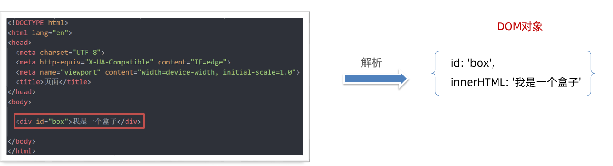
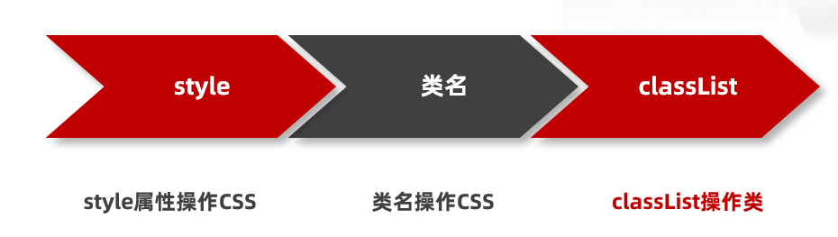
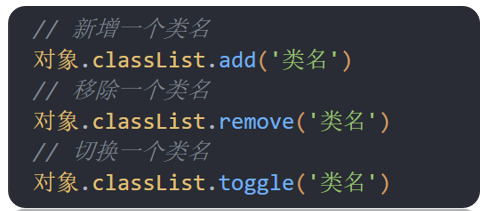

# Web APIs - 第1天笔记

> 掌握DOM属性操作，完成元素内容设置，元素属性设置，控制元素样式

- DOM简介
- 获取DOM元素
- 操作元素内容
- 操作元素属性
- 定时器-间隔函数
- 综合案例


| 描述                        | 属性/方法                         | 效果                         |
| --------------------------- | --------------------------------- | ---------------------------- |
| 获取DOM对象                 | document.querySelector()          | 获取指定的第一个元素         |
| document.querySelectorAll() | 获取指定的所有元素                |                              |
| 操作元素内容                | 元素.innerText                    | 操作元素内容，不解析标签     |
| 元素.innerHTML              | 操作元素内容，解析标签            |                              |
| 操作元素样式                | 元素.style.width                  | 通过style操作样式            |
| 元素.className              | 通过类名操作样式                  |                              |
| 元素.classList.add()        | 增加类名                          |                              |
| 元素.classList.remove()     | 删除类名                          |                              |
| 元素.classList.toggle()     | 切换类名                          |                              |
| 间隔函数                    | setInterval(function()  {}, 1000) | 定时器，每隔指定时间重复执行 |

## 课程介绍

> web APIs 作用：  JavaScript 去操作页面文档和浏览器

### 什么是 API

API: 应用程序接口（Application Programming Interface）

接口：无需关心内部如何实现，程序员只需要调用就可以很方便实现某些功能

## DOM简介

**DOM**（Document Object Model——文档对象模型）

**作用：**DOM用来 操作网页文档，开发网页特效和实现用户交互

DOM的核心思想就是把网页内容当做**对象**来处理，通过对象的属性和方法对网页内容操作

 

### document 对象

是 DOM 里提供的一个对象，是DOM顶级对象

作为网页内容的入口

所以它提供的属性和方法都是用来访问和操作网页内容的

例：document.write()

## 获取DOM对象

### 利用css选择器来获取DOM元素

**语法：**

~~~javascript
const box = document.querySelector('div')
~~~

**参数: **

包含一个或多个有效的CSS选择器 字符串

**返回值：**

CSS选择器匹配的第一个元素对象

如果没有匹配到，则返回 null

~~~javascript
// 利用css选择器来获取DOM元素
// 1. document.querySelector() 选择指定css选择器的第一个元素
// 1.1 参数是字符串的css选择器
const box = document.querySelector('div')
console.log(box)

// 1.2 返回值是dom对象
console.log(typeof box)  // object
console.dir(box)

const box = document.querySelector('.box')
console.log(box)

const li = document.querySelector('ol li')
console.log(li)   // 只选择满足条件的第一个元素li

const li = document.querySelector('ol li:nth-child(2)')
console.log(li)   // 选择第2个小li

// 1.3 如果获取不到则返回 null
const p = document.querySelector('p')
console.log(p)  // null
~~~

### 选择指定css选择器的所有元素

**语法：**

~~~javascript
const lis = document.querySelectorAll('.nav li')
~~~

**参数:**

包含一个或多个有效的CSS选择器 字符串

**返回值：**

CSS选择器匹配的NodeList  伪数组

~~~javascript
// 2. document.querySelectorAll() 选择指定css选择器的所有元素
// 2.1 参数还是字符串的css选择器
const lis = document.querySelectorAll('.nav li')

// 2.2 返回值是一个伪数组里面包含了所有的dom对象 li
console.log(lis)

// 2.3 伪数组
// (1) 有长度和索引号
// (2) 没有数组的一些常用方法 比如 push  pop  splice等方法
// lis.push(1)
// console.log(lis)  // 因为lis是伪数组无法使用push方法所以报错

// 2.4 利用循环遍历伪数组得到里面的每一个元素对象
for (let i = 0; i < lis.length; i++) {
  console.log(lis[i]) // 里面的每一个元素对象
}

// 2.5 即使只有1个元素，我们querySelectorAll 获得的也是一个伪数组，里面只有1个元素而已

const boxs = document.querySelectorAll('.box')
console.log(boxs)
~~~

### 其他方式(了解)

| 语法                   | 实例                                   | 描述                           |
| ---------------------- | -------------------------------------- | ------------------------------ |
| getElementById         | document.getElementById('box')         | 根据id获取元素，单个元素       |
| getElementsByTagName   | document.getElementsByTagName('li')    | 根据标签名获取元素，伪数组     |
| getElementsByClassName | document.getElementsByClassName('one') | 根据类名获取元素，伪数组       |
| getElementsByName      | document.getElementsByName('sex')      | 根据name属性值获取元素，伪数组 |

```javascript
// 1. getElementById   根据id获取
const box = document.getElementById('box')
console.log(box)

// 2. getElementsByClassName   根据类名获取  返回伪数组
const items = document.getElementsByClassName('item')
console.log(items)

// 3. getElementsByTagName  根据标签名获取 返回伪数组
const ps = document.getElementsByTagName('p')
console.log(ps)

// 4. getElementsByName  根据name属性获取 返回伪数组
const inputs = document.getElementsByName('username')
console.log(inputs)

```

## 操作元素内容
DOM对象可以操作页面标签，所以本质上就是操作DOM对象（增删改查）

如果想要操作标签元素的内容，则可以使用如下2种方式：

1.对象.innerText 属性

2.对象.innerHTML 属性

### innerText

1. `innerText` 将文本内容添加/更新到任意标签位置，**文本中包含的标签不会被解析。**

```html
<script>
  // 操作DOM元素内容
  // 1. 对象.innerText 增删改查
  // 1.1 查
  console.log(box.innerText)  // 古丽扎娜
  // 1.2 改
  box.innerText = '迪丽热巴'
  // 1.3 增
  const box1 = document.querySelector('.box1')
  console.log(box1)
  box1.innerText = '佟丽丫丫'
  // 1.4 删  给空字符串可以删除内容
  box.innerText = ''
  box1.innerText = ''
</script>
```

### innerHTML

1. `innerHTML` 将文本内容添加/更新到任意标签位置，**文本中包含的标签会被解析。**

```html
<script>
  // 2. 对象.innerHTML  会解析标签
  box.innerHTML = '<strong>迪丽热巴</strong>'
</script>
```

总结：如果文本内容中包含 `html` 标签时推荐使用 `innerHTML`，否则建议使用 `innerText` 属性。

### 年会抽奖案例

~~~html

<!DOCTYPE html>
<html lang="en">

<head>
  <meta charset="UTF-8" />
  <meta http-equiv="X-UA-Compatible" content="IE=edge" />
  <meta name="viewport" content="width=device-width, initial-scale=1.0" />
  <title>年会抽奖</title>
  <style>
    .wrapper {
      width: 840px;
      height: 420px;
      background: url(./images/bg01.jpg) no-repeat center / cover;
      padding: 100px 250px;
      box-sizing: border-box;
    }

    .wrapper span {
      color: #b10e0d;
    }
  </style>
</head>

<body>
  <div class="wrapper">
    <strong>年会抽奖</strong>
    <h1>一等奖：<span class="one">???</span></h1>
    <h3>二等奖：<span class="two">???</span></h3>
    <h5>三等奖：<span class="three">???</span></h5>
  </div>

  <script>
    // 数组
    const arr = ['迪丽热巴', '古丽扎娜', '佟丽丫丫', '马尔扎哈']
    // 1. 一等奖的做法
    // 1.1 利用随机数选取数组中的名字
    const random = Math.floor(Math.random() * arr.length)
    console.log(random) // 0 ~ 3 之间的随机整数
    console.log(arr[random]) // 随机名字

    // 1.2 把名字放入对应的盒子里面 span
    const one = document.querySelector('.one')
    one.innerText = arr[random]

    // 1.3 不允许重复抽奖，所以要把刚才选出来的名字从数组中删除
    // arr.splice(随机数, 1)  // 可以删除刚才抽取的名字
    arr.splice(random, 1)
    console.log(arr)

    // 2. 二等奖的做法
    // 2.1 利用随机数选取数组中的名字
    const random2 = Math.floor(Math.random() * arr.length)
    console.log(arr[random2]) // 数组里面的名字

    // 2.2 把名字放入对应的盒子里面 span
    const two = document.querySelector('.two')
    two.innerText = arr[random2]

    // 2.3 不允许重复抽奖，所以要把刚才选出来的名字从数组中删除
    arr.splice(random2, 1)
    console.log(arr)

    // 3. 三等奖的做法
    // 3.1 利用随机数选取数组中的名字
    const random3 = Math.floor(Math.random() * arr.length)
    console.log(arr[random3]) // 数组里面的名字

    // 3.2 把名字放入对应的盒子里面 span
    const three = document.querySelector('.three')
    three.innerText = arr[random3]

    // 3.3 不允许重复抽奖，所以要把刚才选出来的名字从数组中删除
    arr.splice(random3, 1)
    console.log(arr)
  </script>
</body>

</html>
~~~

##操作元素属性 

1. 操作元素常用属性
2. 操作元素样式属性
3. 操作 表单元素 属性
4. 自定义属性

### 常用属性修改

可以通过DOM操作元素属性，比如通过 src 更换 图片地址

最常见的属性比如：` href`、`title`、`src` 等等

1. 直接能过属性名修改，最简洁的语法

```html
<script>
  // 1. 先获取这个元素
  const img = document.querySelector('img')
  // 2. 操作DOM元素常见属性
  // 2.1 查
  console.log(img.src)
  // 2.2 改
  img.src = './images/3.png'
  // 2.3 增
  img.title = '我是播仔，我是不是很可爱'
  // 2.4 删
  img.alt = ''
</script>
```

**随机背景案例**

~~~html

<!DOCTYPE html>
<html lang="en">

<head>
  <meta charset="UTF-8">
  <meta http-equiv="X-UA-Compatible" content="IE=edge">
  <meta name="viewport" content="width=device-width, initial-scale=1.0">
  <title>随机显示图片案例</title>
  <style>
    img {
      width: 600px;
    }
  </style>
</head>

<body>
  
  <script>
    // 随机显示图片案例
    // 图片地址
    const arr = [
      './images/1.png',
      './images/2.png',
      './images/3.png',
      './images/4.png'
    ]
    // 获取图片元素
    const img = document.querySelector('img')

    // 1. 利用随机数抽取数组中的一个地址
    const random = Math.floor(Math.random() * arr.length)
    console.log(arr[random]) // 得到图片地址

    // 2. 把地址赋值给图片src属性
    img.src = arr[random]
  </script>
</body>

</html>
~~~


### 操作样式属性

还可以通过 DOM对象修改标签元素的样式属性

- 比如通过 轮播图小圆点自动更换颜色 样式
- 点击按钮可以滚动图片，这是移动的的位置 translateX 等等

#### 通过 style 属性操作元素样式

```html
<script>
  // 通过style操作元素样式
  // 1. 先要获取这个box元素对象
  const box = document.querySelector('.box')

  // 2. 通过style来从操作样式
  box.style.width = '300px'
  box.style.marginTop = '50px'
  box.style.backgroundColor = 'skyblue'

  // 3. 注意事项
  // 3.1 给样式赋值的时候，千万不要忘了加单位比如 300px
  // 3.2 如果有-的样式，我们采取的是小驼峰命名法比如 marginTop
  // 3.3 一定不要忘了加 style 属性
</script>
```

>**注意：**
>
>1.修改样式通过style属性引出
>
>2.如果属性有-连接符，需要转换为小驼峰命名法
>
>3.赋值的时候，需要的时候不要忘记加css单位

#### 操作类名(className) 操作CSS

如果修改的样式比较多，直接通过style属性修改比较繁琐，我们可以通过借助于css类名的形式

**核心：**把多个样式放到css一个类中，然后把这个类添加到这个元素身上

**语法：**

~~~html
<script>
  // 通过类名操作元素样式
  // 1. 获取box盒子
  const box = document.querySelector('.box')
  // 2. 利用类名操作元素样式
  // box.className = 'circle'
  box.className = 'box circle'
  // 3. 利用类名操作样式添加的新的类名会覆盖掉原先的类名
</script>
~~~

>注意：
>
>1.由于class是关键字, 所以使用className去代替
>
>2.className是使用新值换旧值, 如果需要添加一个类,需要保留之前的类名

#### 通过 classList 操作类控制CSS

为了解决className 容易覆盖以前的类名，我们可以通过classList方式追加和删除类名

  

~~~html
<script>
  // 1. 获取box盒子
  const box = document.querySelector('.box')
  // 2.通过classList操作元素样式(推荐)
  // 2.1 追加类名
  // box.classList.add('circle')
  // 2.2 删除类名
  // box.classList.remove('box')
  // 2.3 切换类名： 如果元素身上有这个类名，那么就删除，如果没有这个类名则添加
  box.classList.toggle('circle')
</script>
~~~

### 操作表单元素属性

表单很多情况，也需要修改属性，比如点击眼睛，可以看到密码，本质是把表单类型转换为文本框

正常的有属性有取值的跟其他的标签属性没有任何区别

>**获取:** DOM对象.属性
>
>**设置:** DOM对象.属性= 新值

表单属性中添加就有效果，移除就没有效果，一律使用布尔值表示 

比如实现禁用按钮，勾选按钮等

如果为 `true` 代表添加了该属性 

如果是 `false` 代表移除了该属性

比如： `disabled`、`checked`、`selected`

~~~html
<script>
  // 操作表单属性
  // 1. 操作表单 type 和 value 属性
  // 1.1 修改type属性
  const username = document.querySelector('[name=username]')
  console.log(username)
  // username.type = 'password'

  // 1.2 操作表单的 value 属性
  // console.log(username.value)  // 查
  // username.value = '用户名试试'  // 增
  // username.value = '请输入用户名' // 改
  // username.value = ''  // 删

  // 2. 禁用按钮或者是勾选复选框  布尔型
  // 2.1 禁用按钮  
  const button = document.querySelector('button')
  // button.disabled = true  // true 是禁用
  button.disabled = false  // false 是不禁用

  // 2.2 勾选复选框
  const agree = document.querySelector('[name=agree]')
  console.log(agree)
  // agree.checked = true // true 是选中复选框
  agree.checked = false // flase 是不选中复选框
</script>
~~~

### 自定义属性（重要）

**标准属性:** 标签天生自带的属性 比如class、id、title等, 可以直接使用点语法操作比如：`对象.title`

**自定义属性：**

- 在html5中推出来了专门的data-自定义属性  
- 使用场景：通过自定义属性可以存储数据，后期可以使用这个数据
- 在标签上一律以data-开头
- 在DOM对象上一律以dataset对象方式获取

~~~html
<script>
  // 自定义属性
  // 1. 获取盒子
  const box = document.querySelector('.box')

  // 2. 得到自定义属性值
  // console.log(box.dataset)  // 得到一个对象集合
  // console.log(box.dataset.id) // 1
  // console.log(box.dataset)  // 得到一个对象集合
  console.log(box.dataset.name) // box
</script>
~~~

## 定时器-间隔函数

网页中经常会需要一种功能：每隔一段时间需要自动执行一段代码，不需要我们手动去触发

例如：网页中的`倒计时`

要实现这种需求，需要`定时器函数`

定时器函数有两种:  `间隔函数`和 延迟函数

`setInterval` 是 JavaScript 中内置的函数，它的作用是间隔固定的时间自动重复执行另一个函数，也叫定时器函数。

### 开启定时器:

**语法**

```html
<script>
  setInterval(function () {
    console.log('我是1秒钟执行一次')
  }, 1000)
</script>
```

**作用：**每隔一段时间调用这个函数

**注意：**间隔时间单位是毫秒

### 关闭定时器

需要定时器`变量名`来关闭

返回的是一个唯一的`数字`

~~~html
<script>
  let timer = setInterval(repeat, 1000)  // 注意调用的时候直接写函数名字不需要写小括号
  console.log(timer) //  1
  let timer1 = setInterval(repeat, 1000)  // 注意调用的时候直接写函数名字不需要写小括号
  console.log(timer1) //  2
  // 2. 关闭定时器
  clearInterval(timer)

</script>
~~~

## 综合案例-轮播图定时版

~~~html
<!DOCTYPE html>
<html lang="en">

  <head>
    <meta charset="UTF-8" />
    <meta http-equiv="X-UA-Compatible" content="IE=edge" />
    <meta name="viewport" content="width=device-width, initial-scale=1.0" />
    <title>综合案例-定时版轮播图</title>
    <style>
      * {
        box-sizing: border-box;
      }

      .slider {
        width: 560px;
        height: 400px;
        overflow: hidden;
      }

      .slider-wrapper {
        width: 100%;
        height: 320px;
      }

      .slider-wrapper img {
        width: 100%;
        height: 100%;
        display: block;
      }

      .slider-footer {
        height: 80px;
        background-color: rgb(100, 67, 68);
        padding: 12px 12px 0 12px;
        position: relative;
      }

      .slider-footer .toggle {
        position: absolute;
        right: 0;
        top: 12px;
        display: flex;
      }

      .slider-footer .toggle button {
        margin-right: 12px;
        width: 28px;
        height: 28px;
        appearance: none;
        border: none;
        background: rgba(255, 255, 255, 0.1);
        color: #fff;
        border-radius: 4px;
        cursor: pointer;
      }

      .slider-footer .toggle button:hover {
        background: rgba(255, 255, 255, 0.2);
      }

      .slider-footer p {
        margin: 0;
        color: #fff;
        font-size: 18px;
        margin-bottom: 10px;
      }

      .slider-indicator {
        margin: 0;
        padding: 0;
        list-style: none;
        display: flex;
        align-items: center;
      }

      .slider-indicator li {
        width: 8px;
        height: 8px;
        margin: 4px;
        border-radius: 50%;
        background: #fff;
        opacity: 0.4;
        cursor: pointer;
      }

      .slider-indicator li.active {
        width: 12px;
        height: 12px;
        opacity: 1;
      }
    </style>
  </head>

  <body>
    <div class="slider">
      <div class="slider-wrapper">
        
      </div>
      <div class="slider-footer">
        <p>对人类来说会不会太超前了？</p>
        <ul class="slider-indicator">
          <li class="active"></li>
          <li></li>
          <li></li>
          <li></li>
          <li></li>
          <li></li>
          <li></li>
          <li></li>
        </ul>
        <div class="toggle">
          <button class="prev">&lt;</button>
          <button class="next">&gt;</button>
        </div>
      </div>
    </div>
    <script>
      // 初始数据
      const sliderData = [
        { url: './images/slider01.jpg', title: '对人类来说会不会太超前了？', color: 'rgb(100, 67, 68)' },
        { url: './images/slider02.jpg', title: '开启剑与雪的黑暗传说！', color: 'rgb(43, 35, 26)' },
        { url: './images/slider03.jpg', title: '真正的jo厨出现了！', color: 'rgb(36, 31, 33)' },
        { url: './images/slider04.jpg', title: '李玉刚：让世界通过B站看到东方大国文化', color: 'rgb(139, 98, 66)' },
        { url: './images/slider05.jpg', title: '快来分享你的寒假日常吧~', color: 'rgb(67, 90, 92)' },
        { url: './images/slider06.jpg', title: '哔哩哔哩小年YEAH', color: 'rgb(166, 131, 143)' },
        { url: './images/slider07.jpg', title: '一站式解决你的电脑配置问题！！！', color: 'rgb(53, 29, 25)' },
        { url: './images/slider08.jpg', title: '谁不想和小猫咪贴贴呢！', color: 'rgb(99, 72, 114)' },
      ]
      // 获取元素
      const img = document.querySelector('.slider-wrapper img')
      const p = document.querySelector('.slider-footer p')
      const footer = document.querySelector('.slider-footer')

      // 1. 声明1个变量，利用定时器实现变量++，依次拿到下一个数组中的对象
      // 1.1 声明变量 i 
      let i = 0  // 信号量

      // 1.2 开启定时器实现i++
      setInterval(function () {
        i++
        // 无缝衔接 如果播放到了最后一张 第8张，则快速复原为第1张播放
        // 其实这个8就是数组的长度
        // if (i >= sliderData.length) {
        //   i = 0
        // }

        // 改为三元运算符的写法
        // i = i >= sliderData.length ? 0 : i

        // 利用取余来实现
        i = i % sliderData.length


        console.log(i)
        // 1.3 依次拿到下一个数组中的对象
        // console.log(sliderData[i])

        // 2. 利用对象更换图片、文字、背景颜色、小圆点
        // 2.1 更换图片
        img.src = sliderData[i].url

        // 2.2 更换文字内容
        p.innerText = sliderData[i].title

        // 2.3 更换背景颜色
        footer.style.backgroundColor = sliderData[i].color

        // 2.4 更换小圆点
        // 先把以前的 active 类 移除掉  顺序不能颠倒
        document.querySelector('.slider-indicator .active').classList.remove('active')

        // 添加小圆点
        document.querySelector(`.slider-indicator li:nth-child(${i + 1})`).classList.add('active')

      }, 1000)

    </script>
  </body>

</html>
~~~


