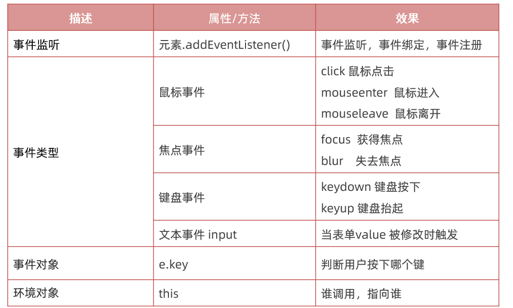
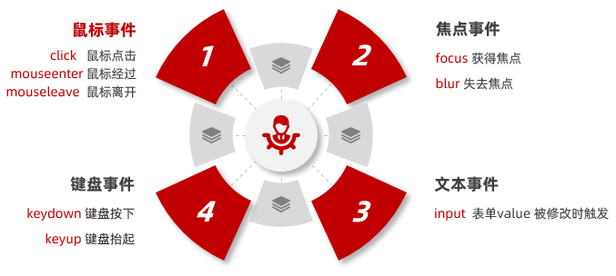
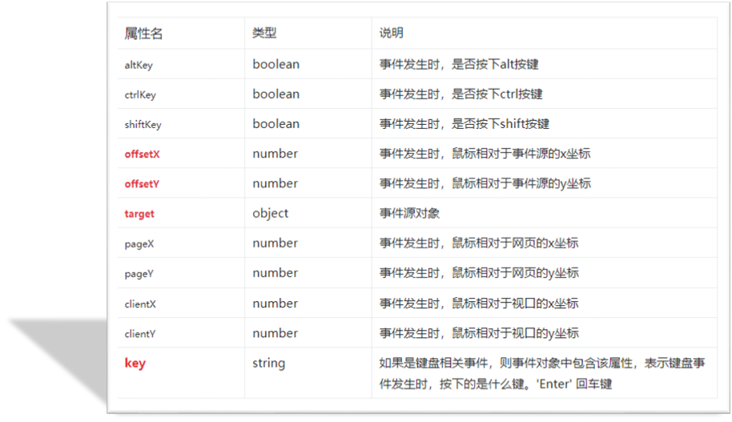
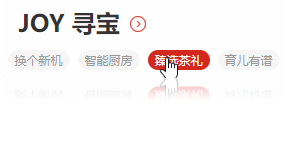

# Web APIs -第二天笔记

> 掌握事件绑定处理和事件对象，完成常见网页交互

- 事件监听
- 事件类型
- 事件对象
- 拓展知识
- 综合案例




## 事件监听

以前写的代码都是自动执行的，我们希望一段代码在某个特定的时机才去执行，比如

- 点击按钮可以弹出警示框
- 比如鼠标经过显示下拉菜单等等

### 事件

事件是程序在运行的时候，发生的特定动作或者特定的事情

- 比如`点击`按钮、
- 比如`鼠标经过`菜单等等

通常，当事件发生时，可以做些事情

- 比如点击按钮，可以 `弹出警示框`
- 比如鼠标经过某个盒子，可以`显示下拉菜单`

###  事件监听

事件发生后，想要执行的代码写到`事件处理函数`里面

- 当触发指定的事件时，则事件处理函数就会被执行
- 事件监听是将事件处理函数注册到元素对象身上
- 事件监听也称为: 事件注册、事件绑定

**语法：**

```JavaScript
元素对象.addEventListener('事件类型', 事件处理函数)
```

事件监听三要素

- 事件源(谁被触发了)
- 事件类型  (什么情况下触发，点击还是鼠标经过等)
- 事件处理函数（要做什么事情）

~~~html
<!DOCTYPE html>
<html lang="en">
  <head>
    <meta charset="UTF-8">
    <meta http-equiv="X-UA-Compatible" content="IE=edge">
    <meta name="viewport" content="width=device-width, initial-scale=1.0">
    <title>事件监听</title>
  </head>
  <body>
    <button class="btn">唐伯虎</button>
    <script>
      // 需求： 点击button按钮，页面会弹出一个警示框，内容显示 '秋香'
      // 事件监听语法:
      // 元素对象.addEventListener('事件类型', 事件处理函数)
      // 1. 获取元素对象 button按钮
      const btn = document.querySelector('.btn')
      // 2. 事件监听 
      btn.addEventListener('click', function () {
        alert('秋香')
      })
    </script>
  </body>
</html>
~~~

>**注意：**
>
>1.事件类型要加引号，小写
>
>2.函数是点击之后再去执行，每次点击都会执行一次

### 回调函数

**回调函数:**当一个函数当做`参数`来传递给另外一个函数的时候，这个函数就是回调函数（`回头调用`的函数）

**作用：**完成某些特定任务

~~~html
<script>
  // 1. 定时器间隔函数，里面第一个参数又是函数，这个匿名函数就是回调函数
  setInterval(function () {
    console.log('我是回调函数')
  }, 1000)

  // 2. addEventListener 函数的第二个参数也是函数，这个匿名函数也是回调函数
  btn.addEventListener('click', function () {
    console.log('我是回调函数')
  })
</script>
~~~

### 事件监听版本

1. DOM0 事件

    事件源.on事件类型 = function() { }

   ~~~javascript
   btn.onclick = function () {
     alert('我是弹窗1')
   }
   ~~~

2. DOM 2事件

   事件源.addEventListener(事件类型，事件处理函数)

   ~~~javascript
   btn.addEventListener('click', function () {
     console.log('我是回调函数')
   })
   ~~~

>**区别：**
>
>on 方式同名事件会被覆盖，addEventListener则不会，同时拥有事件更多特性，推荐使用

## 事件类型

将众多的事件类型分类可分为：鼠标事件、键盘事件、表单事件、焦点事件等，我们逐一展开学习。

事件类型的大小写敏感的字符串，统一用小写字母

 

### 鼠标事件

鼠标事件是指跟鼠标操作相关的事件，如单击、经过等。

```html
<body>
  <div class="box"></div>
  <script>
    // 鼠标事件类型
    const box = document.querySelector('.box')
    // 1. 鼠标点击
    box.addEventListener('click', function () {
      console.log('我点击了盒子')
    })
    // 2. 鼠标经过
    box.addEventListener('mouseenter', function () {
      console.log('我鼠标经过了盒子')
    })
    // 3. 鼠标离开
    box.addEventListener('mouseleave', function () {
      console.log('我鼠标离开了盒子')
    })
  </script>
</body>
```

### 焦点事件

主要是针对于表单是否获得光标的事件， 获得焦点  focus 、失去焦点 blur

~~~html
<!DOCTYPE html>
<html lang="en">

  <head>
    <meta charset="UTF-8">
    <meta http-equiv="X-UA-Compatible" content="IE=edge">
    <meta name="viewport" content="width=device-width, initial-scale=1.0">
    <title>焦点事件</title>
    <style>
      [type=text] {
        width: 245px;
        height: 50px;
        padding-left: 20px;
        border: 1px solid #ccc;
        font-size: 17px;
        outline: none;
      }
    </style>
  </head>

  <body>
    <input type="text" class="search-text">
    <input type="text" class="search">
    <script>
      // 1. 焦点事件(手动触发)
      const search_text = document.querySelector('.search-text')
      // 1.1 获得焦点  focus
      search_text.addEventListener('focus', function () {
        console.log('获得了焦点')
      })
      // 1.2 失去焦点 blur
      search_text.addEventListener('blur', function () {
        console.log('失去了焦点')
      })
      // 2. 拓展 自动获得焦点 focus()    自动失去焦点 blur()
      //  2.1 语法: 元素.focus()  比如百度首页搜索框自动获得焦点
      const search = document.querySelector('.search')
      search.focus()
    </script>
  </body>

</html>
~~~


###  键盘事件和 input事件

| 事件    | 触发时机                | 得到表单值            |
| ------- | ----------------------- | --------------------- |
| keydown | 按下键盘时触发          | 不带最后一次按键值 ab |
| keyup   | 弹起键盘时触发          | 输入内容   abc        |
| input   | 表单value发生变化时触发 | 输入内容   abc        |

~~~html
<!DOCTYPE html>
<html lang="en">

<head>
  <meta charset="UTF-8">
  <meta http-equiv="X-UA-Compatible" content="IE=edge">
  <meta name="viewport" content="width=device-width, initial-scale=1.0">
  <title>input事件和键盘事件</title>
  <style>
    textarea {
      width: 300px;
      height: 30px;
      padding: 10px;
      border-color: transparent;
      outline: none;
      resize: none;
      background: #f5f5f5;
      border-radius: 4px;
    }
  </style>
</head>

<body>
  <textarea id="tx" placeholder="发一条友善的评论" rows="2"></textarea>
  <script>
    // 获取元素
    const tx = document.querySelector('#tx')

    // 1. 键盘事件 
    // 1.1 键盘按下事件  keydown  当我们按下键盘的时候就触发
    tx.addEventListener('keydown', function () {
      console.log('我是keydown事件' + tx.value)
    })

    // 1.2 键盘弹起事件  keyup 当我们键盘弹起的时候就触发
    tx.addEventListener('keyup', function () {
      console.log('我是keyup事件' + tx.value)
    })

    // 2. 用户输入事件 input ，是表单value的值发生变化的时候触发
    tx.addEventListener('input', function () {
      console.log('我是input事件' + tx.value)
    })
    // 3. 注意事项
    // 3.1 执行顺序  keydown →  input   →  keyup
    // 3.2 keydown 获取值的时候得不到最后一次按键的值， keyup和input可以得到用户输入内容
  </script>
</body>

</html>
~~~

>**注意事项**
>
>1. 执行顺序  keydown →  input   →  keyup
>2. keydown 获取值的时候得不到最后一次按键的值， keyup和input可以得到用户输入内容

## 事件对象

**事件对象是什么？ **

- 也是个对象，这个对象里有事件触发时的相关信息，包含属性和方法
- 例如：鼠标点击事件中，事件对象就存了鼠标点在哪个位置等信息

**使用场景**

- 可以判断用户按下哪个键，比如按下回车键可以发布新闻
- 可以判断鼠标点击了哪个元素，从而做相应的操作

```html
<body>
  <div class="box"></div>
  <textarea id="tx" placeholder="发一条友善的评论" rows="2"></textarea>
  <script>
    // 事件对象
    const box = document.querySelector('.box')
    box.addEventListener('click', function (e) {
      console.log(e)
    })
    const tx = document.querySelector('#tx')
    tx.addEventListener('keyup', function (e) {
      // e 就是事件对象
      // console.log(e)
      // console.log(e.key)  // a 
      // 用户如果按下的是回车键，则弹出框提示按下了回车键
      if (e.key === 'Enter') {
        alert('您按下了回车键')
      }
    })
  </script>
</body>
```

事件回调函数的【第1个参数】即所谓的事件对象，通常习惯性的将这个对数命名为 `event`、`ev` 、`ev` 。

   

## 环境对象

> 能够分析判断函数运行在不同环境中 this 所指代的对象。

**环境对象：**指的是函数内部特殊的 this,  它指向一个对象，并且受当前环境影响

**作用：**弄清楚this的指向，可以让我们代码更简洁

- 函数的调用方式不同，this 指代的对象也不同
- 【谁调用， this 就是谁】 是判断 this 指向的粗略规则
- 直接调用函数，其实相当于是 window.函数，所以 this 指代 window

```html
<body>
  <button>点击</button>
  <script>
    // 环境对象 this   粗略规则： 谁调用函数，this就指向谁

    // 1. 全局环境
    // console.log(this)  // this 指向 window 全局对象

    // 2. 普通函数
    function fn() {
      console.log(this)  // this 指向 window 全局对象
    }
    window.fn()

    // 3. 对象方法
    const obj = {
      uname: '佩奇',
      sing: function () {
        console.log(this)  // this 指向 obj对象
      }
    }
    obj.sing()

    // 4. 事件
    const btn1 = document.querySelector('button')
    btn1.addEventListener('click', function () {
      // console.log(this)  // this 指向 btn 这个对象
      // btn1.style.backgroundColor = 'pink'
      this.style.backgroundColor = 'pink'
    })
  </script>
</body>
```

## 排他思想

是一种思路，目的是突出显示某个元素

比如，有多个元素，当鼠标经过时，只有当前元素会添加高亮样式，其余的元素移除样式

 

口诀：注意顺序

①：排除其他人

②：保留我自己


