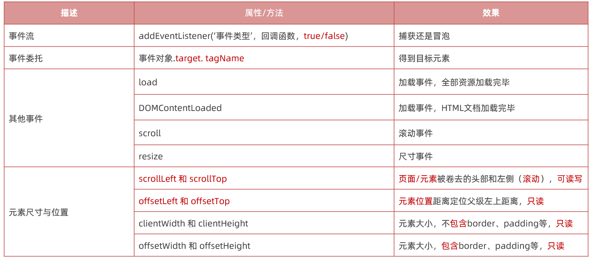
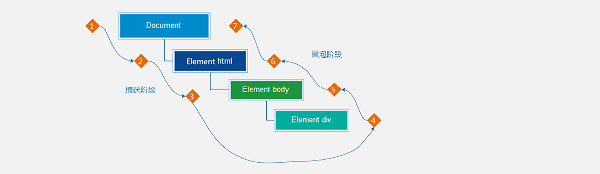
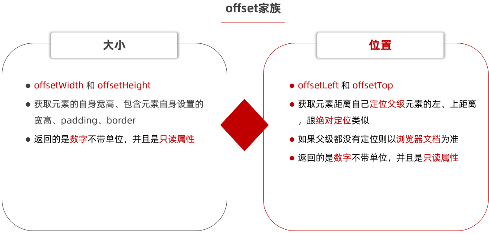

# Web APIs - 第3天

> 目标：学习事件流，事件委托，其他事件等知识，优化多个事件绑定和实现常见网页交互

- 事件流
- 移除事件监听
- 其他事件
- 元素尺寸与位置
- 综合案例



## 事件流

**为什么要学习事件流？**

- 可以帮我们解决一些疑惑，比如点击子盒子会会弹出2次的问题

事件流指的是事件完整执行过程中的`流动路径`

当触发事件时，会经历两个阶段，分别是`捕获阶段`、`冒泡阶段`



事件捕获概念：

当一个元素的事件被触发时，会从DOM的根元素开始依次调用同名事件 (从外到里)

### 捕获

事件捕获需要写对应代码才能看到效果

**语法：**

```html
 元素.addEventListener('click', 回调函数， 是否使用捕获)  
```

```html
<body>
  <div class="father">
    父盒子
    <div class="son">子盒子</div>
  </div>
  <script>
    // 事件流
    const father = document.querySelector('.father')
    const son = document.querySelector('.son')
    // 1. 事件捕获
    // // 点击父盒子
     father.addEventListener('click', function () {
       alert('我是爸爸')
     }, true)  // 事件捕获
     // 点击子盒子
     son.addEventListener('click', function () {
       alert('我是儿子')
     }, true) // 事件捕获
  </script>
</body>

```

>说明：
>
>- addEventListener第三个参数传入 true 代表是捕获阶段触发（很少使用）
>- 若传入false代表冒泡阶段触发，默认就是 false

###事件冒泡

 事件冒泡概念: 

当一个元素的事件被触发时，同样的事件将会在该元素的所有祖先元素中依次被触发。这一过程被称为事件冒泡

- 简单理解：当一个元素触发事件后，会依次向上调用所有父级元素的 `同名事件`
- 事件冒泡是`默认`存在的，或者第三个参数传入 `false` 都是冒泡
- `实际工作都是使用事件冒泡为主`

~~~html
<body>
  <div class="father">
    父盒子
    <div class="son">子盒子</div>
  </div>
  <script>
    // 事件流
    const father = document.querySelector('.father')
    const son = document.querySelector('.son')
    // 2. 事件冒泡
    // 点击父盒子
    father.addEventListener('click', function () {
      alert('我是爸爸')
    })
    // 点击子盒子
    son.addEventListener('click', function () {
      alert('我是儿子')
    }, false) 
  </script>
</body>
~~~

### 阻止冒泡

**问题：**因为默认就有冒泡阶段的存在，所以容易导致事件影响到父级元素（祖先元素）

**需求：**若想把事件就限制在当前元素内，就需要阻止事件冒泡

**前提：**

阻止事件冒泡需要拿到`事件对象`

```html
<body>
  <div class="father">
    父盒子
    <div class="son">子盒子</div>
  </div>
  <script>
    // 事件流
    const father = document.querySelector('.father')
    const son = document.querySelector('.son')
    // 1. 事件冒泡
    // 点击父盒子
    father.addEventListener('click', function () {
      alert('我是爸爸')
    })
    // 点击子盒子
    son.addEventListener('click', function (e) {
      alert('我是儿子')
      // 1.1 先获取事件对象
      // 1.2 事件对象.stopPropagation()  注意是个方法 
      e.stopPropagation()
    }) 
  </script>
</body>
```

结论：事件对象中的 `ev.stopPropagation` 方法，专门用来阻止事件冒泡（事件传播）

>鼠标经过事件：
>
>mouseover 和 mouseout 会有冒泡效果
>
>mouseenter  和 mouseleave   没有冒泡效果 (推荐)

### 事件委托

**事件委托(EventDelegation)**：是JavaScript中注册事件的常用技巧，也称为事件委派、事件代理

简单理解：原本需要注册在子元素的事件委托给父元素，让父元素担当事件监听的职务

**为什么要用事件委托呢？**

- 如果同时给多个元素注册事件，还需要利用循环多次注册事件
- 大量的事件监听是比较耗费性能的，如下代码所示

~~~html
<script>
  // 假设页面中有 10000 个 button 元素
  const buttons = document.querySelectorAll('table button');

  for(let i = 0; i <= buttons.length; i++) {
    // 为 10000 个 button 元素添加了事件
    buttons.addEventListener('click', function () {
      // 省略具体执行逻辑...
    })
  }
</script>
~~~

事件委托是利用事件流的特征解决一些开发需求的知识技巧

- 优点：减少注册次数，可以提高程序性能
- 原理：事件委托其实是利用事件冒泡的特点
  - 给父元素注册事件，当我们触发子元素的时候，会冒泡到父元素身上，从而触发父元素的事件

利用事件委托方式如何得到当前点击的元素呢？

- 实现：事件对象.target. tagName 可以获得真正触发事件的元素

```html
<body>
  <ul>
    <li>第1个孩子</li>
    <li>第2个孩子</li>
    <li>第3个孩子</li>
    <li>第4个孩子</li>
    <li>第5个孩子</li>
  </ul>
  <script>
    // 需求： 点击每个小li都会有弹窗效果
    // 1. 获取父元素ul
    const ul = document.querySelector('ul')

    // 2. 给ul注册点击事件
    ul.addEventListener('click', function (e) {
      // alert('我会弹窗')
      // 3. 利用事件对象.target 得到目标元素
      // console.log(e.target)
      // e.target.style.color = 'pink'

      // 需求2：点击哪个小li，对应的li变色
      // console.dir(e.target.tagName) 可以得到目标元素的标签名
      if (e.target.tagName === 'LI') {
        e.target.style.color = 'pink'
      }
    })
  </script>
```

### 阻止默认行为

阻止元素发生默认的行为

例如：

- 当点击提交按钮时阻止对表单的提交
- 阻止链接的跳转等等

**语法：**

~~~javascript
事件对象.preventDefault()
~~~

~~~html
<body>
  <form action="">
    姓名: <input type="text" name="username">
    <button>提交</button>
  </form>
  <a href="http://www.baidu.com">点击跳转</a>
  <script>
    // 阻止默认行为
    const form = document.querySelector('form')
    const input = document.querySelector('[name=username]')
    form.addEventListener('submit', function (e) {
      // 如果input表单的值为空则不允许提交
      if (input.value === '') {
        // return 无法阻止提交事件
        e.preventDefault()  // 阻止提交事件
      }
    })

    document.querySelector('a').addEventListener('click', function (e) {
      e.preventDefault()
    })
  </script>
</body>
~~~

## 事件解绑（了解）

移除事件处理函数，也称为解绑事件

~~~html
<body>
  <button class="l2">移除L2事件监听</button>
  <button class="l0">移除L0事件监听</button>
  <script>
    // 需求：按钮就点击一次，然后移除点击事件

    // 1. l2事件监听
    const l2 = document.querySelector('.l2')

    l2.addEventListener('click', fn)
    function fn() {
      alert('我点击了')
      // 移除事件监听
      l2.removeEventListener('click', fn)
    }

    // 2. l0事件监听
    const l0 = document.querySelector('.l0')
    l0.onclick = function () {
      alert('我点击了')
      // 移除事件监听
      l0.onclick = null
    }
  </script>
</body>
~~~

## 其他事件

### 页面加载事件

加载外部资源（如图片、外联CSS和JavaScript等）加载完毕时触发的事件

为什么要学？

- 有些时候需要等页面资源全部处理完了做一些事情
- 老代码喜欢把 script 写在 head 中，这时候直接找 dom 元素找不到

**事件名：load**

监听页面所有资源加载完毕：

~~~javascript
window.addEventListener('load', function() {
    // xxxxx
})
~~~

当初始的 HTML 文档被完全加载和解析完成之后就触发，而无需等待样式表、图像等完全加载

**事件名：DOMContentLoaded**

~~~javascript
document.addEventListener('DOMContentLoaded', function() {
    // xxxxx
})
~~~

### 元素滚动事件

滚动条在滚动的时候持续触发的事件

为什么要学？

- 很多网页需要检测用户把页面滚动到某个区域后做一些处理，比如固定导航栏，比如返回顶部

**事件名：scroll**

监听整个页面滚动：

~~~javascript
window.addEventListener('scroll', function() {
    // xxxxx
})
~~~

>scrollTop / scrollLeft, 被卷去的头部或者左侧，可以读取，也可以修改（赋值）

### 页面尺寸事件

会在窗口尺寸改变的时候触发事件：

~~~javascript
window.addEventListener('resize', function() {
    // xxxxx
})
~~~

>clientWidth和clientHeight，获取元素的可见部分宽高（不包含border，margin，滚动条等）

## 元素尺寸与位置

获取元素的自身宽高、包含元素自身设置的宽高、padding、border




