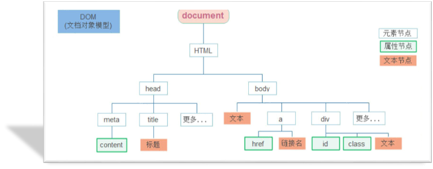
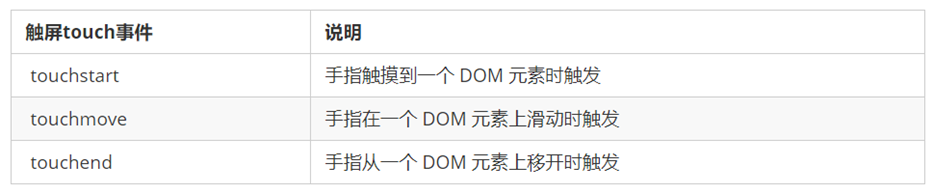

# Web APIs - 第4天笔记

> 目标: 了解DOM节点的增删改查，掌握利用数据操作页面，完成移动端通讯录案例

- 日期对象
- 节点操作
- M端事件
- JS插件
- 综合案例


## 日期对象


日期对象：用来表示日期和时间的对象

作用：可以得到当前系统日期和时间

Date是JavaScript内置对象

日期对象使用必须先`实例化`：创建一个日期对象并获取时间

在代码中发现了 `new` 关键字时，一般将这个操作称为实例化

### 实例化

~~~javascript
<body>
  <script>
    // 1. 实例化日期对象
    // 1.1 得到当前的日期和时间
    const date = new Date()
    console.log(date)

    // 1.2 得到指定的日期和时间
    const date1 = new Date('2099-12-12 08:08:08')
    console.log(date1)
  </script>
</body>
~~~

### 格式化日期对象

| 方法          | 作用               | 说明                 |
| ------------- | ------------------ | -------------------- |
| getFullYear() | 获得年份           | 获取四位年份         |
| getMonth()    | 获得月份           | 取值为 0 ~ 11        |
| getDate()     | 获取月份中的每一天 | 不同月份取值也不相同 |
| getDay()      | 获取星期           | 取值为 0 ~ 6         |
| getHours()    | 获取小时           | 取值为 0 ~ 23        |
| getMinutes()  | 获取分钟           | 取值为 0 ~ 59        |
| getSeconds()  | 获取秒             | 取值为 0 ~ 59        |

 ~~~javascript
<body>
  <script>
    // 2. 格式化日期对象-转换成开发中常见的日期和时间格式
    const myDate = new Date()
    console.log(myDate.getFullYear()) // 得到年份 数字型的 2023
    console.log(myDate.getMonth() + 1) // 得到月份 数字型的 0 需要加1
    console.log(myDate.getDate()) // 得到几号 数字型的 27 
    console.log(myDate.getDay()) // 得到星期  数字型 5 
    console.log(myDate.getHours()) // 得到小时
    console.log(myDate.getMinutes()) // 得到分钟
    console.log(myDate.getSeconds()) // 得到秒数
    console.log(`现在的日期是:${myDate.getFullYear()}年${myDate.getMonth() + 1}月${myDate.getDate()}日`)

  </script>
</body>
 ~~~

### 格式化日期对象另外方法

| 方法                 | 作用                                     | 说明               |
| -------------------- | ---------------------------------------- | ------------------ |
| toLocaleString()     | 返回该日期对象的字符串（包含日期和时间） | 2099/9/20 18:30:43 |
| toLocaleDateString() | 返回日期对象日期部分的字符串             | 2099/9/20          |
| toLocaleTimeString() | 返回日期对象时间部分的字符串             | 18:30:43           |

~~~html
<body>
  <div class="box"></div>
  <script>

    const date = new Date()
    console.log(date.toLocaleString())  // 2023/1/27 23:19:20
    console.log(date.toLocaleDateString())  // 2023/1/27 
    console.log(date.toLocaleTimeString())  // 23:19:20

    // 1. 封装一个 getDateTime函数，里面格式化时间对象
    function getDateTime() {
      const date = new Date()

      return date.toLocaleString()
    }
    // 注意： 先写上这句话，防止盒子有1秒的空白期
    document.querySelector('.box').innerText = getDateTime()
    // 3. 显示到box盒子里面，并且添加定时器
    setInterval(function () {
      document.querySelector('.box').innerText = getDateTime()
    }, 1000)
  </script>
</body>
~~~

### 时间戳

什么是时间戳:

- 是指1970年01月01日00时00分00秒起至现在的总毫秒数(数字型)，它是一种特殊的计量时间的方式

**使用场景：** 计算倒计时效果，需要借助于时间戳完成

算法：

- 将来的时间戳  -  现在的时间戳  =  剩余时间毫秒数  
- 剩余时间毫秒数转换为年月日时分秒就是倒计时时间

~~~javascript
    // 1. 实例化
  const date = new Date()
  // 2. 获取时间戳
  console.log(date.getTime())
// 还有一种获取时间戳的方法
  console.log(+new Date())
  // 还有一种获取时间戳的方法
  console.log(Date.now())

~~~


获取时间戳的方法，分别为 getTime 和 Date.now 和  +new Date()

## DOM 节点

**DOM树：**DOM 将 HTML文档以树状结构直观的表现出来，我们称之为 DOM 树 或者 节点树

**节点（Node）**是DOM树(节点树)中的单个点。包括文档本身、元素、文本以及注释都属于是节点。

- `元素节点`（重点）
  - 所有的标签 比如 body、 div
  - html 是根节点
- 属性节点
  - 所有的属性 比如 href
- 文本节点
  - 所有的文本  

 

### 查找节点

利用节点关系查找节点，返回的都是对象

- 父节点
- 子节点
- 兄弟节点

有了查找节点可以使我们选择元素更加方便

#### 父节点

语法：

~~~JavaScript
元素.parentNode
~~~

~~~html
<body>
  <div class="pop">
    <a href="javascript:;" class="close"></a>
  </div>
  <script>
    // 点击关闭按钮可以关闭父盒子
    const closeBtn = document.querySelector('.close')
    // 利用孩子选取父节点,返回的也是一个元素对象
    console.log(closeBtn.parentNode)
    closeBtn.addEventListener('click', function () {
      this.parentNode.style.display = 'none'
    })
  </script>
</body>
~~~

#### 子节点

**语法:**

~~~javascript
父元素.children
~~~

~~~html
<body>
  <ul>
    <li>我是第1个孩子</li>
    <li>我是第2个孩子</li>
    <li>我是第3个孩子</li>
    <li>我是第4个孩子</li>
  </ul>
  <script>
    // 1. 查询子节点
    const ul = document.querySelector('ul')
    console.log(ul.children)

    // 2. 查询兄弟节点
    const li2 = document.querySelector('ul li:nth-child(2)')
    // console.log(li2)
    console.log(li2.previousElementSibling) // 上一个兄弟
    console.log(li2.nextElementSibling)  // 下一个兄弟
    console.log(ul.children[0]) // 第一个孩子
    console.log(ul.children[2]) // 第三个孩子
  </script>
</body>
~~~

#### 兄弟节点

~~~html
<body>
  <ul>
    <li>我是第1个孩子</li>
    <li>我是第2个孩子</li>
    <li>我是第3个孩子</li>
    <li>我是第4个孩子</li>
  </ul>
  <script>
    // 2. 查询兄弟节点
    const li2 = document.querySelector('ul li:nth-child(2)')
    // console.log(li2)
    console.log(li2.previousElementSibling) // 上一个兄弟
    console.log(li2.nextElementSibling)  // 下一个兄弟
    console.log(ul.children[0]) // 第一个孩子
    console.log(ul.children[2]) // 第三个孩子
  </script>
</body>
~~~

### 增加节点

很多情况下，我们需要在页面中增加元素

- 比如，点击发布按钮，可以新增一条信息

一般情况下，我们新增节点，按照如下操作：

- 创建一个新的节点
- 把创建的新的节点放入到指定的元素内部

1. 父元素最后一个子节点之后，插入节点元素

   ~~~javascript
   element.append()
   ~~~

2. 父元素第一个子元素的之前，插入节点元素

   ~~~javascript
   element.prepend()
   ~~~

如下代码演示：

```html
<body>
  <ul>
    <li>我是小li</li>
  </ul>
  <script>
    // 1. 创建节点
    const li = document.createElement('li')
    li.innerHTML = '我是放到后面的'
    console.log(li)

    // 2. 追加给父元素
    const ul = document.querySelector('ul')
    // 2.1 append 放到ul 的最后面 类似css的 after伪元素
    ul.append(li)
    // 2.2 prepend放到 ul 的最前面 类似css的 before伪元素
    const firstli = document.createElement('li')
    firstli.innerHTML = '我是放到前面的'
    ul.prepend(firstli)
  </script>
</body>
```

### 删除节点

若一个节点在页面中已不需要时，可以删除它

**语法：**

~~~JavaScript
element.remove()
~~~

>1. 把对象从它所属的 DOM 树中删除
>2. 删除节点和隐藏节点（display:none） 有区别的： 隐藏节点还是存在的，但是删除，则从DOM树中删除

```html
<!DOCTYPE html>
<html lang="en">

  <head>
    <meta charset="UTF-8">
    <meta http-equiv="X-UA-Compatible" content="IE=edge">
    <meta name="viewport" content="width=device-width, initial-scale=1.0">
    <title>删除节点</title>
  </head>

  <body>
    <div class="remove">我要删除</div>
    <div class="none">我要隐藏</div>
    <script>
      // 1. 删除节点, remove 会从dom树中删除这个元素
      const remove = document.querySelector('.remove')
      remove.remove()

      // 2. display:none 隐藏元素，页面看不见，但是dom树中还存在这个标签
      const none = document.querySelector('.none')
      none.style.display = 'none'
    </script>
  </body>

</html>
```

## M端事件

M端(移动端)有自己独特的地方。比如`触屏事件 touch`（也称触摸事件），Android 和 IOS都有。

touch 对象代表一个触摸点。触摸点可能是一根手指，也可能是一根触摸笔。触屏事件可响应用户手指（或触控笔）对屏幕或者触控板操作。

常见的触屏事件如下：



~~~javascript
<body>
  <div class="box"></div>
  <script>
    // 触摸事件
    const box = document.querySelector('.box')
    // 1. 手指触屏开始事件 touchstart
    box.addEventListener('touchstart', function () {
      console.log('我开始摸了')
    })
    // 2. 手指触屏滑动事件 touchmove
    box.addEventListener('touchmove', function () {
      console.log('我一直摸')
    })

    // 3. 手指触屏结束事件  touchend
    box.addEventListener('touchend', function () {
      console.log('我摸完了')
    })
  </script>
</body>
~~~

## JS插件

插件: 就是别人写好的一些代码,我们只需要复制对应的代码,就可以直接实现对应的效果

学习插件的思路：

1.看官网。了解这个插件可以完成什么需求           https://www.swiper.com.cn/ 

2.查看基本使用流程 。     https://www.swiper.com.cn/usage/index.html

3.写个小demo。看在线演示,找到符合自己需求的demo      https://www.swiper.com.cn/demo/index.html

4.应用的开发中。

### AlloyFinger 

AlloyFinger 是腾讯 AlloyTeam 团队开源的超轻量级 Web 手势插件，为元素注册各种手势事件

github地址：<https://github.com/AlloyTeam/AlloyFinger>

使用步骤：

1. 下载js库：<http://alloyteam.github.io/AlloyFinger/alloy_finger.js>
2. 将AlloyFinger库引入当前文件：<scriptsrc="alloy_finger.js"></script> 

​    或者使用在线地址：<script src="<https://unpkg.com/alloyfinger@0.1.16/alloy_finger.js>"></script>

3. 配置

   ~~~javascript
   new AlloyFinger(element, {  // element 是给哪个元素做滑动事件
     swipe: function (e) {
       // 滑动的时候要做的事情 e.direction 可以判断上下左右滑动 Left  Right 等
     }
   })
   ~~~

## 综合案例

### 遍历数组forEach

~~~JavaScript
arr.forEach(function (element, index) { /* … */ })
~~~

- element是数组元素
- index是数组元素的索引号

### 字符串截取

~~~JavaScript
字符串.substring(起始索引号, [结束索引号])
~~~

### 思想转变（相当重要）

本次案例，我们尽量减少dom操作，采取`操作数据`的形式，为了后期Vue做铺垫

增加和删除都是针对于`数组的操作`，然后根据`数组数据渲染页面`（数据驱动视图）

**事件委托的两个重要作用：**

1. 减少了注册次数
2. 给新增元素注册事件


