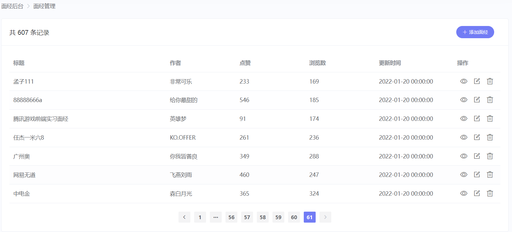
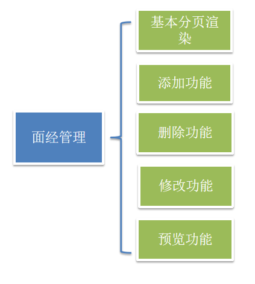
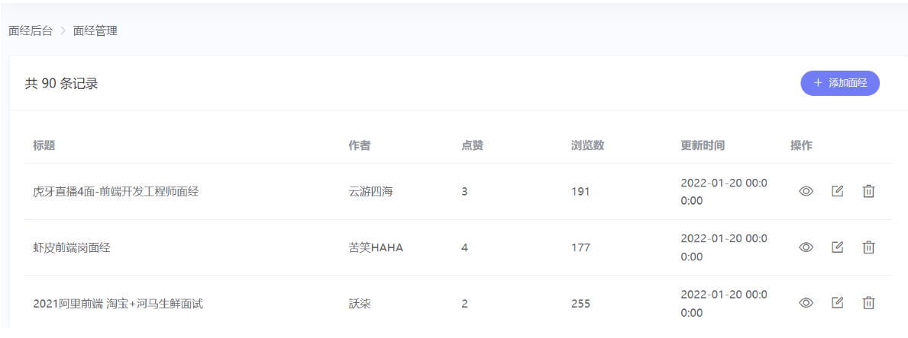
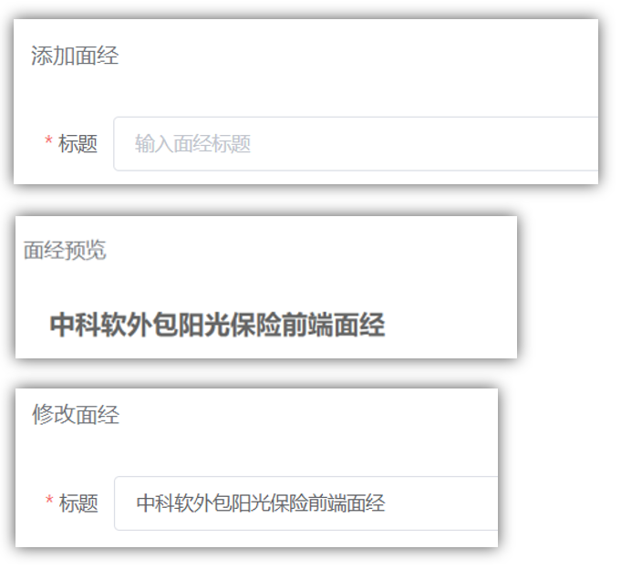
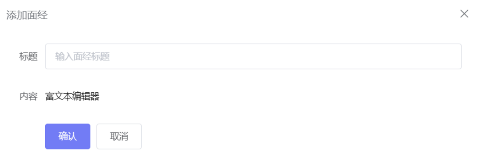
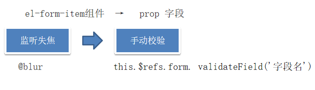
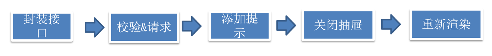
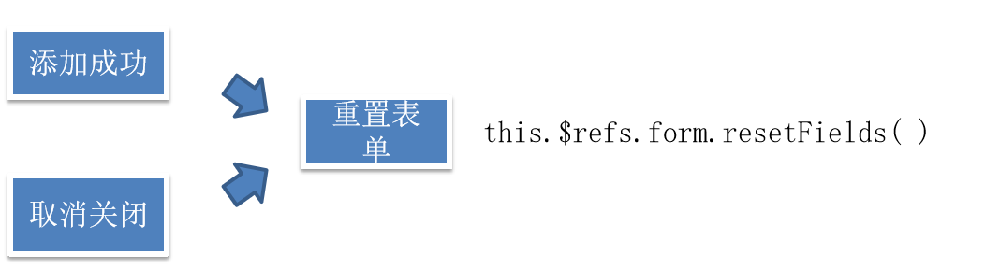

## 一、明确面经管理基本需求





## 二、渲染功能-准备架子和认识表格

`artcile/index.vue`

```jsx
<template>
  <div class="article-page">
    <el-breadcrumb separator-class="el-icon-arrow-right">
      <el-breadcrumb-item>面经后台</el-breadcrumb-item>
      <el-breadcrumb-item>面经管理</el-breadcrumb-item>
    </el-breadcrumb>
    <el-card shadow="never" border="false">
      <template #header>
        <div class="header">
          <span>共 300 条记录</span>
          <el-button
            icon="el-icon-plus"
            size="small"
            type="primary"
            round>
            添加面经
          </el-button>
        </div>
      </template>

    </el-card>
  </div>
</template>

<script>
export default {
  name: 'article-page',
  data () {
    return {}
  },
  created () {
  },
  methods: {
  }
}
</script>

<style lang="scss" scoped>
.el-card {
  margin-top: 25px;
  .header {
    display: flex;
    justify-content: space-between;
    align-items: center;
    padding-right: 16px;
  }
  .actions {
    font-size: 18px;
    display: flex;
    justify-content: space-around;
    color: #666;
    > i:hover {
      color: rgba(114, 124, 245, 1);
      cursor: pointer;
    }
  }
}
.el-pagination {
  margin-top: 20px;
  text-align: center;
}
.el-breadcrumb {
  margin-top: 10px;
}
.el-form {
  padding-right: 40px;
}
.quill-editor {
  ::v-deep .ql-editor {
    height: 300px;
  }
}
.el-rate {
  padding: 10px 0;
}
.article-preview {
  padding: 0 40px 40px 40px;
  > h5 {
    font-size: 20px;
    color: #666;
    border-bottom: 1px dashed #ccc;
    padding-bottom: 30px;
    margin: 0 0 20px 0;
  }
}
</style>

```


### 表格基本 **属性解读**



- data 数据源
- prop 设置数据源中对象中的键名，即可填入数据
- label 列名
- width 列宽

```jsx
<el-table :data="tableData" stripe style="width: 100%">
  <el-table-column prop="date" label="日期" width="180">
  </el-table-column>
  <el-table-column prop="name" label="姓名" width="180">
  </el-table-column>
  <el-table-column prop="address" label="地址"> </el-table-column>
</el-table>

data () {
  return {
    tableData: [{
      date: '2016-05-02',
      name: '王小虎',
      address: '上海市普陀区金沙江路 1518 弄'
    }, {
      date: '2016-05-04',
      name: '王小虎',
      address: '上海市普陀区金沙江路 1517 弄'
    }, {
      date: '2016-05-01',
      name: '王小虎',
      address: '上海市普陀区金沙江路 1519 弄'
    }, {
      date: '2016-05-03',
      name: '王小虎',
      address: '上海市普陀区金沙江路 1516 弄'
    }]
  }
},
```


## 三、渲染功能-封装接口

新建 `api/article.js`

```jsx
import request from '@/utils/request'

export const getArticleList = data => {
  return request.get('/admin/interview/query', {
    params: data
  })
}
```

`article/index.vue` created中发送初始化获取数据的请求

```jsx
data () {
  return {
    current: 1,
    pageSize: 10,
    total: 0,
    list: []
  }
},
created () {
  this.initData()
},
methods: {
  async initData () {
    const { data } = await getArticleList({
      current: this.current,
      pageSize: this.pageSize
    })
    this.list = data.rows
    this.total = data.total
    console.log(data)
  }
}
```


## 四、渲染功能-动态渲染表格

```jsx
<!-- el-table-column 列组件：
 prop:配置数据中的属性名
 label:表格的列名
 width:表格的宽度 -->
<el-table :data="list" style="width: 100%">
  <el-table-column prop="stem" label="标题" width="400">
  </el-table-column>
  <el-table-column prop="creator" label="作者"> </el-table-column>
  <el-table-column prop="likeCount" label="点赞"> </el-table-column>
  <el-table-column prop="views" label="浏览数"> </el-table-column>
  <el-table-column prop="createdAt" label="更新时间" width="200">
  </el-table-column>
</el-table>
```


## 五、渲染功能-操作按钮部分

### 1.说明：列的渲染的两种方式 

1.prop 渲染

2.作用域插槽渲染 (自定义列)


### 2.代码实现：

```jsx
<el-table :data="list" style="width: 100%">
  <el-table-column prop="stem" label="标题" width="400">
  </el-table-column>
  <el-table-column prop="creator" label="作者"> </el-table-column>
  <el-table-column prop="likeCount" label="点赞"> </el-table-column>
  <el-table-column prop="views" label="浏览数"> </el-table-column>
  <el-table-column prop="createdAt" label="更新时间" width="200">
  </el-table-column>
  <el-table-column label="操作" width="120px">
    <template #default="{ row }">
      <div class="actions">
        <i class="el-icon-view"></i>
        <i class="el-icon-edit-outline"></i>
        <i class="el-icon-delete" @click="del(row.id)"></i>
      </div>
    </template>
  </el-table-column>
</el-table>


del (id) {
  console.log(id)
}
```


## 六、渲染功能-基本分页渲染

1.讲解el-pagination完整版的配置项

2.根据完整版的配置项，实现业务功能

```jsx
<el-pagination
  background
  @current-change="handleCurrentChange"
  :current-page="current"
  :page-size="pageSize"
  layout="prev, pager, next"
  :total="total"
>
</el-pagination>


handleCurrentChange (val) {
  // 处理当前页变化
  this.current = val
  this.initData()
}
```


## 七、点击添加、预览、编辑共用逻辑

`添加  预览  修改`，都要打开抽屉，可以复用

1.三个按钮点击时都要打开抽屉

2.预览和编辑时要获取id

```jsx
<el-button @click="openDrawer('add')" icon="el-icon-plus" size="small" type="primary" round>
  添加面经
</el-button>

<el-table-column label="操作" width="120px">
  <template #default="{ row }">
    <div class="actions">
      <i class="el-icon-view" @click="openDrawer('preview', row.id, )"></i>
      <i class="el-icon-edit-outline" @click="openDrawer('edit', row.id)"></i>
      <i class="el-icon-delete" @click="del(row.id)"></i>
    </div>
  </template>
</el-table-column>

openDrawer (type, id) {
  console.log(type, id)
}
```


## 八、打开抽屉 - 显示抽屉

```jsx
<!-- 抽屉区域
         1. title="我是标题"
         2. :visible 控制显示隐藏
         3. :direction="direction"  控制方向
         4. :before-close="handleClose" 关闭抽屉前的处理逻辑 (比如：询问客户是否真的要关闭？)
         5. size="60%" 窗体所占的区域多宽
-->

<el-drawer
  :visible.sync="isShowDrawer"
  :before-close="handleClose"
  title="大标题"
  direction="rtl"
  size="60%"
>
  <span>我来啦!</span>
</el-drawer>

data () {
  return {
    current: 1,
    pageSize: 10,
    total: 0,
    list: [],
    isShowDrawer: false
  }
},


openDrawer (type, id) {
  console.log(type, id)
  this.isShowDrawer = true
},

handleClose (done) {
 // $confirm 可以弹出一个确认框，可确认.then  可取消.catch
      this.$confirm('你确认要关闭么？').then(() => {
        done() // done() 调用，就代表关闭抽屉
      }).catch((e) => {
        console.log('取消', e)
      })
}
```


## 九、计算属性控制标题



每个抽屉的title 都是不一样的，可以通过记录drawerType， 提供计算属性，计算出每个title的值

```jsx
data () {
  return {
    current: 1,
    pageSize: 10,
    total: 0,
    list: [],
    isShowDrawer: false,
    drawerType: ''
  }
},
methods: {  
    openDrawer (type, id) {
      // console.log(type, id)
      this.drawerType = type
      this.isShowDrawer = true
    },
},
    
computed: {
  drawerTitle () {
    let title = '大标题'
    if (this.drawerType === 'add') title = '添加面经'
    if (this.drawerType === 'preview') title = '面经预览'
    if (this.drawerType === 'edit') title = '修改面经'
    return title
  }
},
```

结构中渲染

```jsx
<el-drawer
  :visible.sync="isShowDrawer"
  :before-close="handleClose"
  :title="drawerTitle"
  direction="rtl"
>
  <span>我来啦!</span>
</el-drawer>
```


## 十、准备表单结构



```jsx
<el-form ref="form" label-width="80px">
  <el-form-item label="标题">
    <el-input  placeholder="输入面经标题"></el-input>
  </el-form-item>
  <el-form-item label="内容">
    富文本编辑器
  </el-form-item>
  <el-form-item>
    <el-button type="primary">确认</el-button>
    <el-button>取消</el-button>
  </el-form-item>
</el-form>

```


## 十一、富文本编辑器

https://www.npmjs.com/package/vue-quill-editor

装包

```jsx
npm install vue-quill-editor
```

导入,  局部注册

```jsx
// require styles
import 'quill/dist/quill.core.css'
import 'quill/dist/quill.snow.css'
import 'quill/dist/quill.bubble.css'
 
import { quillEditor } from 'vue-quill-editor'
 
export default {
  components: {
    quillEditor
  }
}
```

使用， v-model 绑定数据

```jsx
<el-form ref="form" label-width="80px">
  <el-form-item label="标题" prop="stem">
    <el-input v-model="form.stem" placeholder="输入面经标题"></el-input>
  </el-form-item>
  <el-form-item label="内容" prop="content">
    <quill-editor v-model="form.content"></quill-editor>
  </el-form-item>
  <el-form-item>
    <el-button type="primary">确认</el-button>
    <el-button>取消</el-button>
  </el-form-item>
</el-form>

data(){
    return {
      form: {
        stem: '', // 标题
        content: '' // 内容
      },
    }
}
```


## 十二、添加非空校验

### 1.目标

实现表单的非空校验

### 2.说明

element-ui 自带的校验，对element-ui表单组件才会默认校验，其他组件标签，需要手动校验

### 3.代码说明：

   3.1element-ui 表单组件的校验     

​     el-form组件            →  :model="form对象"    :rules="rules规则"      

​     el-form-item组件  →   prop 字段       

​     el-input组件           →   v-model

   3.2富文本编辑器的手动校验



```jsx
<el-form :model="form" :rules="rules" ref="form" label-width="80px">
  <el-form-item label="标题" prop="stem">
    <el-input v-model="form.stem" placeholder="输入面经标题"></el-input>
  </el-form-item>
  <el-form-item label="内容" prop="content">
    <quill-editor v-model="form.content"></quill-editor>
  </el-form-item>
  <el-form-item>
    <el-button type="primary" @click="submit">确认</el-button>
    <el-button>取消</el-button>
  </el-form-item>
</el-form>

rules: {
  stem: [{ required: true, message: '请输入面经标题', trigger: 'blur' }],
  content: [{ required: true, message: '请输入面经标题', trigger: 'blur' }]
}
```

富文本编辑器，校验单独处理

```jsx
<quill-editor v-model="form.content" @blur="$refs.form.validateField('content')"></quill-editor>
```


## 十三、封装接口 - 添加完成

### 1.实现思路



### 2.代码实现

`api/article.js`

```jsx
export const createArticle = data => {
  return request.post('/admin/interview/create', data)
}
```

发送请求添加-完成添加

```jsx
async submit () {
  try {
    // 校验 (对整个表单校验)
    await this.$refs.form.validate()
    // 请求
    await createArticle(this.form)
    // 提示
    Message.success('添加成功')
    // 重新渲染 将当前页重置到第一页
    this.current = 1
    this.initData()
    // 关闭抽屉
    this.isShowDrawer = false
  } catch (e) {
    console.log(e)
  }
}
```


## 十四、添加功能-解决关闭重置表单功能

### 1.目标：

重置表单 →  解决关闭抽屉后，重新打开，内容还在的问题



### 2.代码实现

1.把关闭和重置功能 封装到单独的方法中

```js
handleClose () {
  this.$refs.form.resetFields()
  this.isShowDrawer = false
}, 
```

2.添加成功后，调用关闭方法

```js
async submit () {
  try {
    // 校验 (对整个表单校验)
    await this.$refs.form.validate()
    // 请求
    await createArticle(this.form)
    // 提示
    Message.success('添加成功')
    // 重新渲染 将当前页重置到第一页
    this.current = 1
    this.initData()
    // 关闭抽屉
    this.handleClose()
  } catch (e) {
    console.log(e)
  }
}
```

3.点击取消时，调用关闭方法

```js
<el-button @click="handleClose">取消</el-button>
```


## 十五、面经管理 - 删除功能

### 1.目标

实现删除功能

### 2.思路


`api/article.js`

```jsx
export const removeArticle = id => {
  return request.delete('/admin/interview/remove', {
    data: {
      id
    }
  })
}
```

页面中，注册点击事件调用

```jsx
<i class="el-icon-delete" @click="del(row.id)"></i>

async del (id) {
  // 删除请求
  await removeArticle(id)
  // 添加成功的提示
  this.$message.success('删除成功')

  // 处理删除当前页的最后一条
  if (this.tableData.length === 1 && this.current > 1) {
     this.current--
  }
  // 重新渲染
  this.initData()
},
```


## 十六、面经管理 - 修改功能

### 1.目标

​    修改回显

### 2.说明

修改比添加多一层回显，显示弹框时，需要发送请求获取数据

### 3.实现思路

1.封装接口，获取对应 id 的文章详情

2.显示抽屉的同时，将数据存入 form 回显

### 4.代码实现

3.1 封装接口，获取对应 id 的文章详情

`api/article.js`

```jsx
export const getArticleDetail = id => {
  return request.get('/admin/interview/show', {
    params: {
      id
    }
  })
}
```

3.2 显示抽屉的同时，将数据存入 form 回显

```jsx
async openDrawer (type, id) {
  // console.log(type, id)
  this.drawerType = type
  this.isShowDrawer = true

  if (type !== 'add') {
    const res = await getArticleDetail(id)
    this.form = {
      ...res.data
    }
  }
},
```

3.3关闭抽屉时，重置表单中的额外的数据

```js
 closeDrawer () {
   // 将form也手动重置
    this.form = {
      stem: '', // 标题
      content: '' // 内容
    } 
    this.$refs.form.resetFields() // 重置表单 
    this.isShowDrawer = false // 关闭抽屉
 },
```


## 十七、修改提交

### 1.目标

完成修改提交功能

### 2.说明

修改 和 添加 共用同一个按钮，需要进行判断才能复用

### 3.实现思路

   1.封装根据 id 进行提交修改的接口

   2.按钮逻辑中添加判断，区分不同场景，调用接口完成功能

### 4.代码实现

4.1`api/article.js`准备api

```jsx
export const updateArticle = data => {
  return request.put('/admin/interview/update', data)
}
```

4.2判断，修改提交

```jsx
async submit () {
  try {
    // 校验表单
    await this.$refs.form.validate()
    // 如何区分, 当前是 编辑 还是 添加
    if (this.drawerType === 'add') {
      // 发送请求
      await createArticle(this.form)
      // 添加提示 $message.success
      this.$message.success('添加成功')
    }
    if (this.drawerType === 'edit') {
      // 发送的是编辑的请求
      const { id, stem, content } = this.form
      await updateArticle({ id, stem, content })
      this.$message.success('修改成功')
    }
    // 无论是修改还是添加, 都会回到第一页, 重置页码
    this.current = 1
    // 重新渲染
    this.initData()
    // 关闭弹框
    this.handleClose()
  } catch (e) {
    console.log(e)
  }
}
```


## 十八、面经管理 - 预览功能

### 1.目标

完成预览功能

### 2.说明

其实预览已经完成了，也是进行回显，只是不是利用表单回显，而是直接回显文章内容

预览不需要展示表单，直接 v-html 渲染即可

```jsx
<div v-if="drawerType === 'preview'" class="article-preview">
  <h5>{{ form.stem }}</h5>
  <div v-html="form.content"></div>
</div>
<el-form v-else :model="form" :rules="rules" ref="form" label-width="80px">
  ...
</el-form>
```

处理关闭逻辑

```jsx
handleClose () { 
  this.form = { stem: '', content: '' }
  // 注意点: 由于公用的抽屉, 当预览时, 是没有表单的! 不能重置表单 
  if (this.drawerType !== 'preview') {
    // add edit 调用 resetFields 在此处的作用: 重置校验状态
    this.$refs.form.resetFields()
  }
  this.isShowDrawer = false // 关闭弹框
},
```


